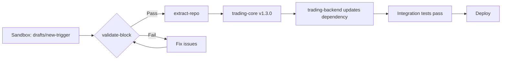

# Multi-Repo Architecture Plan

**Created:** 2024-12-28
**Status:** Planning

## Overview

Splitting 3 monorepos into 5 coordinated packages for parallel development.

### Source Repositories
- `c:\mlang2` - Trading backtesting platform
- `c:\agent` - Agent orchestration framework  
- `c:\ticktraining\edgefire2` - Advanced training platform

### Target Repositories
1. `trading-core` - Shared simulation engine
2. `agent-core` - Agent orchestration
3. `trading-backend` - API server
4. `trading-frontend` - Unified UI
5. `training-platform` - Journaling & scenarios

---

## Repo 1: trading-core

**Purpose:** Pip-installable Python package with zero UI dependencies.

### Files to Extract (from mlang2)
```
src/
├── core/
│   ├── tool_registry.py      → trading_core/registry.py
│   └── strategy_tool.py      → trading_core/strategy.py
├── features/
│   ├── pipeline.py           → trading_core/features/pipeline.py
│   └── state.py              → trading_core/features/state.py
├── policy/
│   ├── triggers/             → trading_core/triggers/
│   ├── brackets/             → trading_core/brackets/
│   ├── filters/              → trading_core/filters/
│   └── scanners/             → trading_core/scanners/
├── sim/
│   ├── fast_forward.py       → trading_core/sim/fast_forward.py
│   ├── market_session.py     → trading_core/sim/market_session.py
│   ├── oco_engine.py         → trading_core/sim/oco_engine.py
│   └── causal_runner.py      → trading_core/sim/causal_runner.py
├── data/
│   ├── loader.py             → trading_core/data/loader.py
│   └── resample.py           → trading_core/data/resample.py
└── config.py                 → trading_core/config.py
```

### Package Structure
```
trading-core/
├── pyproject.toml
├── trading_core/
│   ├── __init__.py           # Public API exports
│   ├── triggers/
│   ├── brackets/
│   ├── sim/
│   ├── features/
│   └── data/
└── tests/
```

### Dependencies
- numpy, pandas, scipy (scientific computing)
- NO FastAPI, NO React, NO ML frameworks

### Public API
```python
from trading_core import (
    TriggerRegistry,
    create_trigger,
    OCOEngine,
    FastVizStrategy,
    FeatureBundle,
    load_continuous_contract,
)
```

---

## Repo 2: agent-core

**Purpose:** Pip-installable agent orchestration framework.

### Files to Extract (from c:\agent)
```
flow/
├── loops.py                  → agent_core/loops.py
├── judge.py                  → agent_core/judge.py
├── planner.py                → agent_core/planner.py
├── preflight.py              → agent_core/preflight.py
└── execs.py                  → agent_core/execs.py

gate/
├── bases.py                  → agent_core/gateway/base.py
├── gemini.py                 → agent_core/gateway/gemini.py
└── openai_compat.py          → agent_core/gateway/openai.py

core/
├── types.py                  → agent_core/types.py
├── proto.py                  → agent_core/proto.py
└── rules.py                  → agent_core/rules.py

tool/
├── bases.py                  → agent_core/tools/base.py
├── index.py                  → agent_core/tools/registry.py
└── (specific tools stay in consuming repos)
```

### Package Structure
```
agent-core/
├── pyproject.toml
├── agent_core/
│   ├── __init__.py
│   ├── loops.py              # AgentLoop
│   ├── judge.py              # AgentJudge
│   ├── planner.py            # ProjectStateMachine
│   ├── gateway/
│   │   ├── base.py
│   │   ├── gemini.py
│   │   └── openai.py
│   ├── tools/
│   │   ├── base.py
│   │   └── registry.py
│   └── types.py
└── tests/
```

### Dependencies
- httpx, google-generativeai (API clients)
- NO trading logic, NO UI

### Public API
```python
from agent_core import (
    AgentLoop,
    AgentJudge,
    GeminiGateway,
    ToolRegistry,
    LoopResult,
)
```

---

## Repo 3: trading-backend

**Purpose:** FastAPI server consuming trading-core and agent-core.

### Files to Extract (from mlang2)
```
src/server/
├── main.py                   → trading_backend/main.py
├── replay_routes.py          → trading_backend/routes/replay.py
├── infer_routes.py           → trading_backend/routes/infer.py
├── db_routes.py              → trading_backend/routes/db.py
└── fast_viz_routes.py        → trading_backend/routes/fast_viz.py

src/tools/
├── agent_tools.py            → trading_backend/agent_tools.py
├── discovery_tools.py        → trading_backend/discovery_tools.py
└── analysis_tools.py         → trading_backend/analysis_tools.py

src/skills/
└── *.py                      → trading_backend/skills/

scripts/
└── backtest_*.py             → trading_backend/scripts/
```

### Package Structure
```
trading-backend/
├── pyproject.toml
├── trading_backend/
│   ├── main.py               # FastAPI app
│   ├── routes/
│   ├── agent_tools.py        # Tools registered for agent
│   ├── skills/
│   └── scripts/
├── Dockerfile
└── tests/
```

### Dependencies
- trading-core (pip install)
- agent-core (pip install)
- fastapi, uvicorn, httpx

---

## Repo 4: trading-frontend

**Purpose:** React/Next.js UI for visualization.

### Decision Point: MLang2 vs Edgefire2

| Aspect | MLang2 (src/) | Edgefire2 (src/) |
|--------|---------------|------------------|
| Chart | lightweight-charts | Custom Canvas |
| State | React useState | Zustand stores |
| Complexity | Simple | Production-grade |
| Features | Basic viz | Journaling, AI Coach |

**Recommendation:** Use Edgefire2 as the frontend, deprecate MLang2's UI.

### Files to Migrate (from edgefire2)
```
src/
├── components/               → trading_frontend/components/
├── hooks/                    → trading_frontend/hooks/
├── lib/                      → trading_frontend/lib/
├── state/                    → trading_frontend/state/
└── app/                      → trading_frontend/app/
```

### What to ADD from MLang2
```
src/components/
├── FastVizPanel.tsx          # Fast Viz sidebar (new)
├── TriggerComposer.tsx       # AND/OR trigger builder (new)
└── BacktestResults.tsx       # Results display (new)
```

---

## Repo 5: training-platform

**Purpose:** Journaling, scenarios, and coaching features.

### Files (from edgefire2)
```
src/
├── domain/                   → training_platform/domain/
├── infrastructure/           → training_platform/infra/
├── ai/flows/                 → training_platform/ai/
└── app/scenarios/            → training_platform/scenarios/
```

This may stay merged with trading-frontend initially.

---

## Extraction Order

### Phase 1: Core Extraction (Week 1-2)
1. Create `trading-core` repo
2. Extract files from mlang2
3. Add pyproject.toml
4. Publish to private PyPI or git+ssh

### Phase 2: Agent Extraction (Week 2-3)
1. Create `agent-core` repo
2. Extract from c:\agent
3. Remove tool implementations (keep base classes)
4. Publish

### Phase 3: Backend Integration (Week 3-4)
1. Create `trading-backend` repo
2. Update imports: `from trading_core import ...`
3. Integrate agent-core for chat
4. Test all endpoints

### Phase 4: Frontend Merge (Week 4-6)
1. Use edgefire2 as base
2. Add MLang2's Fast Viz features
3. Connect to trading-backend API
4. Remove MLang2's frontend

### Phase 5: Polish (Week 6-8)
1. CI/CD per repo
2. Docker Compose for full stack
3. Documentation
4. Integration tests

---

## Shared Contracts

### Trading Core → Backend
```python
# trading_core exposes:
class TriggerConfig(TypedDict):
    type: str
    children: Optional[List['TriggerConfig']]
    # ... params

class FastVizResult:
    run_id: str
    trades: List[Trade]
    stats: Stats
```

### Backend → Frontend
```typescript
// OpenAPI contract
interface FastVizResponse {
  run_id: string;
  trades: Trade[];
  stats: { total_trades: number; win_rate: number };
}

interface AgentChatResponse {
  reply: string;
  ui_action?: {
    type: 'RUN_FAST_VIZ' | 'RUN_STRATEGY' | 'DRAW_ZONE';
    payload: any;
  };
}
```

### Agent Core → Backend
```python
# agent_core exposes:
class AgentLoop:
    async def run(self, state: AgentState, message: str) -> LoopResult

class LoopResult:
    success: bool
    final_answer: str
    steps_taken: int
    tool_calls: List[ToolCall]
```

---

## Tools for Extraction

### Git Filter-Repo (for clean history)
```bash
# Extract trading-core from mlang2
git filter-repo --path src/core --path src/features --path src/policy --path src/sim --path src/data --path src/config.py
```

### Pyproject.toml Template
```toml
[project]
name = "trading-core"
version = "0.1.0"
dependencies = ["numpy>=1.24", "pandas>=2.0"]

[build-system]
requires = ["hatchling"]
build-backend = "hatchling.build"
```

---

## Next Immediate Steps

1. [ ] Review this plan
2. [ ] Create empty repos on GitHub/GitLab
3. [ ] Start with trading-core extraction (lowest risk)
4. [ ] Create CI pipeline template
5. [ ] Define API contracts in shared docs

---

## Questions to Resolve

1. **Private PyPI?** Or install via `pip install git+ssh://...`?
2. **Monorepo workspace?** Use Turborepo/Nx or keep fully separate?
3. **Edgefire2 stays Next.js?** Or convert to Vite for consistency?
4. **Agent-core generic?** Or trading-specific agent package?

---

## Agent Repo Expert Suggestions (c:\agent)

**Added:** 2024-12-28
**Author:** Agent that built c:\agent

### Critical Missing Components from agent-core Extraction

The original plan lists only the basic files. Here's what's **actually valuable** from c:\agent:

#### 1. Core Systems (Missing from Plan)

| Component | File | Why It Matters |
|-----------|------|----------------|
| **Sandbox/Workspace** | `core/sandb.py` (21KB) | Isolates agent writes to workspace/, allows read-only project access. **Critical for safety.** |
| **Context Injection** | `core/context.py` (17KB) | Scans workspace at startup, injects files/skills/last-session into prompt. Reduces discovery overhead. |
| **Task Queue** | `core/taskqueue.py` (18KB) | Persistent queue with checkpointing, parent/child tasks, budget limits per task. |
| **Skill System** | `core/skills.py` (11KB) | Agent creates tools in workspace/skills/, promotes to real tools via patches. |
| **State Management** | `core/state.py` (6KB) | ExecutionContext with learning mode, reflection intervals, step tracking. |

#### 2. Advanced Flow Components

| Component | File | Why It Matters |
|-----------|------|----------------|
| **Preflight Checks** | `flow/preflight.py` (33KB) | Path validation, rule enforcement, retry tracking, gate logic before tool execution. |
| **Learning Nudges** | `flow/learning_nudge.py` (5KB) | Injects hints when common errors detected (true/false, state persistence). |
| **System Prompt** | `flow/plans.py` (19KB) | Comprehensive prompt with tool guidance, patch protocol, pyexe rules, fractal planning. |

#### 3. Model Escalation (Phase 4)

| Component | File | Why It Matters |
|-----------|------|----------------|
| **Escalating Gateway** | `gate/escalating.py` (6KB) | Switches from Flash→Pro on 3 failures, de-escalates after learning stored. |
| **Embedding Gateway** | `gate/embed.py` (3KB) | Separate embedding interface for vector stores. |

#### 4. Memory & Retrieval

| Component | File | Why It Matters |
|-----------|------|----------------|
| **Memory Tool** | `tool/memory.py` (15KB) | store/search/reflect/learn operations with semantic search. |
| **Chunk Indexing** | `store/chunks.py` (23KB) | Code chunking with AST parsing, manifest persistence, stale detection. |
| **Vector Store** | `store/vectors.py` (14KB) | Faiss-backed vector storage with incremental ingestion. |

#### 5. Specialized Tools

| Tool | File | Why It Matters |
|------|------|----------------|
| **PyExe** | `tool/pyexe.py` (13KB) | Isolated Python REPL with timeout, state reset, error handling. |
| **Queue** | `tool/queue.py` (17KB) | Agent-facing task queue interface with queue_add/next/done/fail. |
| **Patch** | `tool/patch.py` (16KB) | create_patch/list_patches/get_patch for safe project modifications. |
| **Promote** | `tool/promote.py` (8KB) | Promotes workspace skills to real tools via structured specs. |
| **VectorGit** | `tool/vectorgit.py` (13KB) | Clone GitHub repos, index for semantic search. |

---

### Revised agent-core Package Structure

```
agent-core/
├── pyproject.toml
├── agent_core/
│   ├── __init__.py
│   ├── loops.py              # AgentLoop (main reasoning loop)
│   ├── judge.py              # AgentJudge (response validation)
│   ├── planner.py            # ProjectStateMachine
│   ├── preflight.py          # Pre-execution validation ← NEW
│   ├── nudges.py             # Error pattern learning ← NEW
│   ├── prompts.py            # System prompt builder ← NEW
│   │
│   ├── gateway/
│   │   ├── base.py
│   │   ├── gemini.py
│   │   ├── openai.py
│   │   ├── escalating.py     # Model switching ← NEW
│   │   └── embed.py          # Embedding interface ← NEW
│   │
│   ├── sandbox/              # ← NEW PACKAGE
│   │   ├── workspace.py      # Workspace isolation
│   │   └── rules.py          # Safety rules engine
│   │
│   ├── memory/               # ← NEW PACKAGE
│   │   ├── store.py          # Memory operations
│   │   ├── chunks.py         # Code chunk indexing
│   │   └── vectors.py        # Vector storage
│   │
│   ├── tasks/                # ← NEW PACKAGE
│   │   ├── queue.py          # Task queue
│   │   ├── context.py        # Context injection
│   │   └── skills.py         # Skill system
│   │
│   ├── tools/
│   │   ├── base.py
│   │   └── registry.py
│   │
│   └── types.py
└── tests/
```

---

### What agent-core Can Offer Edgefire2

Edgefire2's agents.md states (lines 105-113):
> "AI coach cannot draw on the chart, control simulation playback, or show trades"

The c:\agent framework solves this pattern with:

1. **Tool-Based Control** - Define tools like `draw_zone`, `run_simulation`, `place_trade`
2. **Preflight Validation** - Validate tool calls before execution (prevent invalid draws)
3. **Task Queue** - Complex multi-step operations with checkpointing
4. **Memory** - Remember what the AI coach has tried before
5. **Model Escalation** - Use Pro model for complex analysis, Flash for chat

#### Proposed Architecture for Edgefire2 AI Coach

```
┌─────────────────────────────────────────┐
│ Edgefire2 Frontend (Next.js)            │
│ ┌─────────────────────────────────────┐ │
│ │ AI Chat UI                          │ │
│ └────────────────────┬────────────────┘ │
│                      │                   │
│ ┌────────────────────▼────────────────┐ │
│ │ ChartControlPort (client bridge)    │ │
│ │ - draw_zone, run_sim, place_trade   │ │
│ └────────────────────┬────────────────┘ │
└──────────────────────┼──────────────────┘
                       │ WebSocket/SSE
┌──────────────────────▼──────────────────┐
│ trading-backend (FastAPI)               │
│ ┌─────────────────────────────────────┐ │
│ │ agent-core.AgentLoop                │ │
│ │ ├─ Tools: chart_draw, sim_control   │ │
│ │ ├─ Memory: coaching history         │ │
│ │ └─ Escalation: Flash → Pro          │ │
│ └─────────────────────────────────────┘ │
└───────────────────────────────────────┘
```

---

### Integration Recommendations

#### Phase 2A: Enhanced agent-core Extraction
1. Include ALL components listed above (not just loops.py, judge.py)
2. Create sandbox/, memory/, tasks/ subpackages
3. Keep tool implementations in consuming repos (as planned)

#### Phase 3A: Edgefire2 Tool Bridge
1. Create `ChartControlTool` in trading-backend that emits events to frontend
2. Use agent-core's preflight to validate chart commands before execution
3. Add memory tool for coaching context persistence

#### Phase 4A: Shared Memory Layer
1. agent-core's memory system could be shared between mlang2 backtesting and edgefire2 coaching
2. "What did I learn about this pattern?" works across both platforms

---

### Priority Extraction Order (Revised)

1. **Week 1-2:** trading-core (as planned)
2. **Week 2-3:** agent-core **EXPANDED** (include sandbox, memory, tasks, escalating)
3. **Week 3-4:** trading-backend with chart control tools
4. **Week 4-5:** Edgefire2 ChartControlPort + SimulationControlPort
5. **Week 5-6:** Memory sharing between platforms

---

### New Questions to Resolve

5. **Memory persistence?** Use agent-core's memory system with Firebase backend?
6. **Model escalation for coaching?** Flash for quick tips, Pro for deep analysis?
7. **ChartControlPort protocol?** WebSocket events? Server-Sent Events?
8. **Skill promotion in edgefire2?** Allow AI coach to create reusable skills?

---

## Edgefire2 Expert Integration Analysis

**Added:** 2024-12-28  
**Author:** Agent deeply familiar with edgefire2 codebase

### Current Edgefire2 Capabilities (What We Have)

After extensive work on the edgefire2 codebase, here's what it brings to the table:

| System | Key Files | Lines | Capability |
|--------|-----------|-------|------------|
| **AI Chat Flow** | `src/ai/flows/chat-flow.ts` | 422 | Genkit-based chat with context injection, tool execution |
| **Chart Control Tools** | `src/ai/flows/chart-control-tools.ts` | 400+ | drawZone, drawTrendline, drawCallout, zoomChart, panChart |
| **Coach Actions** | `src/hooks/use-coach-actions.ts` | 830 | Client-side action processor for AI commands |
| **Simulation Engine** | `src/lib/simulation-store.ts` | 574 | Zustand-based playback with OCO orders |
| **Canvas Chart** | `src/hooks/use-canvas-chart/` | 2000+ | Custom canvas rendering, event handlers, drawings |
| **Interaction Store** | `src/state/interaction/store.ts` | 300 | Zones, trendlines, callouts, drawing state |
| **Settings Store** | `src/state/settings/store.ts` | 250 | Indicator toggles, chart preferences |
| **Journal/Trades** | `src/domain/trade.ts`, GraphQL | 200+ | TradeLog schema, Firestore persistence |

**Strengths:**
1. Production-grade Next.js/React UI with custom canvas charting
2. Working AI Coach with Genkit integration
3. Context-aware tool execution ("Proxy Catch" pattern for capturing actions)
4. Real-time chart annotation and simulation control
5. Firebase/Firestore persistence
6. GraphQL API layer

**Gaps:**
1. **No Python backend** - All analysis is JS/TS, missing mlang2's quantitative depth
2. **No semantic memory** - AI doesn't remember past sessions
3. **No AgentLoop orchestration** - Simple request/response, no multi-step reasoning
4. **No backtest engine** - Can't run strategies on historical data
5. **Limited analysis tools** - Basic pattern detection vs mlang2's 15+ analysis tools

---

### What Each Repo Contributes

#### mlang2 → Edgefire2

| mlang2 Component | Integration Path | Value Add |
|------------------|------------------|-----------|
| `price_analysis_tools.py` (59KB, 15 tools) | Python backend API | `FindPriceOpportunities`, `RegimeDetection`, `KillerMoveDetector`, `ScanSynthesizer` |
| `sim/fast_forward.py` (12KB) | Backend service | Fast backtest execution for strategy validation |
| `sim/oco_engine.py` (16KB) | Merge with simulation-store | More sophisticated order management |
| `policy/triggers/` (40KB) | Python backend | Visual trigger composer data source |
| `features/pipeline.py` (10KB) | Backend service | Feature bundle calculation for ML analysis |
| Frontend (lightweight-charts) | **DEPRECATE** | Edgefire2's canvas chart is more capable |

**Recommended Extraction:**
```
mlang2/src/tools/price_analysis_tools.py → trading-backend/tools/price_analysis.py
mlang2/src/sim/fast_forward.py          → trading-core/sim/fast_forward.py
mlang2/src/policy/triggers/             → trading-core/triggers/
mlang2/src/features/                    → trading-core/features/
```

#### c:\agent → Edgefire2

| agent Component | Integration Path | Value Add |
|-----------------|------------------|-----------|
| `flow/loops.py` (744 lines) | Replace Genkit-only in chat-flow | Multi-step reasoning with tool budget |
| `tool/memory.py` (416 lines) | New AI subsystem | Cross-session learning ("What did I try before?") |
| `core/preflight.py` (33KB) | Tool validation layer | Prevent invalid chart commands |
| `flow/judge.py` (17KB) | Response validation | Catch hallucinations before execution |
| `store/vectors.py` (14KB) | New subsystem | Semantic search over past coaching sessions |
| `gate/escalating.py` (6KB) | Model router | Flash for chat, Pro for deep analysis |

**Recommended Extraction:**
```
c:\agent/flow/loops.py        → agent-core/loops.py
c:\agent/tool/memory.py       → agent-core/memory/store.py
c:\agent/flow/preflight.py    → agent-core/preflight.py
c:\agent/store/vectors.py     → agent-core/memory/vectors.py
```

---

### Integration Architecture

```
┌─────────────────────────────────────────────────────────────────┐
│                    EDGEFIRE2 FRONTEND (Next.js)                  │
│  ┌─────────────────────────────────────────────────────────────┐│
│  │ AI Chat Panel                                               ││
│  │  └→ calls /api/chat                                         ││
│  ├─────────────────────────────────────────────────────────────┤│
│  │ Canvas Chart + use-coach-actions.ts                         ││
│  │  └→ receives actions, draws zones/trendlines               ││
│  ├─────────────────────────────────────────────────────────────┤│
│  │ Simulation Store (existing)                                 ││
│  │  └→ playback, OCO orders, trade logging                    ││
│  └─────────────────────────────────────────────────────────────┘│
└────────────────────────────┬────────────────────────────────────┘
                             │ REST/GraphQL/WebSocket
┌────────────────────────────▼────────────────────────────────────┐
│                    TRADING-BACKEND (FastAPI)                     │
│  ┌──────────────────────────────────────────────────────────┐   │
│  │ agent-core.AgentLoop                                      │   │
│  │  ├─ Multi-step reasoning (up to 50 steps)                │   │
│  │  ├─ Tool budget enforcement                               │   │
│  │  ├─ Model escalation (Flash → Pro on hard problems)      │   │
│  │  └─ Preflight validation (prevent bad draws)             │   │
│  ├──────────────────────────────────────────────────────────┤   │
│  │ Tools Registry                                            │   │
│  │  ├─ price_analysis (from mlang2)                         │   │
│  │  │   └→ FindPriceOpportunities, RegimeDetection, etc.   │   │
│  │  ├─ chart_control (bridge to frontend)                   │   │
│  │  │   └→ draw_zone, draw_trendline, control_simulation   │   │
│  │  ├─ memory (from agent-core)                             │   │
│  │  │   └→ store/search/reflect/learn                       │   │
│  │  └─ backtest (from mlang2/sim)                           │   │
│  │       └→ run_fast_viz, validate_strategy                 │   │
│  └──────────────────────────────────────────────────────────┘   │
│                                                                  │
│  ┌──────────────────────────────────────────────────────────┐   │
│  │ trading-core (pip install)                                │   │
│  │  └→ triggers, brackets, filters, sim engine              │   │
│  └──────────────────────────────────────────────────────────┘   │
└──────────────────────────────────────────────────────────────────┘
```

---

### What Should Stay the Same in Edgefire2

| System | File(s) | Reason to Keep |
|--------|---------|----------------|
| Canvas Chart | `use-canvas-chart/` | Custom, production-quality, no replacement needed |
| Interaction Store | `state/interaction/` | Well-designed Zustand architecture |
| Simulation Store | `simulation-store.ts` | Works well, just needs OCO enhancement |
| UI Components | `components/` | Clean React components |
| Firebase Integration | `lib/firebase.ts` | Established persistence layer |
| Domain Models | `domain/trade.ts`, etc. | Good schema design |

---

### What Should Change in Edgefire2

| Current | Proposed Change | Reason |
|---------|-----------------|--------|
| `chat-flow.ts` (Genkit-only) | Wrap with `AgentLoop` proxy | Multi-step reasoning, memory, escalation |
| Direct tool execution | Add preflight validation | Prevent invalid draws, catch hallucinations |
| No memory | Add `MemoryTool` integration | "What did I learn about this pattern?" |
| Basic pattern analysis | Call mlang2 analysis tools | 15+ sophisticated analysis capabilities |
| No backtest | Add FastViz integration | "Backtest this setup on the last 3 months" |

---

### What Should Change in Other Repos

#### mlang2 Changes

| Item | Change | Why |
|------|--------|-----|
| Frontend (App.tsx, components/) | **DELETE** | Edgefire2's UI is superior |
| `src/server/` routes | Move to trading-backend | Single API surface |
| `src/tools/` | Keep and export | Power the backend tools |
| `requirements.txt` | Convert to pyproject.toml | Modern packaging |

#### c:\agent Changes

| Item | Change | Why |
|------|--------|-----|
| Workspace concept | Adapt for Firebase | Edgefire2 uses Firestore, not local files |
| Tool implementations | Keep base classes only | Tools live in consuming repos |
| CLI (`cli.py`) | Keep for development | Useful for testing agent locally |

---

### Extraction Plan (Phased)

#### Phase 1: Foundation (Week 1-2)
1. Create `trading-core` pip package
   - Extract mlang2 `sim/`, `policy/`, `features/`
   - No UI dependencies
   - CI with pytest

2. Create `agent-core` pip package
   - Extract c:\agent `flow/`, `core/`, `store/`, `gate/`
   - Include memory, preflight, escalation
   - No trading logic

#### Phase 2: Backend (Week 2-3)
1. Create `trading-backend` FastAPI service
   ```python
   # trading_backend/main.py
   from trading_core import OCOEngine, TriggerRegistry
   from agent_core import AgentLoop, MemoryTool

   # Register mlang2 analysis tools
   from trading_backend.tools import register_price_analysis_tools

   # Bridge tools for edgefire2 chart control
   from trading_backend.tools import register_chart_control_tools
   ```

2. Define ChartControlBridge
   ```python
   class DrawZoneTool(BaseTool):
       """Emits SSE event to frontend to draw zone."""
       async def execute(self, args):
           await sse_broadcast("chart:draw_zone", args)
           return {"success": True, "id": f"zone-{uuid4()}"}
   ```

#### Phase 3: Frontend Integration (Week 3-4)
1. Update edgefire2 `/api/chat/route.ts`:
   - Proxy to trading-backend instead of local Genkit
   - Parse SSE events for chart control

2. Keep Genkit for fallback/simple queries:
   - Quick pattern identification stays local
   - Complex analysis routes to Python backend

#### Phase 4: Memory & Learning (Week 4-5)
1. Add Firebase adapter for agent-core memory:
   ```python
   class FirebaseMemoryStore(VectorStore):
       """Store memories in Firestore + vector embeddings."""
   ```

2. Enable cross-session learning:
   - "Remember this pattern"
   - "What have I learned about ORB setups?"

#### Phase 5: Advanced Features (Week 5-8)
1. Trigger Composer UI (new component)
   - Visual AND/OR trigger builder
   - Powered by mlang2 trigger registry

2. Backtest Results Display
   - Integration with FastViz
   - Show trades on chart with annotations

---

### Tools to Build or Adopt

| Tool | Source | Purpose |
|------|--------|---------|
| `git filter-repo` | Open source | Clean extraction with history |
| `hatch` | Open source | Modern Python packaging |
| `turborepo` | Open source | Monorepo management (optional) |
| `sse-starlette` | Open source | Server-Sent Events for FastAPI |
| **analyze_price** | Build from mlang2 | Wrapper for price_analysis_tools |
| **run_backtest** | Build from mlang2 | FastViz strategy executor |
| **coach_memory** | Build from agent-core | Session-persistent learning |
| **chart_bridge** | Build new | SSE bridge frontend↔backend |

---

### Open Source Integrations to Consider

| Library | Purpose | Integration Point |
|---------|---------|-------------------|
| **FAISS** | Vector similarity | Memory search (already in agent-core) |
| **LangChain** | Tool orchestration | Alternative to agent-core (evaluate) |
| **Instructor** | Structured LLM output | Validate tool call schemas |
| **pandas-ta** | Technical indicators | Extend mlang2 analysis |
| **Backtrader** | Alternative backtest | Compare with FastViz |

---

### Risk Assessment

| Risk | Mitigation |
|------|------------|
| Breaking edgefire2 during integration | Feature flags, parallel deployment |
| Python/TS type mismatch | Shared OpenAPI/Zod schemas |
| Memory store scaling | Firebase vector extensions or dedicated Pinecone |
| Agent loops spinning | Budget limits, max_steps=50 |
| SSE reliability | Fallback to polling, retry logic |

---

### Success Criteria

1. **Week 2:** trading-core installable with `pip install trading-core`
2. **Week 3:** Agent-core passes smoke tests
3. **Week 4:** Edgefire2 can call `analyze_price` via backend
4. **Week 5:** Memory works across sessions
5. **Week 6:** Backtest from chat ("Test this setup on NQ last month")
6. **Week 8:** Full integration, docs complete

---

### Summary: The Vision

**Before:** Three isolated repos with duplicated concepts
- mlang2: Great Python analysis, weak UI
- c:\agent: Great orchestration, no trading domain
- edgefire2: Great UI, limited analysis depth

**After:** Unified platform
- **edgefire2** = User-facing app (Next.js, canvas chart, journal)
- **trading-backend** = Python API (analysis, backtest, agent brain)
- **trading-core** = Shared simulation engine (pip package)
- **agent-core** = Shared orchestration (pip package)

The AI Coach becomes a true trading assistant: it remembers your patterns, runs backtests on demand, detects regimes, synthesizes scanners, and draws annotations—all while maintaining the clean, responsive edgefire2 experience.

---

## Claude's Final Analysis & Recommendations

**Added:** 2024-12-29  
**Author:** Claude (reviewing team contributions)

### What I Learned From Team Input

The additions from the agent expert and edgefire2 expert fundamentally changed my understanding of this project:

#### 1. Agent-Core Is Much Deeper Than I Realized

My original extraction plan listed only `loops.py`, `judge.py`, `planner.py`. The agent expert revealed **critical missing systems**:

| System | What I Missed | Why It Matters |
|--------|--------------|----------------|
| **Sandbox/Workspace** | `core/sandb.py` | Agent writes are isolated - prevents catastrophic mistakes |
| **Context Injection** | `core/context.py` | Reduces discovery overhead - agent knows what's available |
| **Task Queue** | `core/taskqueue.py` | Checkpointing enables long operations (backtests, batch analysis) |
| **Skill System** | `core/skills.py` | Agent can create *new tools* - self-improvement |
| **Escalating Gateway** | `gate/escalating.py` | Flash→Pro switching based on difficulty |

**Key Insight:** The agent framework isn't just "loops + judge". It's a **self-improving system with safety rails**.

#### 2. Edgefire2's AI Gap Is Well-Defined

The edgefire2 expert provided precise gap analysis:

| Gap | Impact | Solution |
|-----|--------|----------|
| No Python backend | Missing mlang2's 15+ analysis tools | trading-backend |
| No semantic memory | AI forgets between sessions | agent-core memory |
| No AgentLoop | Single request/response only | Wrap Genkit with AgentLoop |
| No backtest engine | Can't validate setups | FastViz integration |

**Key Insight:** Edgefire2 has the **best UI**. mlang2 has the **best analysis**. agent-core has the **best orchestration**. The plan correctly identifies how to merge these.

#### 3. The SSE Bridge Pattern

The proposed `ChartControlBridge` via Server-Sent Events is elegant:

```
Backend AgentLoop → Tool returns "draw zone" → SSE broadcast → Frontend draws
```

This keeps:
- **Python doing the thinking** (agent-core)
- **TypeScript doing the rendering** (edgefire2)
- **Clean separation** (backend doesn't know about canvas internals)

---

### Suggested Tools To Build

#### 1. `extract-repo` CLI Tool

**Purpose:** Automate the tedious git-filter-repo + restructure + pyproject.toml creation.

```bash
# Usage
python tools/extract-repo.py \
    --source c:\mlang2 \
    --target trading-core \
    --paths src/sim src/policy src/features \
    --exclude tests/ __pycache__/

# Output:
# trading-core/
# ├── pyproject.toml (auto-generated)
# ├── trading_core/__init__.py (public API stub)
# └── ...extracted files with renamed imports
```

**Implementation sketch:**
```python
# tools/extract_repo.py
@dataclass
class ExtractionRequest:
    source: Path
    target: str
    paths: List[str]
    rename_map: Dict[str, str]  # e.g., "src.sim" -> "trading_core.sim"

def extract_repo(req: ExtractionRequest):
    # 1. Clone source to temp
    # 2. Run git filter-repo --path for each path
    # 3. Rewrite imports using rope/libcst
    # 4. Generate pyproject.toml from template
    # 5. Run pytest to verify nothing broke
```

#### 2. `interface-scanner` Tool

**Purpose:** Scan repos for public interfaces, generate OpenAPI + Zod schemas.

```bash
python tools/interface-scanner.py --repo trading-core --output contracts/

# Output:
# contracts/
# ├── trading_core.openapi.yaml
# ├── trading_core.zod.ts  # For frontend
# └── trading_core.pydantic.py  # Canonical types
```

**Why:** The plan mentions "Shared OpenAPI/Zod schemas" but doesn't show how to generate them. This tool ensures Python types → TypeScript types stay in sync.

#### 3. `lego-block-validator`

**Purpose:** Verify a package is a valid "lego block" that can snap into the mainframe.

```bash
python tools/validate-block.py trading-core

# Checks:
# ✅ pyproject.toml exists and is valid
# ✅ __init__.py exports public API
# ✅ No imports from consuming repos (no circular deps)
# ✅ All dependencies declared
# ✅ pytest passes
# ✅ Type hints complete (mypy --strict)
# ✅ No hardcoded paths (uses config)
```

#### 4. `integration-harness`

**Purpose:** Docker Compose + test matrix for full-stack testing.

```yaml
# integration/docker-compose.yaml
services:
  trading-core-test:
    build: ../trading-core
    command: pytest

  agent-core-test:
    build: ../agent-core
    command: pytest

  trading-backend:
    build: ../trading-backend
    depends_on: [trading-core-test, agent-core-test]
    command: uvicorn main:app --port 8000

  integration-tests:
    build: ./tests
    depends_on: [trading-backend]
    command: pytest tests/integration/
```

---

### Test Architecture

#### Unit Tests (Per Package)

| Package | Test Focus | Coverage Target |
|---------|-----------|-----------------|
| trading-core | Trigger logic, OCO lifecycle, feature computation | 90% |
| agent-core | AgentLoop step limits, Judge validations, Preflight rules | 85% |
| trading-backend | API contracts, tool registration, auth | 80% |
| trading-frontend | Component rendering, store updates, SSE handling | 70% |

#### Integration Tests (Cross-Package)

```python
# tests/integration/test_full_flow.py
async def test_chat_to_backtest():
    """User asks for backtest → Agent runs FastViz → Results returned."""
    response = await client.post("/api/chat", json={
        "message": "Backtest pin bar strategy on May 2025"
    })
    assert response.json()["actions"][0]["type"] == "BACKTEST_COMPLETE"
    assert response.json()["actions"][0]["payload"]["trades"] > 0

async def test_memory_persistence():
    """User saves insight → Memory persists → Recalled in new session."""
    await client.post("/api/chat", json={
        "message": "Remember that ORB works best on Tuesdays"
    })
    # New session
    response = await client.post("/api/chat", json={
        "message": "What do I know about ORB?"
    })
    assert "Tuesday" in response.json()["response"]
```

#### Contract Tests

```python
# tests/contracts/test_trading_core_api.py
def test_trigger_config_schema():
    """Verify TriggerConfig matches OpenAPI spec."""
    from trading_core import TriggerConfig
    schema = TriggerConfig.__pydantic_model__.model_json_schema()
    with open("contracts/trading_core.openapi.yaml") as f:
        expected = yaml.safe_load(f)["components"]["schemas"]["TriggerConfig"]
    assert schema == expected
```

---

### The Sandbox Architecture

**Goal:** A development environment where you can throw code in, test it, and extract validated "lego blocks."

```
┌─────────────────────────────────────────────────────────────────┐
│                          SANDBOX                                 │
│  ┌───────────────┐  ┌───────────────┐  ┌───────────────────┐    │
│  │ workspace/    │  │ experiments/  │  │ drafts/           │    │
│  │ (local only)  │  │ (git ignored) │  │ (feature branches)│    │
│  │               │  │               │  │                   │    │
│  │ Quick tests   │  │ ML training   │  │ New trigger       │    │
│  │ Scratch code  │  │ Data analysis │  │ New analysis tool │    │
│  └───────┬───────┘  └───────┬───────┘  └─────────┬─────────┘    │
│          │                  │                    │               │
│          └──────────────────┼────────────────────┘               │
│                             │                                    │
│                    ┌────────▼────────┐                           │
│                    │  validate-block │                           │
│                    │  (CLI tool)     │                           │
│                    └────────┬────────┘                           │
│                             │                                    │
│                     ┌───────▼───────┐                            │
│                     │   PASSES?     │                            │
│                     └───────┬───────┘                            │
│                             │                                    │
│              ┌──────────────┼──────────────┐                     │
│              │ YES          │ NO           │                     │
│              ▼              ▼              │                     │
│     ┌────────────────┐  ┌────────────────┐ │                     │
│     │ extract-repo   │  │ Fix + Retry    │ │                     │
│     └───────┬────────┘  └────────────────┘ │                     │
└─────────────┼──────────────────────────────────────────────────┘
              │
              ▼
┌──────────────────────────────────────────────────────────────────┐
│                         MAINFRAME                                 │
│                                                                   │
│   ┌───────────────┐  ┌───────────────┐  ┌───────────────────┐    │
│   │ trading-core  │  │ agent-core    │  │ trading-backend   │    │
│   │ (v1.2.3)      │  │ (v0.8.1)      │  │ (v2.0.0)          │    │
│   └───────────────┘  └───────────────┘  └───────────────────┘    │
│                                                                   │
│   Published to private PyPI / git+ssh                             │
│   Versioned, tested, documented                                   │
└──────────────────────────────────────────────────────────────────┘
```

#### Sandbox Rules

1. **workspace/** - Local only, never committed. For quick tests.
2. **experiments/** - Git ignored. For ML training runs, data exploration.
3. **drafts/** - Feature branches. For new features being developed.
4. **validate-block** - Must pass before extraction.
5. **extract-repo** - Moves validated code to mainframe package.

#### Promotion Flow



---

### Questions The Team Should Discuss

Based on my review, these decisions need consensus:

| Question | Options | My Recommendation |
|----------|---------|-------------------|
| **Package registry** | Private PyPI vs git+ssh | git+ssh for now (simpler), PyPI when >5 packages |
| **Mono vs Multi** | Turborepo workspace vs fully separate | Fully separate (clearer boundaries, CI isolation) |
| **Memory backend** | Firebase vs Postgres+pgvector vs Pinecone | Firebase (edgefire2 already uses it) |
| **Model strategy** | Flash always vs escalation vs user-chosen | Escalation (agent-core has this built) |
| **Frontend framework** | Keep Next.js vs migrate to Vite | Keep Next.js (edgefire2 is production-ready) |

---

### Implementation Confidence Assessment

| Phase | Complexity | Risk | Confidence |
|-------|------------|------|------------|
| Phase 1: trading-core extraction | Medium | Low | 95% |
| Phase 2: agent-core extraction | Medium-High | Medium | 85% |
| Phase 3: trading-backend | Medium | Medium | 80% |
| Phase 4: Frontend integration | High | High | 70% |
| Phase 5: Memory + Learning | High | Medium | 75% |

**Phase 4 is the riskiest** because it touches edgefire2's production code. Recommend feature flags and parallel deployment.

---

### Final Thoughts

The team's additions transformed this from a "split the code" plan into a **platform architecture**. Key realizations:

1. **agent-core is the brain** - Not just loops, but memory, skills, escalation
2. **trading-core is the engine** - Pure simulation, no opinions on presentation
3. **edgefire2 is the face** - Keep its UI, replace its brain
4. **SSE is the nervous system** - Clean Python→TypeScript bridge

The sandbox architecture I proposed above gives you a safe place to experiment without breaking production. The validation tooling ensures only tested blocks enter the mainframe.

**When you're ready to start Phase 1:** Create `trading-core` repo, I can generate the initial `pyproject.toml` and `__init__.py` with the public API exports.

---

*End of document. Game time.* 🎮

---

## Outside Perspective: Devil's Advocate Analysis

**Added:** 2024-12-28  
**Author:** Fresh eyes (not tunnel-visioned on this codebase)

### The Brutal Honest Take

I've read the plan and explored all three repos. Here's where I think you're overcomplicating things and what I'd do differently.

---

### 🔴 Where to Cut

#### 1. Five Repos Is Too Many

You're proposing:
1. `trading-core`
2. `agent-core`
3. `trading-backend`
4. `trading-frontend`
5. `training-platform`

**Reality Check:** You're a small team (maybe just one person) trying to manage FIVE repos with CI/CD, versioning, dependency updates, and cross-repo debugging. Every version bump in `trading-core` triggers cascading updates in `trading-backend`. Every interface change requires coordinated PRs across repos.

**My recommendation: 3 repos max**

| Proposed | Keep? | Why |
|----------|-------|-----|
| `trading-core` | ✅ Merge into `trading-backend` | The distinction between "core" and "backend" is premature optimization. You have ~100KB of Python simulation code. It doesn't need its own pip package yet. |
| `agent-core` | ✅ Keep | This is genuinely reusable beyond trading |
| `trading-backend` | ✅ Keep (absorbs trading-core) | One Python repo for all trading logic + API |
| `trading-frontend` | ✅ Merge into backend as monorepo | Or keep if you have dedicated frontend devs |
| `training-platform` | ❌ DELETE from plan | It "may stay merged" is basically admitting it shouldn't exist |

**Simplified architecture:**
```
1. wyrmspire/agent-core     → Generic agent framework (pip installable)
2. wyrmspire/trading        → Backend + Core + Frontend (monorepo)
   ├── backend/             → Python FastAPI (imports agent-core)
   └── frontend/            → React/Next.js (edgefire2)
```

#### 2. The SSE Bridge Is Overengineered

The plan describes:
```
Backend AgentLoop → Tool returns "draw zone" → SSE broadcast → Frontend draws
```

**What you actually need:** The frontend already has `use-coach-actions.ts` with 830 lines of client-side action processing. The simplest solution:

```typescript
// Frontend sends: "draw a zone at 5200"
// Backend returns: { reply: "Done!", actions: [{ type: "DRAW_ZONE", params: {...} }] }
// Frontend's existing useCoachActions handles it
```

This is just **REST with action payloads**. You don't need SSE. You don't need a "ChartControlBridge". The complexity saved is massive.

**When you'd need SSE:** If the agent takes 30+ seconds and you want real-time streaming of partial work. But for "draw a zone", regular request/response is fine.

#### 3. The Memory System Is Premature

The plan doubles down on agent-core's memory:
- `store/vectors.py` (14KB)
- `store/chunks.py` (23KB)
- `tool/memory.py` (15KB)

**Question:** How often do you actually need semantic memory search? 

For trading, what you really need:
1. **Session context** - What we discussed THIS session (already in conversation history)
2. **Trade journal** - Existing edgefire2 Firestore trades
3. **User preferences** - Simple key-value store

**Cut this:** The FAISS vector store, embeddings, chunking. If you find you need it later, add it. Right now it's 50KB+ of code you'll maintain without clear value.

---

### 🟡 What's Overcomplicated

#### 1. The Extraction Timeline Is Fantasy

```
Phase 1: Week 1-2 (trading-core)
Phase 2: Week 2-3 (agent-core)
Phase 3: Week 3-4 (backend)
Phase 4: Week 4-6 (frontend)
Phase 5: Week 6-8 (polish)
```

**Reality:** You're proposing to:
- Extract ~15 files from mlang2 into a pip package
- Rewrite all imports
- Set up CI/CD
- Handle all the edge cases when things break

Each "phase" will take 2-3x longer than estimated because you'll discover:
- Circular imports you didn't see
- Tests that assume file paths
- Configs that are hardcoded
- Integration bugs at every boundary

**Realistic timeline:** 4-6 months, not 8 weeks.

#### 2. The "Sandbox Architecture" Adds Complexity Without Value

```
┌─────────────────────────────────────────────────────────────────┐
│                          SANDBOX                                 │
│  ┌───────────────┐  ┌───────────────┐  ┌───────────────────┐    │
│  │ workspace/    │  │ experiments/  │  │ drafts/           │    │
```

This is building infrastructure for a team of 10. You probably need:
- A `scratch/` folder (git-ignored)
- Feature branches
- That's it.

The `validate-block`, `extract-repo`, `lego-block-validator` tools are admirable but add weeks of work for tooling instead of trading features.

#### 3. The Interface Scanner / Contract Tests Are Premature

```python
# tests/contracts/test_trading_core_api.py
def test_trigger_config_schema():
    """Verify TriggerConfig matches OpenAPI spec."""
```

You're writing contract tests before you have stable contracts. Right now your code is churning—you've got deprecated modules, naming refactors, feature experiments. Contract tests make sense when:
- Multiple teams consume your API
- The API is stable
- Breaking changes are expensive

None of those are true yet.

---

### 🟢 What I'd Do Differently

#### 1. Don't Extract, Just Organize

Instead of creating `trading-core` as a separate repo, create it as a **folder structure**:

```
mlang2/
├── packages/
│   └── trading_core/    ← This is just a folder, not a repo
│       ├── __init__.py
│       ├── triggers/
│       ├── sim/
│       └── features/
├── backend/             ← FastAPI server
│   └── main.py          ← imports from packages.trading_core
└── frontend/            ← React (or just use edgefire2 repo)
```

Benefits:
- One repo to manage
- Still pip-installable with `pip install -e packages/trading_core`
- Refactoring across boundaries is trivial (IDE rename works)
- No version hell

When you have 5 developers and 50K+ lines in `trading_core`, THEN extract it.

#### 2. Start With The Smallest Useful Integration

Instead of the 8-week master plan, ship ONE integration in ONE week:

> **Goal:** "Analyze this chart" in edgefire2 calls mlang2's price_analysis_tools.

Implementation:
1. mlang2 runs as a sidecar service (FastAPI on port 8001)
2. edgefire2's `/api/chat/route.ts` proxies complex analysis to mlang2
3. Done.

No repo extraction. No pip packages. No SSE. Just two services talking over HTTP.

You get value immediately, and you learn what abstractions you actually need.

#### 3. The Agent-Core Extraction IS Worth Doing

Unlike trading-core, `agent-core` genuinely has reuse value:
- It's domain-agnostic (no trading imports)
- It has clear boundaries (loops, gateways, tools)
- You could use it for non-trading projects

**But simplify it:**

| Include | Exclude (for now) |
|---------|-------------------|
| `flow/loops.py` | `store/vectors.py` (memory) |
| `flow/judge.py` | `store/chunks.py` (chunking) |
| `gate/gemini.py` | `core/taskqueue.py` (premature) |
| `tool/bases.py` | `core/skills.py` (cool but complex) |
| `flow/preflight.py` | `gate/escalating.py` (can add later) |

Start with 5 files (~40KB), not 15 files (~150KB).

---

### 📋 The Minimalist Alternative Plan

**Week 1-2: Agent-Core Lite**
- Extract 5 core files from c:\agent into `agent-core` pip package
- Run smoke tests
- Document public API

**Week 3-4: Backend Unification**
- Keep mlang2 as-is but add `/api/analyze` endpoint exposing price_analysis_tools
- edgefire2 frontend calls mlang2 backend for heavy analysis
- Both UIs work independently

**Week 5-6: Agent Integration**
- edgefire2 imports `agent-core`
- Replace Genkit with AgentLoop for complex queries
- Simple action payload returns (no SSE)

**Week 7-8: Evaluate**
- What worked?
- What's still painful?
- NOW decide if trading-core extraction is worth it

---

### The Questions You Should Actually Ask

Instead of "how do we split into 5 repos", ask:

1. **What's the ONE thing that would make edgefire2 10x better?**
   - Probably: "Access to mlang2's analysis tools"
   - Solution: HTTP API, not repo extraction

2. **What slows you down the most TODAY?**
   - If it's "too much code in one place" → Organize folders, not repos
   - If it's "can't deploy separately" → Docker Compose with one repo
   - If it's "tests are slow" → Parallel test runs

3. **How many people are blocked by each other?**
   - If answer is "just me" → Monorepo is fine
   - If answer is "3+ devs stepping on each other" → Multi-repo makes sense

4. **What's your deployment story?**
   - If it's "I run `python main.py` on my machine" → This plan is premature
   - If it's "Kubernetes with 5 services" → Multi-repo makes sense

---

### Summary: Where I'd Cut

| Proposed | Verdict |
|----------|---------|
| 5 repos | ❌ Cut to 2-3 |
| SSE bridge | ❌ Use REST + action payloads |
| Memory system | ❌ Defer until needed |
| 8-week extraction plan | ❌ Ship one integration first |
| Sandbox tooling | ❌ Just use git branches |
| Contract tests | ❌ Too early, API not stable |
| trading-core separate repo | ❌ Keep as folder until 50K+ LOC |
| agent-core extraction | ✅ Yes, but slim it down |
| Backend API exposure | ✅ Yes, simplest integration path |

---

### Final Thought

This plan is **architecturally beautiful** but **operationally heavy**. The vision of modular lego blocks, SSE bridges, and memory systems is elegant. But the cost is:

- Months of infrastructure work before shipping features
- Cross-repo debugging hell
- Version coordination overhead
- Tooling maintenance (extract-repo, validate-block, etc.)

**My advice:** Ship the ugly integration first. Make edgefire2 call mlang2 over HTTP. Use that for a month. THEN decide what abstractions emerged naturally vs what you thought you'd need.

The best architectures evolve from working software, they're not designed in advance.

---

*"Make it work, make it right, make it fast. In that order."* — Kent Beck
