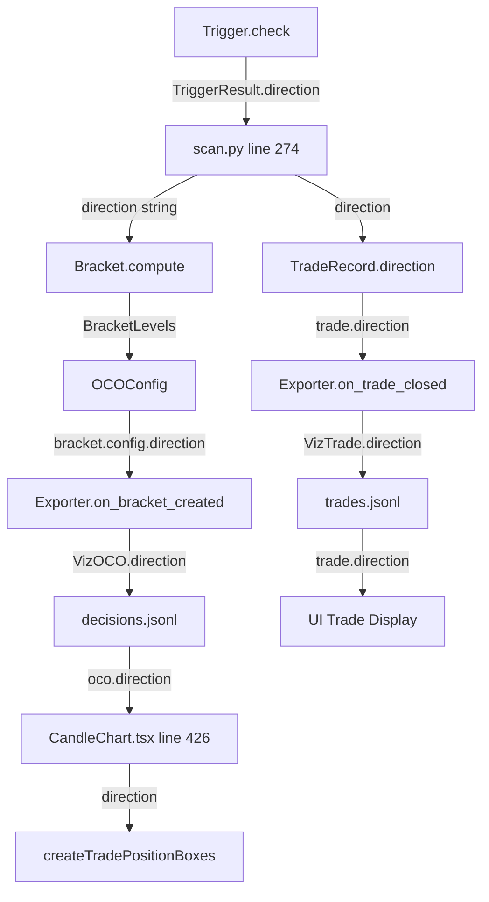

        """
        if not self.config.include_full_series:
            return
        
        bars = []
        for _, row in df.iterrows():
            bars.append({
                'time': row['time'].isoformat() if hasattr(row['time'], 'isoformat') else str(row['time']),
                'open': float(row['open']),
                'high': float(row['high']),
                'low': float(row['low']),
                'close': float(row['close']),
                'volume': float(row['volume']),
            })
        
        self.full_series = VizBarSeries(
            timeframe=timeframe,
            bars=bars,
            trade_markers=[]
        )
    
    def on_decision(
        self,
        decision: DecisionRecord,
        features: Optional[FeatureBundle] = None,
        model_logits: Optional[List[float]] = None,
        model_probs: Optional[List[float]] = None,
        future_1m: Optional[List[List[float]]] = None,
        raw_ohlcv: Optional[List[List[float]]] = None,
        indicators: Optional[Dict[str, float]] = None
    ):
        """Record a decision point."""
        viz_decision = VizDecision(
            decision_id=decision.decision_id,
            timestamp=decision.timestamp.isoformat() if decision.timestamp else None,
            bar_idx=decision.bar_idx,
            index=self._decision_idx,
            scanner_id=decision.scanner_id,
            scanner_context=decision.scanner_context,
            action=decision.action.value,
            skip_reason=decision.skip_reason.value if decision.skip_reason else "",
            current_price=decision.current_price,
            atr=decision.atr,
            cf_outcome=decision.cf_outcome,
            cf_pnl_dollars=decision.cf_pnl_dollars,
        )
        
        # Add model outputs
        if self.config.include_model_outputs:
            viz_decision.model_logits = model_logits
            viz_decision.model_probs = model_probs
        
        # Add window data - output even if features is sparse/dummy
        # The key fields for UI are raw_ohlcv_1m and indicators
        if self.config.include_windows and (raw_ohlcv or indicators):
            viz_decision.window = VizWindow(
                x_price_1m=features.x_price_1m.tolist() if features and features.x_price_1m is not None else [],
                x_price_5m=features.x_price_5m.tolist() if features and features.x_price_5m is not None else [],
                x_price_15m=features.x_price_15m.tolist() if features and features.x_price_15m is not None else [],
                x_context=features.x_context.tolist() if features and features.x_context is not None else [],
                raw_ohlcv_1m=raw_ohlcv or [],
                future_price_1m=future_1m or [],
                indicators=indicators or {}
            )
        
        self.decisions.append(viz_decision)
        self._decision_idx += 1
        
        # Update split stats
        if self.splits:
            self.splits[-1].num_decisions += 1
    
    def on_bracket_created(self, decision_id: str, bracket: OCOBracket, contracts: int = 1):
        """
        Record OCO bracket creation.
        
        Args:
            decision_id: Decision ID to link to
            bracket: OCO bracket configuration
            contracts: Number of contracts (REQUIRED, must be calculated via sizing)
        """
        # Use getattr for compatibility with both legacy oco.py and unified oco_engine.py
        # oco_engine.py doesn't have reference/reference_value fields
        reference_attr = getattr(bracket.config, 'reference', None)
        reference_type = reference_attr.value if reference_attr else "PRICE"
        reference_value = getattr(bracket, 'reference_value', 0.0)
        
        viz_oco = VizOCO(
            entry_price=bracket.entry_price,
            stop_price=bracket.stop_price,
            tp_price=bracket.tp_price,
            entry_type=bracket.config.entry_type,
            direction=bracket.config.direction,
            contracts=contracts,  # REQUIRED: Set from sizing calculation
            reference_type=reference_type,
            reference_value=reference_value,
            atr_at_creation=bracket.atr_at_creation,
            max_bars=bracket.config.max_bars,
            stop_atr=bracket.config.stop_atr,
            tp_multiple=bracket.config.tp_multiple,
        )
        
        self._pending_ocos[decision_id] = viz_oco
        
        # Link back to decision
        for d in reversed(self.decisions):
            if d.decision_id == decision_id:
                d.oco = viz_oco
                break
    
    def on_order_fill(
        self,
        decision_id: str,
        fill_type: str,
        price: float,
        bar_idx: int,
        timestamp: Optional[str] = None
    ):
        """Record an order fill."""
        fill = VizFill(
            order_id=f"{decision_id}_{fill_type}",
            fill_type=fill_type,
            price=price,
            bar_idx=bar_idx,
            timestamp=timestamp,
        )
        
        if decision_id not in self._pending_fills:
            self._pending_fills[decision_id] = []
        self._pending_fills[decision_id].append(fill)
    
    def on_trade_closed(self, trade: TradeRecord):
        """Record a completed trade."""
        # Get contracts from the matching decision's OCO
        contracts = 1  # Default
        for d in reversed(self.decisions):
            if d.decision_id == trade.decision_id and d.oco:
                contracts = d.oco.contracts
                break
        
        viz_trade = VizTrade(
            trade_id=trade.trade_id,
            decision_id=trade.decision_id,
            index=self._trade_idx,
            direction=trade.direction,
            size=contracts,  # Use contracts from OCO
            entry_time=trade.entry_time.isoformat() if trade.entry_time else None,
            entry_bar=trade.entry_bar,
            entry_price=trade.entry_price,
            exit_time=trade.exit_time.isoformat() if trade.exit_time else None,
            exit_bar=trade.exit_bar,
            exit_price=trade.exit_price,
            exit_reason=trade.exit_reason,
            outcome=trade.outcome,
            pnl_points=trade.pnl_points,
            pnl_dollars=trade.pnl_dollars,
            r_multiple=trade.r_multiple,
            bars_held=trade.bars_held,
            mae=trade.mae,
            mfe=trade.mfe,
        )
        
        # Attach fills
        if trade.decision_id in self._pending_fills:
            viz_trade.fills = self._pending_fills.pop(trade.decision_id)
        
        self.trades.append(viz_trade)
        self._trade_idx += 1
        
        # === CRITICAL: Update the matching decision with oco_results ===
        # This is required for position box duration in the UI
        # Format MUST match ifvg_debug: flat dict, not nested
        for d in reversed(self.decisions):
            if d.decision_id == trade.decision_id:
                d.oco_results = {
                    "filled": True,
                    "outcome": trade.outcome,
                    "exit_price": trade.exit_price,
                    "bars_held": trade.bars_held,
                    "pnl_points": trade.pnl_points,
                    "pnl_dollars": trade.pnl_dollars
                }
                break
        
        # Update split stats
        if self.splits:
            self.splits[-1].num_trades += 1
            self.splits[-1].total_pnl += trade.pnl_dollars
    
    def finalize(self, out_dir: Path) -> Path:
        """Write all artifacts to disk."""
        out_dir = Path(out_dir)
        out_dir.mkdir(parents=True, exist_ok=True)
        
        # Update split win rates
        for split in self.splits:
            split_trades = [t for t in self.trades if any(
                d.decision_id == t.decision_id for d in self.decisions
            )]
            wins = sum(1 for t in split_trades if t.outcome == 'WIN')
            split.win_rate = wins / len(split_trades) if split_trades else 0.0
        
        # Build run summary - use timezone-aware datetime for contract compliance
        from datetime import timezone
        now_utc = datetime.now(timezone.utc)
        run = VizRun(
            run_id=self.run_id,
            fingerprint=self._compute_fingerprint(),
            created_at=now_utc.isoformat(),
            config=self.experiment_config,
            splits=self.splits,
            total_decisions=len(self.decisions),
            total_trades=len(self.trades),
            total_pnl=sum(t.pnl_dollars for t in self.trades),
        )
        
        # Write run.json
        run_path = out_dir / "run.json"
        with open(run_path, 'w') as f:
            json.dump(run.to_dict(), f, indent=2, default=str)
        
        # Write decisions.jsonl
        decisions_path = out_dir / "decisions.jsonl"
        with open(decisions_path, 'w') as f:
            for d in self.decisions:
                f.write(json.dumps(d.to_dict(), default=str) + '\n')
        
        # Write trades.jsonl
        trades_path = out_dir / "trades.jsonl"
        with open(trades_path, 'w') as f:
            for t in self.trades:
                f.write(json.dumps(t.to_dict(), default=str) + '\n')
        
        # Write full_series.json if available
        series_path = None
        if self.full_series:
            series_path = out_dir / "full_series.json"
            with open(series_path, 'w') as f:
                json.dump(self.full_series.to_dict(), f, default=str)
        
        # Write manifest.json - includes required 'strategy' field for contract compliance
        strategy_name = self.experiment_config.get('trigger', {}).get('trigger_id', 'unknown')
        manifest = {
            'run_id': self.run_id,
            'fingerprint': self._compute_fingerprint(),
            'config': self.experiment_config,
            'created_at': now_utc.isoformat(),
            'strategy': strategy_name,
            'files': {
                'run': 'run.json',
                'decisions': 'decisions.jsonl',
                'trades': 'trades.jsonl',
            },
            'counts': {
                'decisions': len(self.decisions),
                'trades': len(self.trades),
                'splits': len(self.splits),
            },
            'checksums': {
                'run': self._file_checksum(run_path),
                'decisions': self._file_checksum(decisions_path),
                'trades': self._file_checksum(trades_path),
            }
        }
        
        # Add window bounds and warnings if available
        if self._window_warnings:
            manifest['window_warnings'] = self._window_warnings
        
        # Compute actual window bounds from decisions
        window_bounds = self._compute_window_bounds()
        if window_bounds:
            manifest['window_bounds'] = window_bounds
        
        if series_path:
            manifest['files']['full_series'] = 'full_series.json'
            manifest['checksums']['full_series'] = self._file_checksum(series_path)
        
        manifest_path = out_dir / "manifest.json"
        with open(manifest_path, 'w') as f:
            json.dump(manifest, f, indent=2)
        
        print(f"Viz export complete: {out_dir}")
        print(f"  Decisions: {len(self.decisions)}")
        print(f"  Trades: {len(self.trades)}")
        if self._window_warnings:
            print(f"  Window warnings: {len(self._window_warnings)}")
            for warning in self._window_warnings:
                print(f"    - {warning}")
        
        return out_dir
    
    def _compute_window_bounds(self) -> Optional[Dict[str, Any]]:
        """
        Compute actual window bounds from decisions with windows.
        
        Returns dict with window_start, window_end, and policy compliance info.
        """
        decisions_with_windows = [d for d in self.decisions if d.window and d.window.raw_ohlcv_1m]
        if not decisions_with_windows:
            return None
        
        # Find min/max timestamps across all windows
        all_times = []
        for d in decisions_with_windows:
            if d.window.raw_ohlcv_1m:
                # Handle both dict and list formats
                for bar in d.window.raw_ohlcv_1m:
                    if isinstance(bar, dict) and 'time' in bar:
                        all_times.append(bar['time'])
        
        if not all_times:
            return None
        
        return {
            'window_start': min(all_times),
            'window_end': max(all_times),
            'decisions_with_windows': len(decisions_with_windows),
        }
    
    def _compute_fingerprint(self) -> str:
        """Compute a fingerprint for this run."""
        content = json.dumps(self.experiment_config, sort_keys=True, default=str)
        return hashlib.sha256(content.encode()).hexdigest()[:16]
    
    def _file_checksum(self, path: Path) -> str:
        """Compute SHA256 checksum of a file."""
        with open(path, 'rb') as f:
            return hashlib.sha256(f.read()).hexdigest()[:16]

```

### src/viz/schema.py

```python
"""
Viz Schema
Dataclasses for visualization export.
"""

from dataclasses import dataclass, field
from typing import Dict, Any, Optional, List
import pandas as pd
import numpy as np


@dataclass
class VizWindow:
    """
    OHLCV windows captured at decision time.
    Used by the UI to render "what the model saw".
    """
    # Normalized model inputs (for "Model View")
    x_price_1m: List[List[float]] = field(default_factory=list)  # (lookback, 5)
    x_price_5m: List[List[float]] = field(default_factory=list)
    x_price_15m: List[List[float]] = field(default_factory=list)
    x_price_1h: List[List[float]] = field(default_factory=list)   # 1-hour timeframe
    x_price_4h: List[List[float]] = field(default_factory=list)   # 4-hour timeframe
    x_context: List[float] = field(default_factory=list)
    
    # Raw OHLCV for chart display (not normalized)
    raw_ohlcv_1m: List[List[float]] = field(default_factory=list)  # [o, h, l, c, v] per bar
    
    # Future context for post-analysis
    future_price_1m: List[List[float]] = field(default_factory=list)
    
    # Indicators at decision time
    indicators: Dict[str, float] = field(default_factory=dict)  # ema, atr, rsi, etc.
    
    # Normalization metadata for denormalization in UI
    norm_method: str = "zscore"
    norm_params: Dict[str, float] = field(default_factory=dict)
    
    def to_dict(self) -> Dict[str, Any]:
        return {
            'x_price_1m': self.x_price_1m,
            'x_price_5m': self.x_price_5m,
            'x_price_15m': self.x_price_15m,
            'x_price_1h': self.x_price_1h,
            'x_price_4h': self.x_price_4h,
            'x_context': self.x_context,
            'raw_ohlcv_1m': self.raw_ohlcv_1m,
            'future_price_1m': self.future_price_1m,
            'indicators': self.indicators,
            'norm_method': self.norm_method,
            'norm_params': self.norm_params,
        }


@dataclass
class VizOCO:
    """
    OCO bracket snapshot for visualization.
    """
    entry_price: float = 0.0
    stop_price: float = 0.0
    tp_price: float = 0.0
    entry_type: str = "LIMIT"
    direction: str = "LONG"
    contracts: int = 1  # Number of contracts for position sizing
    
    reference_type: str = "PRICE"
    reference_value: float = 0.0
    atr_at_creation: float = 0.0
    max_bars: int = 200
    
    # Config values for tooltip display
    stop_atr: float = 1.0
    tp_multiple: float = 1.4
    
    def to_dict(self) -> Dict[str, Any]:
        return {
            'entry_price': self.entry_price,
            'stop_price': self.stop_price,
            'tp_price': self.tp_price,
            'entry_type': self.entry_type,
            'direction': self.direction,
            'contracts': self.contracts,
            'reference_type': self.reference_type,
            'reference_value': self.reference_value,
            'atr_at_creation': self.atr_at_creation,
            'max_bars': self.max_bars,
            'stop_atr': self.stop_atr,
            'tp_multiple': self.tp_multiple,
        }


@dataclass
class VizFill:
    """
    Order fill event.
    """
    order_id: str = ""
    fill_type: str = ""  # 'ENTRY', 'SL', 'TP', 'TIMEOUT'
    price: float = 0.0
    bar_idx: int = 0
    timestamp: Optional[str] = None
    
    def to_dict(self) -> Dict[str, Any]:
        return {
            'order_id': self.order_id,
            'fill_type': self.fill_type,
            'price': self.price,
            'bar_idx': self.bar_idx,
            'timestamp': self.timestamp,
        }


@dataclass
class VizDecision:
    """
    Decision point for visualization.
    References DecisionRecord but adds viz-specific fields.
    """
    decision_id: str = ""
    timestamp: Optional[str] = None
    bar_idx: int = 0
    index: int = 0  # For paging (Next/Prev)
    
    scanner_id: str = ""
    scanner_context: Dict[str, Any] = field(default_factory=dict)
    
    action: str = "NO_TRADE"
    skip_reason: str = ""
    
    # Market state at decision
    current_price: float = 0.0
    atr: float = 0.0
    
    # Counterfactual label
    cf_outcome: str = ""
    cf_pnl_dollars: float = 0.0
    
    # Model outputs (if available)
    model_logits: Optional[List[float]] = None
    model_probs: Optional[List[float]] = None
    
    # Window (if include_windows=True)
    window: Optional[VizWindow] = None
    
    # OCO (if PLACE_ORDER)
    oco: Optional[VizOCO] = None
    
    # OCO results for position box duration - UI reads bars_held from here
    oco_results: Optional[Dict[str, Dict[str, Any]]] = None
    
    def to_dict(self) -> Dict[str, Any]:
        return {
            'decision_id': self.decision_id,
            'timestamp': self.timestamp,
            'bar_idx': self.bar_idx,
            'index': self.index,
            'scanner_id': self.scanner_id,
            'scanner_context': self.scanner_context,
            'action': self.action,
            'skip_reason': self.skip_reason,
            'current_price': self.current_price,
            'atr': self.atr,
            'cf_outcome': self.cf_outcome,
            'cf_pnl_dollars': self.cf_pnl_dollars,
            'model_logits': self.model_logits,
            'model_probs': self.model_probs,
            'window': self.window.to_dict() if self.window else None,
            'oco': self.oco.to_dict() if self.oco else None,
            'oco_results': self.oco_results,
        }


@dataclass
class VizTrade:
    """
    Completed trade for visualization.
    Reuses TradeRecord.to_dict() fields, adds lifecycle.
    """
    trade_id: str = ""
    decision_id: str = ""
    index: int = 0  # For paging
    
    direction: str = ""
    size: int = 1  # Contracts
    
    # Entry
    entry_time: Optional[str] = None
    entry_bar: int = 0
    entry_price: float = 0.0
    
    # Exit
    exit_time: Optional[str] = None
    exit_bar: int = 0
    exit_price: float = 0.0
    exit_reason: str = ""
    
    # Outcome
    outcome: str = ""
    pnl_points: float = 0.0
    pnl_dollars: float = 0.0
    r_multiple: float = 0.0
    
    # Analytics
    bars_held: int = 0
    mae: float = 0.0
    mfe: float = 0.0
    
    # Lifecycle events
    fills: List[VizFill] = field(default_factory=list)
    
    def to_dict(self) -> Dict[str, Any]:
        return {
            'trade_id': self.trade_id,
            'decision_id': self.decision_id,
            'index': self.index,
            'direction': self.direction,
            'size': self.size,
            'entry_time': self.entry_time,
            'entry_bar': self.entry_bar,
            'entry_price': self.entry_price,
            'exit_time': self.exit_time,
            'exit_bar': self.exit_bar,
            'exit_price': self.exit_price,
            'exit_reason': self.exit_reason,
            'outcome': self.outcome,
            'pnl_points': self.pnl_points,
            'pnl_dollars': self.pnl_dollars,
            'r_multiple': self.r_multiple,
            'bars_held': self.bars_held,
            'mae': self.mae,
            'mfe': self.mfe,
            'fills': [f.to_dict() for f in self.fills],
        }


@dataclass
class VizBarSeries:
    """
    Full OHLCV series for overview mode.
    """
    timeframe: str = "1m"
    bars: List[Dict[str, Any]] = field(default_factory=list)  # [{time, o, h, l, c, v}, ...]
    
    # Trade markers for overlay
    trade_markers: List[Dict[str, Any]] = field(default_factory=list)  # [{bar_idx, type, price}, ...]
    
    def to_dict(self) -> Dict[str, Any]:
        return {
            'timeframe': self.timeframe,
            'bars': self.bars,
            'trade_markers': self.trade_markers,
        }


@dataclass
class VizSplit:
    """
    Single walk-forward split summary.
    """
    split_id: str = ""
    split_idx: int = 0
    
    train_start: Optional[str] = None
    train_end: Optional[str] = None
    test_start: Optional[str] = None
    test_end: Optional[str] = None
    
    # Counts
    num_decisions: int = 0
    num_trades: int = 0
    
    # Performance
    total_pnl: float = 0.0
    win_rate: float = 0.0
    
    def to_dict(self) -> Dict[str, Any]:
        return {
            'split_id': self.split_id,
            'split_idx': self.split_idx,
            'train_start': self.train_start,
            'train_end': self.train_end,
            'test_start': self.test_start,
            'test_end': self.test_end,
            'num_decisions': self.num_decisions,
            'num_trades': self.num_trades,
            'total_pnl': self.total_pnl,
            'win_rate': self.win_rate,
        }


@dataclass
class VizRun:
    """
    Top-level run metadata.
    """
    run_id: str = ""
    fingerprint: str = ""
    created_at: Optional[str] = None
    
    # Config snapshot
    config: Dict[str, Any] = field(default_factory=dict)
    
    # Splits summary
    splits: List[VizSplit] = field(default_factory=list)
    
    # Totals
    total_decisions: int = 0
    total_trades: int = 0
    total_pnl: float = 0.0
    
    def to_dict(self) -> Dict[str, Any]:
        return {
            'run_id': self.run_id,
            'fingerprint': self.fingerprint,
            'created_at': self.created_at,
            'config': self.config,
            'splits': [s.to_dict() for s in self.splits],
            'total_decisions': self.total_decisions,
            'total_trades': self.total_trades,
            'total_pnl': self.total_pnl,
        }

```

### src/viz/window_utils.py

```python
"""
Window utilities for enforcing 2-hour policy.

According to ARCHITECTURE_AGREEMENT.md Section 3:
- Exporter MUST guarantee 2 hours of context before first trade entry
- Exporter MUST guarantee 2 hours after last exit
- This is enforced at exporter level, not UI hack
"""

import pandas as pd
from typing import List, Dict, Any, Optional, Tuple
from datetime import timedelta


def enforce_2hour_window(
    df_1m: pd.DataFrame,
    entry_time: pd.Timestamp,
    exit_time: Optional[pd.Timestamp] = None,
    bars_held: int = 0
) -> Tuple[List[Dict[str, Any]], Optional[str]]:
    """
    Enforce 2-hour window policy for OHLCV data.
    
    Args:
        df_1m: DataFrame with 1-minute OHLCV data
        entry_time: Trade entry time
        exit_time: Trade exit time (if known)
        bars_held: Number of bars held (used if exit_time not provided)
    
    Returns:
        Tuple of (raw_ohlcv_list, warning_message)
        - raw_ohlcv_list: List of dicts with time, open, high, low, close, volume
        - warning_message: String if data is missing, None otherwise
    
    Policy:
        window_start = entry_time - 2 hours
        window_end = exit_time + 2 hours (or entry_time + bars_held + 2 hours)
    """
    # Compute window bounds
    window_start = entry_time - timedelta(hours=2)
    
    if exit_time is not None:
        window_end = exit_time + timedelta(hours=2)
    else:
        # Estimate exit time from bars_held (assume 1-minute bars)
        exit_time_est = entry_time + timedelta(minutes=int(bars_held))
        window_end = exit_time_est + timedelta(hours=2)
    
    # Filter data
    if 'time' not in df_1m.columns:
        return [], "DataFrame missing 'time' column. Expected DataFrame with columns: time, open, high, low, close, volume"
    
    mask = (df_1m['time'] >= window_start) & (df_1m['time'] <= window_end)
    window_df = df_1m.loc[mask]
    
    # Check if we have full coverage
    warnings = []
    if window_df.empty:
        warnings.append(f"No data available for window {window_start} to {window_end}")
    else:
        # Check start coverage
        if window_df['time'].min() > window_start:
            missing_start = (window_df['time'].min() - window_start).total_seconds() / 60
            warnings.append(f"Missing {missing_start:.0f} minutes at start of 2h window")
        # Check end coverage (not elif - check BOTH)
        if window_df['time'].max() < window_end:
            missing_end = (window_end - window_df['time'].max()).total_seconds() / 60
            warnings.append(f"Missing {missing_end:.0f} minutes at end of 2h window")
    
    warning = "; ".join(warnings) if warnings else None
    
    # Format as list of dicts
    raw_ohlcv = [
        {
            "time": row['time'].isoformat() if hasattr(row['time'], 'isoformat') else str(row['time']),
            "open": float(row['open']),
            "high": float(row['high']),
            "low": float(row['low']),
            "close": float(row['close']),
            "volume": int(row.get('volume', 0))
        }
        for _, row in window_df.iterrows()
    ]
    
    return raw_ohlcv, warning


def get_window_bounds_from_trades(
    trades: List[Dict[str, Any]]
) -> Optional[Dict[str, str]]:
    """
    Compute required window bounds from a list of trades.
    
    Args:
        trades: List of trade dicts with entry_time and exit_time
    
    Returns:
        Dict with window_start and window_end, or None if no trades
    """
    if not trades:
        return None
    
    # Find earliest entry and latest exit
    entry_times = []
    exit_times = []
    
    for trade in trades:
        if 'entry_time' in trade and trade['entry_time']:
            entry_times.append(pd.Timestamp(trade['entry_time']))
        if 'exit_time' in trade and trade['exit_time']:
            exit_times.append(pd.Timestamp(trade['exit_time']))
    
    if not entry_times or not exit_times:
        return None
    
    first_entry = min(entry_times)
    last_exit = max(exit_times)
    
    # Apply 2-hour policy
    window_start = first_entry - timedelta(hours=2)
    window_end = last_exit + timedelta(hours=2)
    
    return {
        'window_start': window_start.isoformat(),
        'window_end': window_end.isoformat(),
        'first_entry': first_entry.isoformat(),
        'last_exit': last_exit.isoformat(),
    }

```

### start.sh

```bash
#!/bin/bash
# start.sh - Start mlang2 backend and frontend servers
# Usage: ./start.sh

set -e

echo "=============================================="
echo "  MLang2 - Starting Services"
echo "=============================================="

# Load environment variables
if [ -f src/.env.local ]; then
    echo "[1] Loading src/.env.local..."
    export $(cat src/.env.local | grep -v '^#' | xargs)
elif [ -f .env.local ]; then
    echo "[1] Loading .env.local..."
    export $(cat .env.local | grep -v '^#' | xargs)
else
    echo "[!] Warning: No .env.local found. GEMINI_API_KEY may not be set."
fi

# Kill existing processes aggressively
echo "[2] Killing all existing servers..."

# Detect OS and use appropriate kill commands
if [[ "$OSTYPE" == "msys" || "$OSTYPE" == "win32" ]]; then
    # Windows
    taskkill //F //IM python.exe 2>/dev/null || true
    taskkill //F //IM pythonw.exe 2>/dev/null || true
    taskkill //F //IM node.exe 2>/dev/null || true
    
    # Also find and kill whatever is holding port 8000/8001 specifically
    for port in 8000 8001; do
        pid=$(netstat -ano | grep ":$port" | grep "LISTEN" | awk '{print $5}' | head -n 1)
        if [ -n "$pid" ]; then
            echo "    Killing process $pid on port $port..."
            taskkill //F //PID $pid 2>/dev/null || true
        fi
    done
else
    # Unix/Linux/Mac
    # Kill uvicorn/FastAPI processes
    pkill -f "uvicorn.*src.server.main" || true
    pkill -f "python.*src.server.main" || true
    
    # Kill vite/npm dev server processes
    pkill -f "vite" || true
    pkill -f "npm.*run.*dev" || true
    
    # Kill any process listening on ports 8000, 8001, 3000
    lsof -ti:8000 | xargs kill -9 2>/dev/null || true
    lsof -ti:8001 | xargs kill -9 2>/dev/null || true
    lsof -ti:3000 | xargs kill -9 2>/dev/null || true
fi

# Wait for ports to clear
echo "    Waiting for ports to clear..."
sleep 2

# Check if port 8000 is available, fallback to 8001
BACKEND_PORT=8000
if command -v lsof &> /dev/null; then
    # Unix/Linux/Mac with lsof
    if lsof -Pi :8000 -sTCP:LISTEN -t >/dev/null 2>&1; then
        echo "    Port 8000 busy, using 8001..."
        BACKEND_PORT=8001
    fi
elif command -v netstat &> /dev/null; then
    # Fallback to netstat
    if netstat -ano 2>/dev/null | grep -q ":8000.*LISTEN\|:8000.*ESTABLISHED\|:8000.*FIN_WAIT"; then
        echo "    Port 8000 busy, using 8001..."
        BACKEND_PORT=8001
    fi
fi

# Start backend
echo "[3] Starting FastAPI backend on port $BACKEND_PORT..."
python -m uvicorn src.server.main:app --host 0.0.0.0 --port $BACKEND_PORT &
BACKEND_PID=$!

# Wait for backend to be ready
echo "    Waiting for backend..."
for i in {1..30}; do
    if curl -s http://localhost:$BACKEND_PORT/health > /dev/null 2>&1; then
        echo "    Backend is ready on port $BACKEND_PORT!"
        break
    fi
    sleep 1
done

# Start frontend
echo "[4] Starting Vite frontend on port 3000..."
npm run dev &
FRONTEND_PID=$!

# Wait for frontend
sleep 2

echo ""
echo "=============================================="
echo "  Services Started!"
echo "  Backend:  http://localhost:$BACKEND_PORT"
echo "  Frontend: http://localhost:3000"
echo "=============================================="
echo ""
echo "Press Ctrl+C to stop all services."
echo ""

# Cleanup function
cleanup() {
    echo ""
    echo "Stopping services..."
    kill $BACKEND_PID 2>/dev/null || true
    kill $FRONTEND_PID 2>/dev/null || true
    
    # Detect OS and use appropriate kill commands
    if [[ "$OSTYPE" == "msys" || "$OSTYPE" == "win32" ]]; then
        taskkill //F //IM python.exe 2>/dev/null || true
        taskkill //F //IM node.exe 2>/dev/null || true
    else
        pkill -f "uvicorn.*src.server.main" || true
        pkill -f "vite" || true
    fi
    exit 0
}

trap cleanup INT TERM

# Wait for Ctrl+C
wait

```

### tests/test_agent_integration.py

```python
#!/usr/bin/env python3
"""
Agent Integration Test

Tests the full Agent research cycle:
1. Query DB for existing strategies
2. Run a scan to find patterns
3. Train a model from scan results  
4. Simulate with the trained model
5. Store results to DB
6. Query DB to confirm storage

This validates all infrastructure components work together.

Run:
    python tests/test_agent_integration.py
"""

import sys
from pathlib import Path
sys.path.insert(0, str(Path(__file__).parent.parent))

import json
import time
from datetime import datetime


def test_full_agent_cycle():
    """
    Simulate what an Agent would do to find a profitable strategy.
    """
    print("=" * 70)
    print("AGENT INTEGRATION TEST - Full Research Cycle")
    print("=" * 70)
    
    # =========================================================================
    # Step 1: Query existing experiments
    # =========================================================================
    print("\n[1/6] Querying ExperimentDB for existing strategies...")
    
    from src.storage import ExperimentDB
    db = ExperimentDB()
    
    existing_count = db.count()
    print(f"      Found {existing_count} existing experiments")
    
    if existing_count > 0:
        best = db.query_best("win_rate", min_trades=1, top_k=3)
        print("      Top 3 by win_rate:")
        for exp in best:
            print(f"        - {exp['run_id']}: {exp['win_rate']:.1%} ({exp['total_trades']} trades)")
    
    # =========================================================================
    # Step 2: Check for scan data (or use existing)
    # =========================================================================
    print("\n[2/6] Looking for scan data...")
    
    from src.config import RESULTS_DIR
    
    # Find any existing scan with records
    scan_run_id = None
    records_file = None
    
    for run_dir in RESULTS_DIR.iterdir():
        if run_dir.is_dir():
            for candidate in ["records.jsonl", "decisions.jsonl"]:
                f = run_dir / candidate
                if f.exists():
                    # Check it has records
                    with open(f) as file:
                        lines = file.readlines()
                    if len(lines) >= 20:  # Need at least 20 for training
                        scan_run_id = run_dir.name
                        records_file = f
                        break
        if scan_run_id:
            break
    
    if scan_run_id:
        print(f"      Found existing scan: {scan_run_id}")
        with open(records_file) as f:
            record_count = sum(1 for _ in f)
        print(f"      Records: {record_count}")
    else:
        print("      No scan data found. Skipping train step.")
        print("      (Run a scan first: python scripts/run_or_multi_oco.py)")
        return {"success": False, "reason": "No scan data available"}
    
    # =========================================================================
    # Step 3: Train model from scan (using the training function directly)
    # =========================================================================
    print("\n[3/6] Training model from scan data...")
    
    model_name = f"test_integration_{datetime.now().strftime('%H%M%S')}"
    model_path = Path(f"models/{model_name}.pth")
    
    # Load and process records (same as /agent/train-from-scan does)
    from scripts.train_ifvg_4class import IFVG4ClassCNN, IFVG4ClassDataset, train_model
    import torch
    from torch.utils.data import DataLoader, random_split
    
    records = []
    with open(records_file) as f:
        for line in f:
            records.append(json.loads(line))
    
    dataset = IFVG4ClassDataset(records, lookback=30)
    if len(dataset) < 10:
        print("      Not enough samples for training")
        return {"success": False, "reason": "Not enough training samples"}
    
    train_size = int(0.8 * len(dataset))
    val_size = len(dataset) - train_size
    train_ds, val_ds = random_split(dataset, [train_size, val_size])
    train_loader = DataLoader(train_ds, batch_size=16, shuffle=True)
    val_loader = DataLoader(val_ds, batch_size=16)
    
    print(f"      Training on {len(train_ds)} samples (val: {len(val_ds)})...")
    
    model = IFVG4ClassCNN()
    device = torch.device('cuda' if torch.cuda.is_available() else 'cpu')
    # Quick training for test (10 epochs instead of 50)
    best_state, best_acc = train_model(model, train_loader, val_loader, 10, 0.001, device)
    
    # Save model
    Path('models').mkdir(exist_ok=True)
    torch.save(best_state, model_path)
    print(f"      Model saved: {model_path}")
    print(f"      Accuracy: {best_acc:.1%}")
    
    # =========================================================================
    # Step 4: Store training to ExperimentDB
    # =========================================================================
    print("\n[4/6] Storing training result to ExperimentDB...")
    
    db.store_run(
        run_id=f"train_{model_name}",
        strategy="integration_test",
        config={
            "scan_run_id": scan_run_id,
            "epochs": 10,
            "lookback": 30,
        },
        metrics={
            "total_trades": len(train_ds),
            "wins": int(len(train_ds) * best_acc),
            "losses": int(len(train_ds) * (1 - best_acc)),
            "win_rate": best_acc,
            "total_pnl": 0,
        },
        model_path=str(model_path)
    )
    print(f"      Stored: train_{model_name}")
    
    # =========================================================================
    # Step 5: Run simulation with trained model
    # =========================================================================
    print("\n[5/6] Running simulation with trained model...")
    
    from tests.test_backend_simulation import run_simulation
    
    sim_results = run_simulation(
        model_path=str(model_path),
        days=2,
        threshold=0.2,
        verbose=False
    )
    
    print(f"      Triggers: {sim_results['triggers']}")
    print(f"      Trades: {sim_results['trades']}")
    print(f"      Win Rate: {sim_results['win_rate']:.1%}")
    print(f"      Total PnL: ${sim_results['total_pnl']:.2f}")
    
    # Store simulation result
    if sim_results['trades'] > 0:
        db.store_run(
            run_id=f"sim_{model_name}",
            strategy="simulation_test",
            config={
                "model_id": model_name,
                "threshold": 0.2,
                "days": 2,
            },
            metrics={
                "total_trades": sim_results['trades'],
                "wins": sim_results['wins'],
                "losses": sim_results['losses'],
                "win_rate": sim_results['win_rate'],
                "total_pnl": sim_results['total_pnl'],
                "avg_pnl_per_trade": sim_results['total_pnl'] / max(1, sim_results['trades']),
            },
            model_path=str(model_path)
        )
        print(f"      Stored: sim_{model_name}")
    
    # =========================================================================
    # Step 6: Query DB to confirm full cycle
    # =========================================================================
    print("\n[6/6] Confirming experiments in database...")
    
    final_count = db.count()
    print(f"      Total experiments: {final_count} (was {existing_count})")
    
    # Query our new experiments
    train_exp = db.get_run(f"train_{model_name}")
    sim_exp = db.get_run(f"sim_{model_name}")
    
    if train_exp:
        print(f"      [OK] Training result found: {train_exp['win_rate']:.1%} accuracy")
    if sim_exp:
        print(f"      [OK] Simulation result found: {sim_exp['win_rate']:.1%} win rate, ${sim_exp['total_pnl']:.2f}")
    
    # =========================================================================
    # Summary
    # =========================================================================
    print("\n" + "=" * 70)
    print("INTEGRATION TEST COMPLETE")
    print("=" * 70)
    print()
    print("[OK] Query existing experiments")
    print("[OK] Found scan data")
    print("[OK] Trained model")
    print("[OK] Stored training to DB")
    print("[OK] Ran simulation")
    print("[OK] Stored simulation to DB")
    print("[OK] Queried results from DB")
    print()
    print("The Agent can now perform the full research cycle!")
    
    return {
        "success": True,
        "model_name": model_name,
        "training_accuracy": best_acc,
        "simulation_win_rate": sim_results['win_rate'],
        "simulation_pnl": sim_results['total_pnl'],
        "experiments_added": final_count - existing_count,
    }


if __name__ == "__main__":
    result = test_full_agent_cycle()
    print("\nResult:", json.dumps(result, indent=2))

```

### tests/test_backend_simulation.py

```python
#!/usr/bin/env python3
"""
Backend Simulation Test

Mirrors what the frontend SimulationView does:
1. Load market data
2. Step through bars
3. Call CNN inference every N bars
4. Manage OCO brackets (entry, SL, TP)
5. Track wins/losses

Run:
    python tests/test_backend_simulation.py
"""

import sys
from pathlib import Path
sys.path.insert(0, str(Path(__file__).parent.parent))

import json
import numpy as np
from dataclasses import dataclass
from typing import Optional, List, Dict


@dataclass
class OCOBracket:
    """OCO bracket tracking - same as frontend."""
    entry: float
    stop: float
    tp: float
    start_time: float
    direction: str  # 'LONG' or 'SHORT'


@dataclass
class Trade:
    """Completed trade record."""
    entry: float
    exit: float
    direction: str
    outcome: str  # 'WIN' or 'LOSS'
    bars_held: int
    pnl: float


def normalize_ohlcv(ohlcv_array):
    """
    Normalize OHLCV - DELEGATES TO UNIFIED ENGINE.
    
    For new code, use:
        from src.features.engine import normalize_ohlcv_window
    """
    from src.features.engine import normalize_ohlcv_window
    return normalize_ohlcv_window(ohlcv_array)


def run_simulation(
    model_path: str = "models/ifvg_4class_cnn.pth",
    start_date: str = None,
    days: int = 7,
    threshold: float = 0.35,
    stop_atr: float = 2.0,
    tp_atr: float = 4.0,
    lookback: int = 30,
    infer_every: int = 5,
    verbose: bool = True
) -> Dict:
    """
    Run simulation matching frontend logic.
    
    Returns summary of trades.
    """
    from src.data.loader import load_continuous_contract
    from src.models.model_registry_init import IFVG4ClassWrapper
    
    print("=" * 60)
    print("Backend Simulation Test")
    print("=" * 60)
    
    # Load model via registry wrapper
    print(f"\n[1] Loading model: {model_path}")
    model = IFVG4ClassWrapper(model_path=model_path)
    print("    Model loaded OK")
    
    # Load market data
    print("\n[2] Loading market data...")
    df = load_continuous_contract()
    
    if start_date:
        import pandas as pd
        start_dt = pd.Timestamp(start_date)
        if start_dt.tzinfo is None:
            start_dt = start_dt.tz_localize('America/New_York')
        df = df[df['time'] >= start_dt]
    
    # Limit to N days
    if len(df) > days * 390:  # ~390 bars per day
        df = df.head(days * 390)
    
    bars = df[['open', 'high', 'low', 'close', 'volume']].values
    times = df['time'].values
    
    print(f"    Loaded {len(bars)} bars")
    
    # Simulation state
    active_oco: Optional[OCOBracket] = None
    trades: List[Trade] = []
    triggers = 0
    
    print(f"\n[3] Running simulation (threshold={threshold}, stop={stop_atr}ATR, tp={tp_atr}ATR)")
    print("-" * 60)
    
    for idx in range(lookback, len(bars)):
        bar = bars[idx]
        current_open, current_high, current_low, current_close, _ = bar
        
        # Check OCO exit (same as frontend)
        if active_oco is not None:
            outcome = None
            exit_price = 0
            
            if active_oco.direction == 'LONG':
                if current_low <= active_oco.stop:
                    outcome = 'LOSS'
                    exit_price = active_oco.stop
                elif current_high >= active_oco.tp:
                    outcome = 'WIN'
                    exit_price = active_oco.tp
            else:  # SHORT
                if current_high >= active_oco.stop:
                    outcome = 'LOSS'
                    exit_price = active_oco.stop
                elif current_low <= active_oco.tp:
                    outcome = 'WIN'
                    exit_price = active_oco.tp
            
            if outcome:
                is_long = active_oco.direction == 'LONG'
                pnl = (exit_price - active_oco.entry) if is_long else (active_oco.entry - exit_price)
                pnl_dollars = pnl * 50  # MES multiplier
                
                trade = Trade(
                    entry=active_oco.entry,
                    exit=exit_price,
                    direction=active_oco.direction,
                    outcome=outcome,
                    bars_held=1,  # Simplified
                    pnl=pnl_dollars
                )
                trades.append(trade)
                
                if verbose:
                    print(f"  [{outcome}] {active_oco.direction} @ {active_oco.entry:.2f} -> {exit_price:.2f} = ${pnl_dollars:+.2f}")
                
                active_oco = None
        
        # Check for trigger (every N bars, no active trade)
        if active_oco is None and idx % infer_every == 0:
            # Build window of last 30 bars
            window = bars[idx - lookback + 1:idx + 1]
            
            # Calculate ATR
            recent = bars[max(0, idx - 13):idx + 1]
            atr = np.mean(recent[:, 1] - recent[:, 2])  # avg(high - low)
            if atr < 0.5:
                atr = current_close * 0.001
            
            # Normalize and predict
            ohlcv_norm = normalize_ohlcv(window)
            result = model.predict({'ohlcv': ohlcv_norm})
            
            # Check trigger
            if result['triggered'] and max(result['long_win_prob'], result['short_win_prob']) >= threshold:
                triggers += 1
                direction = result['direction']
                
                entry = current_close
                if direction == 'LONG':
                    stop = entry - (stop_atr * atr)
                    tp = entry + (tp_atr * atr)
                else:
                    stop = entry + (stop_atr * atr)
                    tp = entry - (tp_atr * atr)
                
                active_oco = OCOBracket(
                    entry=entry,
                    stop=stop,
                    tp=tp,
                    start_time=float(idx),
                    direction=direction
                )
                
                if verbose:
                    prob = result['long_win_prob'] if direction == 'LONG' else result['short_win_prob']
                    print(f"  [TRIGGER] {direction} @ {entry:.2f} (prob={prob:.2%}, SL={stop:.2f}, TP={tp:.2f})")
    
    # Summary
    print("-" * 60)
    wins = sum(1 for t in trades if t.outcome == 'WIN')
    losses = len(trades) - wins
    total_pnl = sum(t.pnl for t in trades)
    
    print(f"\n[4] Summary")
    print(f"    Triggers: {triggers}")
    print(f"    Trades:   {len(trades)}")
    print(f"    Wins:     {wins}")
    print(f"    Losses:   {losses}")
    print(f"    Win Rate: {wins/max(1, len(trades)):.1%}")
    print(f"    Total PnL: ${total_pnl:+.2f}")
    
    return {
        'triggers': triggers,
        'trades': len(trades),
        'wins': wins,
        'losses': losses,
        'win_rate': wins / max(1, len(trades)),
        'total_pnl': total_pnl,
        'trade_details': [
            {'entry': t.entry, 'exit': t.exit, 'direction': t.direction, 'outcome': t.outcome, 'pnl': t.pnl}
            for t in trades
        ]
    }


if __name__ == "__main__":
    import argparse
    from datetime import datetime
    
    parser = argparse.ArgumentParser(description="Backend simulation test")
    parser.add_argument("--model", default="models/ifvg_4class_cnn.pth", help="Model path")
    parser.add_argument("--start", default=None, help="Start date (YYYY-MM-DD)")
    parser.add_argument("--days", type=int, default=7, help="Number of days")
    parser.add_argument("--threshold", type=float, default=0.35, help="Trigger threshold")
    parser.add_argument("--stop-atr", type=float, default=2.0, help="Stop loss ATR multiple")
    parser.add_argument("--tp-atr", type=float, default=4.0, help="Take profit ATR multiple")
    parser.add_argument("--save", action="store_true", help="Save results to experiment database")
    parser.add_argument("--run-id", default=None, help="Run ID for saving (auto-generated if not provided)")
    
    args = parser.parse_args()
    
    results = run_simulation(
        model_path=args.model,
        start_date=args.start,
        days=args.days,
        threshold=args.threshold,
        stop_atr=args.stop_atr,
        tp_atr=args.tp_atr
    )
    
    # Optionally save to experiment database
    if args.save and results['trades'] > 0:
        from src.storage import ExperimentDB
        
        run_id = args.run_id or f"sim_{datetime.now().strftime('%Y%m%d_%H%M%S')}"
        config = {
            'model_path': args.model,
            'start_date': args.start,
            'days': args.days,
            'threshold': args.threshold,
            'stop_atr': args.stop_atr,
            'tp_atr': args.tp_atr,
        }
        metrics = {
            'total_trades': results['trades'],
            'wins': results['wins'],
            'losses': results['losses'],
            'win_rate': results['win_rate'],
            'total_pnl': results['total_pnl'],
            'avg_pnl_per_trade': results['total_pnl'] / max(1, results['trades']),
        }
        
        db = ExperimentDB()
        db.store_run(run_id, "backend_simulation", config, metrics, args.model)
        print(f"\n[5] Saved to experiment DB: {run_id}")


```

### tests/test_causal_runner.py

```python
import pytest
import pandas as pd
import numpy as np
from src.sim.causal_runner import CausalExecutor, StepResult
from src.sim.stepper import MarketStepper
from src.sim.account_manager import AccountManager
from src.sim.oco_engine import OCOBracket, OCOStatus
from src.policy.scanners import Scanner, ScanResult
from src.data.loader import load_continuous_contract
from src.data.resample import resample_all_timeframes

class MockScanner(Scanner):
    def __init__(self, triggers_on_indices=[5]):
        self.triggers_on_indices = triggers_on_indices
        self.call_count = 0
        
    @property
    def scanner_id(self) -> str:
        return "MockScanner"
        
    def scan(self, market_state, features):
        self.call_count += 1
        # Trigger on specific call counts
        if self.call_count in self.triggers_on_indices:
            return ScanResult(
                scanner_id=self.scanner_id,
                triggered=True,
                context={'test': True, 'score': 0.9}
            )
        return ScanResult(scanner_id=self.scanner_id, triggered=False)

@pytest.fixture
def real_data():
    # Load real data (slice for speed)
    df = load_continuous_contract()
    df = df.head(500)
    # Resample for higher timeframes
    htf = resample_all_timeframes(df)
    return df, htf['5m'], htf['15m']

def test_causal_executor_real_data_flow(real_data):
    df_1m, df_5m, df_15m = real_data
    
    # Start deeper to allow features
    start_idx = 200
    stepper = MarketStepper(df_1m, start_idx=start_idx, end_idx=start_idx + 50)
    account_manager = AccountManager()
    
    # Trigger on the 5th step from start
    scanner = MockScanner(triggers_on_indices=[5])
    
    executor = CausalExecutor(
        df=df_1m,
        stepper=stepper,
        account_manager=account_manager,
        scanner=scanner,
        df_5m=df_5m,
        df_15m=df_15m
    )
    
    # Step through
    results = []
    triggered = False
    
    for _ in range(10):
        res = executor.step()
        if res:
            results.append(res)
            if res.scanner_triggers:
                triggered = True
                assert len(res.new_orders) == 1
                
    assert len(results) == 10
    assert triggered, "Scanner should have triggered on the 5th step"
    
    # Verify features were computed (check ATR)
    last_res = results[-1]
    assert last_res.atr > 0, "ATR should be computed correctly with real data"
    assert last_res.features is not None

def test_causal_executor_trade_lifecycle(real_data):
    df_1m, df_5m, df_15m = real_data
    
    start_idx = 200
    stepper = MarketStepper(df_1m, start_idx=start_idx, end_idx=start_idx + 100)
    account_manager = AccountManager()
    
    # Trigger immediately on 1st step
    scanner = MockScanner(triggers_on_indices=[1])
    
    executor = CausalExecutor(
        df=df_1m,
        stepper=stepper,
        account_manager=account_manager,
        scanner=scanner,
        df_5m=df_5m,
        df_15m=df_15m
    )
    
    # 1. Trigger Entry
    res1 = executor.step()
    assert res1.new_orders, "Should create order"
    bracket = res1.new_orders[0]
    
    # 2. Step forward until entry fill (usually immediate/next bar for Market)
    filled = False
    for _ in range(5):
        res = executor.step()
        if not res: break
        
        # Check for fills events in the result
        entry_fills = [e for b, e in res.fills if e == 'ENTRY']
        if entry_fills:
            filled = True
            break
            
    assert filled, "Order should fill within a few bars"
    
    # 3. Step forward until exit
    # This might take a while depending on price action.
    # We just want to ensure logic runs without error.
    for _ in range(50):
        res = executor.step()
        if not res: break
        
        exit_fills = [e for b, e in res.fills if e in ['STOP_LOSS', 'TAKE_PROFIT', 'TIMEOUT']]
        if exit_fills:
            # Trade completed
            assert bracket.status in [OCOStatus.CLOSED_SL, OCOStatus.CLOSED_TP, OCOStatus.CLOSED_TIMEOUT]
            return

    # If we get here, trade didn't close in 50 bars, which is fine, 
    # but let's assert the account position open
    acc = account_manager.get_account('default')
    assert len(acc.positions) > 0 or len(acc.closed_positions) > 0

```

### tests/test_golden_runs.py

```python
"""
Tests for Golden Run Validation

Ensures that:
1. Golden runs maintain valid structure
2. New runs can be validated against architectural requirements
3. Regressions are caught before merge
"""

import sys
import json
import tempfile
import unittest
from pathlib import Path

sys.path.insert(0, str(Path(__file__).resolve().parents[1]))

from golden.validator import RunValidator, validate_run_structure, ValidationIssue


class TestGoldenRunValidator(unittest.TestCase):
    """Test the golden run validator itself."""
    
    def setUp(self):
        """Create a temporary directory for test runs."""
        self.temp_dir = tempfile.mkdtemp()
        self.test_run_path = Path(self.temp_dir) / "test_run"
        self.test_run_path.mkdir(parents=True, exist_ok=True)
    
    def tearDown(self):
        """Clean up temporary files."""
        import shutil
        shutil.rmtree(self.temp_dir, ignore_errors=True)
    
    def test_missing_directory(self):
        """Validator should report error if directory doesn't exist."""
        validator = RunValidator(Path("/nonexistent/path"))
        issues = validator.validate()
        
        self.assertTrue(len(issues) > 0)
        self.assertEqual(issues[0].severity, 'ERROR')
        self.assertIn('does not exist', issues[0].message)
    
    def test_missing_required_files(self):
        """Validator should report errors for missing required files."""
        validator = RunValidator(self.test_run_path)
        issues = validator.validate()
        
        errors = [i for i in issues if i.severity == 'ERROR']
        
        # Should report missing manifest, decisions, trades
        self.assertTrue(len(errors) >= 3)
        
        error_messages = [e.message for e in errors]
        self.assertTrue(any('manifest.json' in m for m in error_messages))
        self.assertTrue(any('decisions.jsonl' in m for m in error_messages))
        self.assertTrue(any('trades.jsonl' in m for m in error_messages))
    
    def test_valid_minimal_run(self):
        """Validator should pass a minimal but valid run."""
        # Create manifest
        manifest = {
            'run_id': 'test_run_001',
            'fingerprint': 'abc123',
            'created_at': '2025-03-17T10:30:00-05:00',
            'config': {},
            'file_inventory': ['manifest.json', 'decisions.jsonl', 'trades.jsonl']
        }
        with open(self.test_run_path / 'manifest.json', 'w') as f:
            json.dump(manifest, f)
        
        # Create empty decisions
        (self.test_run_path / 'decisions.jsonl').touch()
        
        # Create empty trades
        (self.test_run_path / 'trades.jsonl').touch()
        
        validator = RunValidator(self.test_run_path)
        issues = validator.validate()
        
        errors = [i for i in issues if i.severity == 'ERROR']
        self.assertEqual(len(errors), 0, f"Unexpected errors: {errors}")
    
    def test_invalid_manifest_json(self):
        """Validator should report error for invalid JSON in manifest."""
        with open(self.test_run_path / 'manifest.json', 'w') as f:
            f.write("{invalid json")
        
        (self.test_run_path / 'decisions.jsonl').touch()
        (self.test_run_path / 'trades.jsonl').touch()
        
        validator = RunValidator(self.test_run_path)
        issues = validator.validate()
        
        errors = [i for i in issues if i.category == 'manifest' and i.severity == 'ERROR']
        self.assertTrue(len(errors) > 0)
        self.assertTrue(any('Invalid JSON' in e.message for e in errors))
    
    def test_manifest_missing_fields(self):
        """Validator should report errors for missing manifest fields."""
        manifest = {
            'run_id': 'test_run_001'
            # Missing fingerprint, created_at
        }
        with open(self.test_run_path / 'manifest.json', 'w') as f:
            json.dump(manifest, f)
        
        (self.test_run_path / 'decisions.jsonl').touch()
        (self.test_run_path / 'trades.jsonl').touch()
        
        validator = RunValidator(self.test_run_path)
        issues = validator.validate()
        
        errors = [i for i in issues if i.category == 'manifest' and i.severity == 'ERROR']
        
        # Should report missing fingerprint and created_at
        error_messages = [e.message for e in errors]
        self.assertTrue(any('fingerprint' in m for m in error_messages))
        self.assertTrue(any('created_at' in m for m in error_messages))
    
    def test_invalid_timestamp_format(self):
        """Validator should reject timestamps without timezone."""
        manifest = {
            'run_id': 'test_run_001',
            'fingerprint': 'abc123',
            'created_at': '2025-03-17T10:30:00',  # Missing timezone
            'config': {}
        }
        with open(self.test_run_path / 'manifest.json', 'w') as f:
            json.dump(manifest, f)
        
        (self.test_run_path / 'decisions.jsonl').touch()
        (self.test_run_path / 'trades.jsonl').touch()
        
        validator = RunValidator(self.test_run_path)
        issues = validator.validate()
        
        errors = [i for i in issues if i.category == 'manifest' and 'ISO 8601' in i.message]
        self.assertTrue(len(errors) > 0)
    
    def test_decision_with_oco(self):
        """Validator should check OCO structure in decisions."""
        manifest = {
            'run_id': 'test_run_001',
            'fingerprint': 'abc123',
            'created_at': '2025-03-17T10:30:00-05:00',
            'config': {}
        }
        with open(self.test_run_path / 'manifest.json', 'w') as f:
            json.dump(manifest, f)
        
        # Decision with PLACE_ORDER but no oco
        decision = {
            'decision_id': 'dec_001',
            'timestamp': '2025-03-17T10:30:00-05:00',
            'bar_idx': 100,
            'action': 'PLACE_ORDER'
            # Missing oco
        }
        with open(self.test_run_path / 'decisions.jsonl', 'w') as f:
            f.write(json.dumps(decision) + '\n')
        
        (self.test_run_path / 'trades.jsonl').touch()
        
        validator = RunValidator(self.test_run_path)
        issues = validator.validate()
        
        errors = [i for i in issues if i.category == 'decision' and 'oco' in i.message.lower()]
        self.assertTrue(len(errors) > 0)
    
    def test_oco_missing_contracts(self):
        """Validator should report error if OCO missing contracts field."""
        manifest = {
            'run_id': 'test_run_001',
            'fingerprint': 'abc123',
            'created_at': '2025-03-17T10:30:00-05:00',
            'config': {}
        }
        with open(self.test_run_path / 'manifest.json', 'w') as f:
            json.dump(manifest, f)
        
        decision = {
            'decision_id': 'dec_001',
            'timestamp': '2025-03-17T10:30:00-05:00',
            'bar_idx': 100,
            'action': 'PLACE_ORDER',
            'oco': {
                'entry_price': 5000.0,
                'stop_price': 4990.0,
                'tp_price': 5014.0
                # Missing contracts
            }
        }
        with open(self.test_run_path / 'decisions.jsonl', 'w') as f:
            f.write(json.dumps(decision) + '\n')
        
        (self.test_run_path / 'trades.jsonl').touch()
        
        validator = RunValidator(self.test_run_path)
        issues = validator.validate()
        
        errors = [i for i in issues if i.category == 'oco' and 'contracts' in i.message.lower()]
        self.assertTrue(len(errors) > 0)
    
    def test_oco_results_nested_error(self):
        """Validator should detect nested oco_results (common error)."""
        manifest = {
            'run_id': 'test_run_001',
            'fingerprint': 'abc123',
            'created_at': '2025-03-17T10:30:00-05:00',
            'config': {}
        }
        with open(self.test_run_path / 'manifest.json', 'w') as f:
            json.dump(manifest, f)
        
        # WRONG: nested oco_results in oco.results
        decision = {
            'decision_id': 'dec_001',
            'timestamp': '2025-03-17T10:30:00-05:00',
            'bar_idx': 100,
            'action': 'PLACE_ORDER',
            'oco': {
                'entry_price': 5000.0,
                'contracts': 2,
                'results': {  # ❌ WRONG - nested
                    'filled': True,
                    'bars_held': 23
                }
            }
        }
        with open(self.test_run_path / 'decisions.jsonl', 'w') as f:
            f.write(json.dumps(decision) + '\n')
        
        (self.test_run_path / 'trades.jsonl').touch()
        
        validator = RunValidator(self.test_run_path)
        issues = validator.validate()
        
        errors = [i for i in issues if i.category == 'oco' and 'FLAT' in i.message]
        self.assertTrue(len(errors) > 0, "Should detect nested oco_results")
    
    def test_oco_results_flat_valid(self):
        """Validator should accept flat oco_results at decision level."""
        manifest = {
            'run_id': 'test_run_001',
            'fingerprint': 'abc123',
            'created_at': '2025-03-17T10:30:00-05:00',
            'config': {}
        }
        with open(self.test_run_path / 'manifest.json', 'w') as f:
            json.dump(manifest, f)
        
        # CORRECT: flat oco_results at decision level
        decision = {
            'decision_id': 'dec_001',
            'timestamp': '2025-03-17T10:30:00-05:00',
            'bar_idx': 100,
            'action': 'PLACE_ORDER',
            'oco': {
                'entry_price': 5000.0,
                'contracts': 2
            },
            'oco_results': {  # ✅ CORRECT - flat
                'filled': True,
                'bars_held': 23,
                'pnl_dollars': 70.0,
                'outcome': 'WIN'
            }
        }
        with open(self.test_run_path / 'decisions.jsonl', 'w') as f:
            f.write(json.dumps(decision) + '\n')
        
        (self.test_run_path / 'trades.jsonl').touch()
        
        validator = RunValidator(self.test_run_path)
        issues = validator.validate()
        
        # Should have no errors related to oco_results structure
        errors = [i for i in issues if i.severity == 'ERROR' and i.category == 'oco']
        self.assertEqual(len(errors), 0, f"Unexpected OCO errors: {errors}")
    
    def test_trade_structure(self):
        """Validator should check trade structure."""
        manifest = {
            'run_id': 'test_run_001',
            'fingerprint': 'abc123',
            'created_at': '2025-03-17T10:30:00-05:00',
            'config': {}
        }
        with open(self.test_run_path / 'manifest.json', 'w') as f:
            json.dump(manifest, f)
        
        (self.test_run_path / 'decisions.jsonl').touch()
        
        # Trade with all required fields
        trade = {
            'trade_id': 'trade_001',
            'decision_id': 'dec_001',
            'entry_price': 5000.0,
            'exit_price': 5014.0,
            'pnl_dollars': 70.0,
            'outcome': 'WIN',
            'bars_held': 23,
            'entry_time': '2025-03-17T10:30:00-05:00',
            'exit_time': '2025-03-17T11:00:00-05:00',
            'exit_reason': 'TP'
        }
        with open(self.test_run_path / 'trades.jsonl', 'w') as f:
            f.write(json.dumps(trade) + '\n')
        
        validator = RunValidator(self.test_run_path)
        issues = validator.validate()
        
        errors = [i for i in issues if i.severity == 'ERROR' and i.category == 'trade']
        self.assertEqual(len(errors), 0, f"Unexpected trade errors: {errors}")


class TestGoldenRunReference(unittest.TestCase):
    """Test against golden reference runs if they exist."""
    
    def test_golden_ifvg_reference_if_exists(self):
        """Validate golden IFVG reference run if it exists."""
        golden_path = Path(__file__).parent.parent / "golden" / "ifvg_reference"
        
        if not golden_path.exists():
            self.skipTest("Golden IFVG reference not yet created")
        
        issues = validate_run_structure(golden_path)
        
        errors = [i for i in issues if i.severity == 'ERROR']
        self.assertEqual(len(errors), 0, 
            f"Golden reference has errors: {[str(e) for e in errors]}")


class TestArchitecturalInvariants(unittest.TestCase):
    """
    Test architectural invariants from ARCHITECTURE_AGREEMENT.md.
    
    These tests validate the "Phase 6 window policy" and "Phase 5 migration"
    requirements from the problem statement.
    """
    
    def setUp(self):
        """Create a temporary directory for test runs."""
        self.temp_dir = tempfile.mkdtemp()
        self.test_run_path = Path(self.temp_dir) / "test_run"
        self.test_run_path.mkdir(parents=True, exist_ok=True)
    
    def tearDown(self):
        """Clean up temporary files."""
        import shutil
        shutil.rmtree(self.temp_dir, ignore_errors=True)
    
    def test_2hour_window_bounds_in_manifest(self):
        """
        Test: 2h before first entry and 2h after last exit window bounds.
        
        Per problem statement requirement #1:
        - window_start = first_entry_time - 2h
        - window_end = last_exit_time + 2h
        - Manifest should record actual window bounds
        """
        from datetime import datetime, timedelta
        
        # Create minimal manifest with window bounds
        first_entry = datetime.fromisoformat('2025-03-17T10:00:00-05:00')
        last_exit = datetime.fromisoformat('2025-03-17T12:00:00-05:00')
        
        # Expected: 2h before/after
        expected_window_start = first_entry - timedelta(hours=2)
        expected_window_end = last_exit + timedelta(hours=2)
        
        manifest = {
            'run_id': 'test_window',
            'fingerprint': 'abc123',
            'created_at': '2025-03-17T14:00:00-05:00',
            'config': {},
            'window_bounds': {
                'window_start': expected_window_start.isoformat(),
                'window_end': expected_window_end.isoformat(),
                'first_entry': first_entry.isoformat(),
                'last_exit': last_exit.isoformat(),
            }
        }
        with open(self.test_run_path / 'manifest.json', 'w') as f:
            json.dump(manifest, f)
        
        (self.test_run_path / 'decisions.jsonl').touch()
        (self.test_run_path / 'trades.jsonl').touch()
        
        # Validate structure
        validator = RunValidator(self.test_run_path)
        issues = validator.validate()
        errors = [i for i in issues if i.severity == 'ERROR']
        
        # Should not have errors for having window_bounds
        self.assertEqual(len(errors), 0)
        
        # Verify window bounds are correct
        with open(self.test_run_path / 'manifest.json') as f:
            loaded = json.load(f)
        
        self.assertIn('window_bounds', loaded)
        window_start = datetime.fromisoformat(loaded['window_bounds']['window_start'])
        window_end = datetime.fromisoformat(loaded['window_bounds']['window_end'])
        
        # Verify 2-hour policy
        first_entry_loaded = datetime.fromisoformat(loaded['window_bounds']['first_entry'])
        last_exit_loaded = datetime.fromisoformat(loaded['window_bounds']['last_exit'])
        
        self.assertEqual(window_start, first_entry_loaded - timedelta(hours=2))
        self.assertEqual(window_end, last_exit_loaded + timedelta(hours=2))
    
    def test_contracts_present_and_non_one_when_risk_requires(self):
        """
        Test: contracts present + non-1 when risk requires it.
        
        Per problem statement requirement #2:
        - VizOCO.contracts is REQUIRED and missing it breaks UI rendering
        - contracts should NOT default to 1 without calculation
        """
        manifest = {
            'run_id': 'test_contracts',
            'fingerprint': 'abc123',
            'created_at': '2025-03-17T14:00:00-05:00',
            'config': {}
        }
        with open(self.test_run_path / 'manifest.json', 'w') as f:
            json.dump(manifest, f)
        
        # Decision with calculated contracts (not defaulted to 1)
        # Entry=5000, Stop=4990, 10 points risk
        # $300 max risk / (10 points * $5/point) = 6 contracts
        decision = {
            'decision_id': 'dec_contracts',
            'timestamp': '2025-03-17T10:30:00-05:00',
            'bar_idx': 100,
            'action': 'PLACE_ORDER',
            'oco': {
                'entry_price': 5000.0,
                'stop_price': 4990.0,
                'tp_price': 5014.0,
                'contracts': 6,  # REQUIRED: Not defaulted to 1
                'direction': 'LONG'
            }
        }
        with open(self.test_run_path / 'decisions.jsonl', 'w') as f:
            f.write(json.dumps(decision) + '\n')
        
        (self.test_run_path / 'trades.jsonl').touch()
        
        # Load and verify
        with open(self.test_run_path / 'decisions.jsonl') as f:
            loaded_decision = json.loads(f.readline())
        
        self.assertIn('oco', loaded_decision)
        self.assertIn('contracts', loaded_decision['oco'])
        self.assertEqual(loaded_decision['oco']['contracts'], 6)
        self.assertNotEqual(loaded_decision['oco']['contracts'], 1,
            "Contracts should be calculated, not defaulted to 1")
    
    def test_pnl_invariant(self):
        """
        Test: pnl_dollars == pnl_points * point_value * contracts.
        
        Per problem statement requirement #3:
        - Single cost model for all PnL calculations
        - No approximate conversions
        """
        manifest = {
            'run_id': 'test_pnl',
            'fingerprint': 'abc123',
            'created_at': '2025-03-17T14:00:00-05:00',
            'config': {}
        }
        with open(self.test_run_path / 'manifest.json', 'w') as f:
            json.dump(manifest, f)
        
        (self.test_run_path / 'decisions.jsonl').touch()
        
        # Trade with correct PnL calculation
        # Entry=5000, Exit=5010, 10 points profit
        # 6 contracts * 10 points * $5/point = $300 gross
        # Commission = 6 * $1.25 * 2 = $15
        # Net = $285
        trade = {
            'trade_id': 'trade_pnl',
            'decision_id': 'dec_001',
            'entry_price': 5000.0,
            'exit_price': 5010.0,
            'pnl_points': 10.0,
            'pnl_dollars': 285.0,  # Includes commission
            'direction': 'LONG',
            'size': 6,  # contracts
            'outcome': 'WIN',
            'bars_held': 23,
            'entry_time': '2025-03-17T10:30:00-05:00',
            'exit_time': '2025-03-17T11:00:00-05:00',
            'exit_reason': 'TP'
        }
        with open(self.test_run_path / 'trades.jsonl', 'w') as f:
            f.write(json.dumps(trade) + '\n')
        
        # Load and verify invariant (approximately, accounting for commission)
        with open(self.test_run_path / 'trades.jsonl') as f:
            loaded_trade = json.loads(f.readline())
        
        point_value = 5.0  # MES default
        expected_gross_pnl = loaded_trade['pnl_points'] * point_value * loaded_trade['size']
        
        # Should be close (within commission range)
        self.assertAlmostEqual(loaded_trade['pnl_dollars'], 285.0, delta=1.0)
        self.assertGreater(loaded_trade['pnl_dollars'], 0)  # Win should be positive
        
        # Verify not using approximate conversion like "pnl_dollars / 50"
        # If it was approximate, we'd see weird values
        self.assertNotEqual(loaded_trade['pnl_points'], loaded_trade['pnl_dollars'] / 50)
    
    def test_oco_results_filled_status(self):
        """
        Test: stop/TP actually triggering in OCO results for known scenarios.
        
        Per problem statement requirement #5:
        - OCO results should show actual simulation output
        - Not approximate/counterfactual paths
        """
        manifest = {
            'run_id': 'test_oco_filled',
            'fingerprint': 'abc123',
            'created_at': '2025-03-17T14:00:00-05:00',
            'config': {}
        }
        with open(self.test_run_path / 'manifest.json', 'w') as f:
            json.dump(manifest, f)
        
        # Decision with oco_results showing actual fill
        decision = {
            'decision_id': 'dec_filled',
            'timestamp': '2025-03-17T10:30:00-05:00',
            'bar_idx': 100,
            'action': 'PLACE_ORDER',
            'oco': {
                'entry_price': 5000.0,
                'stop_price': 4990.0,
                'tp_price': 5014.0,
                'contracts': 6,
                'direction': 'LONG'
            },
            'oco_results': {  # FLAT, not nested
                'filled': True,
                'outcome': 'TP',  # Take profit triggered
                'exit_price': 5014.0,
                'bars_held': 23,
                'pnl_points': 14.0,
                'pnl_dollars': 405.0  # 6 * 14 * 5 - commission
            }
        }
        with open(self.test_run_path / 'decisions.jsonl', 'w') as f:
            f.write(json.dumps(decision) + '\n')
        
        (self.test_run_path / 'trades.jsonl').touch()
        
        # Load and verify oco_results
        with open(self.test_run_path / 'decisions.jsonl') as f:
            loaded = json.loads(f.readline())
        
        self.assertIn('oco_results', loaded)
        self.assertTrue(loaded['oco_results']['filled'])
        self.assertEqual(loaded['oco_results']['outcome'], 'TP')
        
        # Verify not nested under oco
        self.assertNotIn('results', loaded.get('oco', {}))


if __name__ == "__main__":
    unittest.main()

```

### tests/test_indicators_pro.py

```python
"""
Tests for Professional Trading Indicators

Tests all 6 categories of trading primitives.
"""

import unittest
import pandas as pd
import numpy as np
from datetime import datetime, timedelta

from src.features.indicators_pro import (
    # Bar Measurement
    calculate_heikin_ashi,
    calculate_bar_expansion,
    calculate_average_bar_size,
    # Time Series
    calculate_macd,
    calculate_stochastic,
    calculate_adx,
    calculate_ichimoku,
    # Volume
    calculate_obv,
    calculate_relative_volume,
    calculate_chaikin_money_flow,
    calculate_vwmacd,
    # Levels
    calculate_pivot_points,
    calculate_fibonacci_levels,
    calculate_round_levels,
    # Breakouts
    calculate_donchian_channels,
    detect_channel_breakout,
    detect_momentum_burst,
    # Filters/Risk
    filter_time_of_day,
    calculate_kelly_criterion,
    calculate_position_size,
    check_risk_reward_ratio,
    PivotLevels,
)


class TestBarMeasurement(unittest.TestCase):
    """Test bar measurement primitives."""
    
    def setUp(self):
        """Create sample OHLCV data."""
        dates = pd.date_range('2025-01-01', periods=100, freq='1min')
        np.random.seed(42)
        
        self.df = pd.DataFrame({
            'time': dates,
            'open': 5000 + np.cumsum(np.random.randn(100) * 0.5),
            'high': 5000 + np.cumsum(np.random.randn(100) * 0.5) + 2,
            'low': 5000 + np.cumsum(np.random.randn(100) * 0.5) - 2,
            'close': 5000 + np.cumsum(np.random.randn(100) * 0.5),
            'volume': np.random.randint(1000, 5000, 100)
        })
        self.df['high'] = self.df[['open', 'close', 'high']].max(axis=1) + 1
        self.df['low'] = self.df[['open', 'close', 'low']].min(axis=1) - 1
    
    def test_heikin_ashi(self):
        """Test Heikin-Ashi calculation."""
        ha = calculate_heikin_ashi(self.df)
        
        self.assertEqual(len(ha), len(self.df))
        self.assertIn('ha_open', ha.columns)
        self.assertIn('ha_close', ha.columns)
        self.assertIn('ha_high', ha.columns)
        self.assertIn('ha_low', ha.columns)
        
        # HA High should be >= HA Low
        self.assertTrue((ha['ha_high'] >= ha['ha_low']).all())
    
    def test_bar_expansion(self):
        """Test bar expansion detection."""
        expansion = calculate_bar_expansion(self.df, atr_period=14, threshold=1.5)
        
        self.assertEqual(len(expansion), len(self.df))
        self.assertIsInstance(expansion, pd.Series)
        # Should have some True values
        self.assertTrue(expansion.any())
    
    def test_average_bar_size(self):
        """Test average bar size calculation."""
        avg_size = calculate_average_bar_size(self.df, period=20)
        
        self.assertEqual(len(avg_size), len(self.df))
        # Should be positive
        self.assertTrue((avg_size[20:] > 0).all())


class TestTimeSeries(unittest.TestCase):
    """Test time series primitives."""
    
    def setUp(self):
        """Create sample price data."""
        np.random.seed(42)
        self.close = pd.Series(5000 + np.cumsum(np.random.randn(100) * 0.5))
        self.df = pd.DataFrame({
            'high': self.close + np.random.rand(100) * 2,
            'low': self.close - np.random.rand(100) * 2,
            'close': self.close,
            'volume': np.random.randint(1000, 5000, 100)
        })
    
    def test_macd(self):
        """Test MACD calculation."""
        macd, signal, hist = calculate_macd(self.close)
        
        self.assertEqual(len(macd), len(self.close))
        self.assertEqual(len(signal), len(self.close))
        self.assertEqual(len(hist), len(self.close))
        
        # Histogram = MACD - Signal
        np.testing.assert_array_almost_equal(
            hist.dropna().values,
            (macd - signal).dropna().values,
            decimal=10
        )
    
    def test_stochastic(self):
        """Test Stochastic Oscillator."""
        k, d = calculate_stochastic(self.df)
        
        self.assertEqual(len(k), len(self.df))
        self.assertEqual(len(d), len(self.df))
        
        # Values should be between 0 and 100
        self.assertTrue((k.dropna() >= 0).all())
        self.assertTrue((k.dropna() <= 100).all())
    
    def test_adx(self):
        """Test ADX calculation."""
        adx, plus_di, minus_di = calculate_adx(self.df)
        
        self.assertEqual(len(adx), len(self.df))
        # ADX should be 0-100
        self.assertTrue((adx.dropna() >= 0).all())
        self.assertTrue((adx.dropna() <= 100).all())
    
    def test_ichimoku(self):
        """Test Ichimoku Cloud calculation."""
        cloud = calculate_ichimoku(self.df)
        
        self.assertIn('tenkan', cloud)
        self.assertIn('kijun', cloud)
        self.assertIn('senkou_a', cloud)
        self.assertIn('senkou_b', cloud)
        self.assertIn('chikou', cloud)
        
        # All should have same length
        for key, series in cloud.items():
            self.assertEqual(len(series), len(self.df))


class TestVolume(unittest.TestCase):
    """Test volume primitives."""
    
    def setUp(self):
        """Create sample data."""
        np.random.seed(42)
        close = 5000 + np.cumsum(np.random.randn(100) * 0.5)
        self.df = pd.DataFrame({
            'close': close,
            'high': close + np.abs(np.random.randn(100)) + 1,
            'low': close - np.abs(np.random.randn(100)) - 1,
            'volume': np.random.randint(1000, 5000, 100)
        })
    
    def test_obv(self):
        """Test On-Balance Volume."""
        obv = calculate_obv(self.df)
        
        self.assertEqual(len(obv), len(self.df))
        # First value should be first volume
        self.assertEqual(obv.iloc[0], self.df.iloc[0]['volume'])
    
    def test_relative_volume(self):
        """Test relative volume calculation."""
        rel_vol = calculate_relative_volume(self.df, period=20)
        
        self.assertEqual(len(rel_vol), len(self.df))
        # Should have some values > 1
        self.assertTrue((rel_vol[20:] > 0).all())
    
    def test_chaikin_money_flow(self):
        """Test Chaikin Money Flow."""
        cmf = calculate_chaikin_money_flow(self.df, period=20)
        
        self.assertEqual(len(cmf), len(self.df))
        # CMF should be between -1 and 1
        self.assertTrue((cmf.dropna() >= -1).all())
        self.assertTrue((cmf.dropna() <= 1).all())
    
    def test_vwmacd(self):
        """Test Volume-Weighted MACD."""
        vwmacd, signal, hist = calculate_vwmacd(self.df)
        
        self.assertEqual(len(vwmacd), len(self.df))
        self.assertEqual(len(signal), len(self.df))
        self.assertEqual(len(hist), len(self.df))


class TestLevels(unittest.TestCase):
    """Test levels primitives."""
    
    def test_pivot_points_standard(self):
        """Test standard pivot points."""
        pivots = calculate_pivot_points(5010, 4990, 5000, method='standard')
        
        self.assertIsInstance(pivots, PivotLevels)
        # R levels should be above pivot
        self.assertGreater(pivots.r1, pivots.pivot)
        self.assertGreater(pivots.r2, pivots.r1)
        # S levels should be below pivot
        self.assertLess(pivots.s1, pivots.pivot)
        self.assertLess(pivots.s2, pivots.s1)
    
    def test_pivot_points_woodie(self):
        """Test Woodie pivot points."""
        pivots = calculate_pivot_points(5010, 4990, 5000, method='woodie')
        
        self.assertIsInstance(pivots, PivotLevels)
        self.assertIsNotNone(pivots.pivot)
    
    def test_pivot_points_camarilla(self):
        """Test Camarilla pivot points."""
        pivots = calculate_pivot_points(5010, 4990, 5000, method='camarilla')
        
        self.assertIsInstance(pivots, PivotLevels)
        # Camarilla levels are closer to price
        self.assertLess(abs(pivots.r1 - 5000), 20)
    
    def test_fibonacci_retracement(self):
        """Test Fibonacci retracement levels."""
        fibs = calculate_fibonacci_levels(5100, 5000, direction='retracement')
        
        self.assertIn('38.2', fibs)
        self.assertIn('61.8', fibs)
        # 50% level should be midpoint
        self.assertAlmostEqual(fibs['50.0'], 5050, places=2)
    
    def test_fibonacci_extension(self):
        """Test Fibonacci extension levels."""
        fibs = calculate_fibonacci_levels(5100, 5000, direction='extension')
        
        self.assertIn('161.8', fibs)
        self.assertIn('261.8', fibs)
        # Extension levels should be above swing high
        self.assertGreater(fibs['161.8'], 5100)
    
    def test_round_levels(self):
        """Test round level calculation."""
        levels = calculate_round_levels(5023, increment=50)
        
        self.assertEqual(len(levels), 5)
        # Should include 5000
        self.assertIn(5000, levels)
        # Should be multiples of 50
        for level in levels:
            self.assertEqual(level % 50, 0)


class TestBreakouts(unittest.TestCase):
    """Test breakout primitives."""
    
    def setUp(self):
        """Create sample data."""
        np.random.seed(42)
        close = 5000 + np.cumsum(np.random.randn(100) * 0.5)
        self.df = pd.DataFrame({
            'close': close,
            'high': close + np.abs(np.random.randn(100)) + 1,
            'low': close - np.abs(np.random.randn(100)) - 1,
            'volume': np.random.randint(1000, 5000, 100)
        })
    
    def test_donchian_channels(self):
        """Test Donchian channel calculation."""
        upper, lower, middle = calculate_donchian_channels(self.df, period=20)
        
        self.assertEqual(len(upper), len(self.df))
        # Upper should be >= lower
        self.assertTrue((upper[20:] >= lower[20:]).all())
        # Middle should be average
        np.testing.assert_array_almost_equal(
            middle[20:].values,
            ((upper + lower) / 2)[20:].values
        )
    
    def test_channel_breakout(self):
        """Test channel breakout detection."""
        breakouts = detect_channel_breakout(self.df, period=20)
        
        self.assertEqual(len(breakouts), len(self.df))
        # Should have values in {-1, 0, 1}
        unique_vals = breakouts.unique()
        for val in unique_vals:
            self.assertIn(val, [-1, 0, 1])
    
    def test_momentum_burst(self):
        """Test momentum burst detection."""
        bursts = detect_momentum_burst(self.df)
        
        self.assertEqual(len(bursts), len(self.df))
        self.assertIsInstance(bursts, pd.Series)


class TestFiltersRisk(unittest.TestCase):
    """Test filter and risk primitives."""
    
    def test_filter_time_of_day(self):
        """Test time-of-day filtering."""
        # Morning hours
        ts_morning = pd.Timestamp('2025-01-01 10:00:00', tz='America/New_York')
        allowed = [(9, 12), (14, 16)]
        
        self.assertTrue(filter_time_of_day(ts_morning, allowed))
        
        # Lunch hour (not allowed)
        ts_lunch = pd.Timestamp('2025-01-01 12:30:00', tz='America/New_York')
        self.assertFalse(filter_time_of_day(ts_lunch, allowed))
    
    def test_kelly_criterion(self):
        """Test Kelly Criterion calculation."""
        # 60% win rate, avg win 100, avg loss 50
        kelly = calculate_kelly_criterion(0.6, 100, 50)
        
        self.assertGreater(kelly, 0)
        self.assertLessEqual(kelly, 0.25)  # Capped at 25%
    
    def test_kelly_criterion_edge_cases(self):
        """Test Kelly edge cases."""
        # 0% win rate
        self.assertEqual(calculate_kelly_criterion(0.0, 100, 50), 0.0)
        
        # 100% win rate
        self.assertEqual(calculate_kelly_criterion(1.0, 100, 50), 0.0)
        
        # Zero avg loss
        self.assertEqual(calculate_kelly_criterion(0.6, 100, 0), 0.0)
    
    def test_position_size(self):
        """Test position size calculation."""
        contracts = calculate_position_size(
            account_balance=100000,
            risk_percent=1.0,
            entry_price=5000,
            stop_price=4990,
            contract_value=5.0
        )
        
        self.assertGreater(contracts, 0)
        self.assertIsInstance(contracts, int)
        
        # Risk = $1000, risk per contract = 10 * 5 = $50, contracts = 20
        self.assertEqual(contracts, 20)
    
    def test_risk_reward_ratio(self):
        """Test risk/reward ratio check."""
        # 2:1 RR (10 risk, 20 reward)
        self.assertTrue(check_risk_reward_ratio(5000, 4990, 5020, min_rr=2.0))
        
        # 1:1 RR (doesn't meet 2:1 minimum)
        self.assertFalse(check_risk_reward_ratio(5000, 4990, 5010, min_rr=2.0))


if __name__ == '__main__':
    unittest.main()

```

### tests/test_oco_engine.py

```python
"""
Tests for unified OCO Engine.

Ensures:
- Consistent price rounding
- Correct bars_held calculation
- Flat oco_results output
- Stop/TP priority rules
- Smart stop integration
"""

import unittest
import pandas as pd
import numpy as np
from datetime import datetime, timedelta

from src.sim.oco_engine import (
    OCOEngine, OCOConfig, OCOBracket, OCOStatus, ExitPriority,
    create_oco_bracket, process_oco_bar
)
from src.sim.stop_calculator import StopType, StopConfig
from src.sim.costs import CostModel
from src.sim.bar_fill_model import BarFillEngine, BarFillConfig


class TestOCOEngine(unittest.TestCase):
    """Test the unified OCO engine."""
    
    def setUp(self):
        """Set up test fixtures."""
        self.engine = OCOEngine()
        self.costs = CostModel(tick_size=0.25, point_value=5.0)
        
        # Create sample bar data
        base_time = datetime(2025, 3, 18, 9, 30)
        self.sample_bars = pd.DataFrame({
            'time': [base_time + timedelta(minutes=i) for i in range(100)],
            'open': [5000.0 + i * 0.5 for i in range(100)],
            'high': [5001.0 + i * 0.5 for i in range(100)],
            'low': [4999.0 + i * 0.5 for i in range(100)],
            'close': [5000.5 + i * 0.5 for i in range(100)],
            'volume': [1000] * 100,
        })
    
    def test_create_bracket_long_atr_stop(self):
        """Test creating LONG bracket with ATR-based stop."""
        config = OCOConfig(
            direction="LONG",
            entry_type="LIMIT",
            entry_offset_atr=0.25,
            stop_atr=1.0,
            tp_multiple=1.5,
            name="TEST_LONG"
        )
        
        bracket = self.engine.create_bracket(
            config=config,
            base_price=5000.0,
            atr=10.0
        )
        
        # Entry should be below base price
        self.assertLess(bracket.entry_price, 5000.0)
        # Stop should be below entry
        self.assertLess(bracket.stop_price, bracket.entry_price)
        # TP should be above entry
        self.assertGreater(bracket.tp_price, bracket.entry_price)
        
        # Check tick rounding (0.25 tick size)
        self.assertEqual(bracket.entry_price % 0.25, 0.0)
        self.assertEqual(bracket.stop_price % 0.25, 0.0)
        self.assertEqual(bracket.tp_price % 0.25, 0.0)
        
        # Check risk/reward
        risk = bracket.entry_price - bracket.stop_price
        reward = bracket.tp_price - bracket.entry_price
        self.assertAlmostEqual(reward / risk, 1.5, places=2)
    
    def test_create_bracket_short_atr_stop(self):
        """Test creating SHORT bracket with ATR-based stop."""
        config = OCOConfig(
            direction="SHORT",
            entry_type="LIMIT",
            entry_offset_atr=0.25,
            stop_atr=1.0,
            tp_multiple=2.0,
            name="TEST_SHORT"
        )
        
        bracket = self.engine.create_bracket(
            config=config,
            base_price=5000.0,
            atr=10.0
        )
        
        # Entry should be above base price
        self.assertGreater(bracket.entry_price, 5000.0)
        # Stop should be above entry
        self.assertGreater(bracket.stop_price, bracket.entry_price)
        # TP should be below entry
        self.assertLess(bracket.tp_price, bracket.entry_price)
        
        # Check tick rounding
        self.assertEqual(bracket.entry_price % 0.25, 0.0)
        self.assertEqual(bracket.stop_price % 0.25, 0.0)
        self.assertEqual(bracket.tp_price % 0.25, 0.0)
    
    def test_market_entry_fills_immediately(self):
        """Test that MARKET entry fills on first bar."""
        config = OCOConfig(
            direction="LONG",
            entry_type="MARKET",
            stop_atr=1.0,
            tp_multiple=1.5,
        )
        
        bracket = self.engine.create_bracket(
            config=config,
            base_price=5000.0,
            atr=10.0
        )
        
        self.assertEqual(bracket.status, OCOStatus.PENDING_ENTRY)
        
        # Process first bar
        bar = self.sample_bars.iloc[0]
        bracket, event = self.engine.process_bar(bracket, bar, 0)
        
        self.assertEqual(event, 'ENTRY')
        self.assertEqual(bracket.status, OCOStatus.ACTIVE)
        self.assertIsNotNone(bracket.entry_fill)
        self.assertEqual(bracket.entry_bar, 0)
        self.assertEqual(bracket.bars_in_trade, 0)  # Entry bar doesn't count
    
    def test_bars_held_calculation(self):
        """Test that bars_held is calculated correctly (bars AFTER entry)."""
        config = OCOConfig(
            direction="LONG",
            entry_type="MARKET",
            stop_atr=1000.0,  # Very wide stop to avoid exit
            tp_multiple=1000.0,  # Very wide TP
            max_bars=10,
        )
        
        bracket = self.engine.create_bracket(
            config=config,
            base_price=5000.0,
            atr=1.0
        )
        
        # Entry at bar 0
        bracket, event = self.engine.process_bar(bracket, self.sample_bars.iloc[0], 0)
        self.assertEqual(event, 'ENTRY')
        self.assertEqual(bracket.bars_in_trade, 0)
        
        # Process bars 1-5
        for i in range(1, 6):
            bracket, event = self.engine.process_bar(bracket, self.sample_bars.iloc[i], i)
            self.assertEqual(bracket.bars_in_trade, i)  # bars_in_trade = i (bars after entry)
    
    def test_timeout_exit(self):
        """Test timeout exit after max_bars."""
        config = OCOConfig(
            direction="LONG",
            entry_type="MARKET",
            stop_atr=1000.0,
            tp_multiple=1000.0,
            max_bars=5,
        )
        
        bracket = self.engine.create_bracket(
            config=config,
            base_price=5000.0,
            atr=1.0
        )
        
        # Entry at bar 0
        bracket, _ = self.engine.process_bar(bracket, self.sample_bars.iloc[0], 0)
        
        # Process until timeout
        for i in range(1, 10):
            bracket, event = self.engine.process_bar(bracket, self.sample_bars.iloc[i], i)
            if event == 'TIMEOUT':
                self.assertEqual(bracket.bars_in_trade, 5)
                self.assertEqual(bracket.status, OCOStatus.CLOSED_TIMEOUT)
                break
    
    def test_stop_loss_exit(self):
        """Test stop loss exit."""
        config = OCOConfig(
            direction="LONG",
            entry_type="MARKET",
            stop_atr=1.0,
            tp_multiple=10.0,
        )
        
        bracket = self.engine.create_bracket(
            config=config,
            base_price=5000.0,
            atr=10.0
        )
        
        # Entry
        bracket, _ = self.engine.process_bar(bracket, self.sample_bars.iloc[0], 0)
        
        # Create bar that hits stop
        stop_bar = pd.Series({
            'time': datetime(2025, 3, 18, 9, 31),
            'open': 5000.0,
            'high': 5000.0,
            'low': bracket.stop_price - 5.0,  # Goes below stop
            'close': 4995.0,
            'volume': 1000,
        })
        
        bracket, event = self.engine.process_bar(bracket, stop_bar, 1)
        
        self.assertEqual(event, 'SL')
        self.assertEqual(bracket.status, OCOStatus.CLOSED_SL)
        self.assertIsNotNone(bracket.exit_fill)
    
    def test_take_profit_exit(self):
        """Test take profit exit."""
        config = OCOConfig(
            direction="LONG",
            entry_type="MARKET",
            stop_atr=100.0,
            tp_multiple=1.0,
        )
        
        bracket = self.engine.create_bracket(
            config=config,
            base_price=5000.0,
            atr=10.0
        )
        
        # Entry
        bracket, _ = self.engine.process_bar(bracket, self.sample_bars.iloc[0], 0)
        
        # Create bar that hits TP
        tp_bar = pd.Series({
            'time': datetime(2025, 3, 18, 9, 31),
            'open': 5000.0,
            'high': bracket.tp_price + 5.0,  # Goes above TP
            'low': 5000.0,
            'close': 5010.0,
            'volume': 1000,
        })
        
        bracket, event = self.engine.process_bar(bracket, tp_bar, 1)
        
        self.assertEqual(event, 'TP')
        self.assertEqual(bracket.status, OCOStatus.CLOSED_TP)
        self.assertIsNotNone(bracket.exit_fill)
    
    def test_flat_oco_results_output(self):
        """Test that to_flat_dict produces flat structure."""
        config = OCOConfig(
            direction="LONG",
            entry_type="MARKET",
            stop_atr=1.0,
            tp_multiple=1.5,
            name="TEST"
        )
        
        bracket = self.engine.create_bracket(
            config=config,
            base_price=5000.0,
            atr=10.0
        )
        
        # Entry
        bracket, _ = self.engine.process_bar(bracket, self.sample_bars.iloc[0], 0)
        
        # Process a few bars
        for i in range(1, 5):
            bracket, _ = self.engine.process_bar(bracket, self.sample_bars.iloc[i], i)
        
        # Get flat dict
        result = bracket.to_flat_dict()
        
        # Verify it's a flat dict (no nested dicts)
        self.assertIsInstance(result, dict)
        for key, value in result.items():
            self.assertNotIsInstance(value, dict, f"Field {key} should not be a dict")
        
        # Verify required fields
        self.assertIn('bars_held', result)
        self.assertIn('filled', result)
        self.assertIn('outcome', result)
        self.assertIn('entry_price', result)
        self.assertIn('stop_price', result)
        self.assertIn('tp_price', result)
        
        # bars_held should match bars_in_trade
        self.assertEqual(result['bars_held'], bracket.bars_in_trade)
    
    def test_mae_mfe_tracking(self):
        """Test MAE/MFE tracking during trade."""
        config = OCOConfig(
            direction="LONG",
            entry_type="MARKET",
            stop_atr=100.0,
            tp_multiple=100.0,
        )
        
        bracket = self.engine.create_bracket(
            config=config,
            base_price=5000.0,
            atr=10.0
        )
        
        # Entry at 5000
        bracket, _ = self.engine.process_bar(bracket, self.sample_bars.iloc[0], 0)
        entry_price = bracket.entry_price
        
        # Bar with adverse move
        adverse_bar = pd.Series({
            'time': datetime(2025, 3, 18, 9, 31),
            'open': 5000.0,
            'high': 5010.0,
            'low': entry_price - 15.0,  # Adverse
            'close': 5000.0,
            'volume': 1000,
        })
        
        bracket, _ = self.engine.process_bar(bracket, adverse_bar, 1)
        self.assertGreaterEqual(bracket.mae, 15.0)
        
        # Bar with favorable move
        favorable_bar = pd.Series({
            'time': datetime(2025, 3, 18, 9, 32),
            'open': 5000.0,
            'high': entry_price + 25.0,  # Favorable
            'low': 5000.0,
            'close': 5020.0,
            'volume': 1000,
        })
        
        bracket, _ = self.engine.process_bar(bracket, favorable_bar, 2)
        self.assertGreaterEqual(bracket.mfe, 25.0)
    
    def test_backward_compatibility_wrappers(self):
        """Test that legacy functions still work."""
        config = OCOConfig(
            direction="LONG",
            stop_atr=1.0,
            tp_multiple=1.5,
        )
        
        # Test create_oco_bracket wrapper
        bracket = create_oco_bracket(
            config=config,
            base_price=5000.0,
            atr=10.0
        )
        
        self.assertIsInstance(bracket, OCOBracket)
        
        # Test process_oco_bar wrapper
        bracket, event = process_oco_bar(
            bracket=bracket,
            bar=self.sample_bars.iloc[0],
            bar_idx=0
        )
        
        self.assertIsInstance(event, (str, type(None)))


class TestSmartStopIntegration(unittest.TestCase):
    """Test integration with stop_calculator for smart stops."""
    
    def setUp(self):
        """Set up test fixtures."""
        self.engine = OCOEngine()
        
        # Create HTF data (5m bars)
        base_time = datetime(2025, 3, 18, 9, 30)
        self.df_5m = pd.DataFrame({
            'time': [base_time + timedelta(minutes=i*5) for i in range(20)],
            'open': [5000.0 + i * 2 for i in range(20)],
            'high': [5003.0 + i * 2 for i in range(20)],
            'low': [4997.0 + i * 2 for i in range(20)],
            'close': [5001.0 + i * 2 for i in range(20)],
            'volume': [5000] * 20,
        })
    
    def test_create_bracket_with_candle_low_stop(self):
        """Test bracket creation with candle low stop."""
        stop_config = StopConfig(
            stop_type=StopType.CANDLE_LOW,
            timeframe="5m",
            lookback=1,
            atr_padding=0.25
        )
        
        config = OCOConfig(
            direction="LONG",
            entry_type="MARKET",
            stop_config=stop_config,
            tp_multiple=1.5,
        )
        
        bracket = self.engine.create_bracket(
            config=config,
            base_price=5020.0,
            atr=10.0,
            df_htf=self.df_5m
        )
        
        # Stop should be based on previous 5m candle low, not ATR
        self.assertIsNotNone(bracket.stop_price)
        # Should be rounded to tick
        self.assertEqual(bracket.stop_price % 0.25, 0.0)


if __name__ == '__main__':
    unittest.main()

```

### tests/test_oco_properties.py

```python
"""
Property-based tests for OCO Engine.

Tests edge cases and invariants:
- Same-bar stop+TP hits
- Tick rounding for all price levels
- Price gaps and extreme movements
- Risk/reward ratio consistency
- Bars_held calculation correctness
"""

import unittest
import pandas as pd
import numpy as np
from datetime import datetime, timedelta
from typing import List, Tuple

from src.sim.oco_engine import (
    OCOEngine, OCOConfig, OCOBracket, OCOStatus, ExitPriority
)
from src.sim.costs import CostModel


class TestOCOProperties(unittest.TestCase):
    """Property-based tests for OCO engine invariants."""
    
    def setUp(self):
        """Set up test fixtures."""
        self.engine = OCOEngine()
        self.costs = CostModel(tick_size=0.25, point_value=5.0)
    
    # =========================================================================
    # Property: Tick Rounding Invariant
    # =========================================================================
    
    def test_property_all_prices_tick_rounded(self):
        """Property: All prices must be rounded to tick size."""
        # Test various base prices and ATR values
        test_cases = [
            (5000.0, 10.0),
            (5000.13, 10.0),   # Non-aligned base price
            (5000.0, 10.37),   # Non-aligned ATR
            (4999.99, 9.99),   # Both non-aligned
            (10000.0, 50.0),   # Different scale
        ]
        
        for base_price, atr in test_cases:
            with self.subTest(base_price=base_price, atr=atr):
                # Test LONG
                config_long = OCOConfig(
                    direction="LONG",
                    entry_type="LIMIT",
                    entry_offset_atr=0.25,
                    stop_atr=1.0,
                    tp_multiple=1.5
                )
                bracket_long = self.engine.create_bracket(config_long, base_price, atr)
                
                # All prices must be multiples of tick size (0.25)
                self.assertEqual(bracket_long.entry_price % 0.25, 0.0,
                               f"Entry price {bracket_long.entry_price} not tick-aligned")
                self.assertEqual(bracket_long.stop_price % 0.25, 0.0,
                               f"Stop price {bracket_long.stop_price} not tick-aligned")
                self.assertEqual(bracket_long.tp_price % 0.25, 0.0,
                               f"TP price {bracket_long.tp_price} not tick-aligned")
                
                # Test SHORT
                config_short = OCOConfig(
                    direction="SHORT",
                    entry_type="LIMIT",
                    entry_offset_atr=0.25,
                    stop_atr=1.0,
                    tp_multiple=1.5
                )
                bracket_short = self.engine.create_bracket(config_short, base_price, atr)
                
                self.assertEqual(bracket_short.entry_price % 0.25, 0.0)
                self.assertEqual(bracket_short.stop_price % 0.25, 0.0)
                self.assertEqual(bracket_short.tp_price % 0.25, 0.0)
    
    # =========================================================================
    # Property: Risk/Reward Consistency
    # =========================================================================
    
    def test_property_risk_reward_ratio_preserved(self):
        """Property: TP/SL ratio should match configured tp_multiple."""
        test_multiples = [1.0, 1.5, 2.0, 2.5, 3.0]
        
        for tp_multiple in test_multiples:
            with self.subTest(tp_multiple=tp_multiple):
                # LONG
                config_long = OCOConfig(
                    direction="LONG",
                    stop_atr=1.0,
                    tp_multiple=tp_multiple
                )
                bracket_long = self.engine.create_bracket(config_long, 5000.0, 10.0)
                
                risk = bracket_long.entry_price - bracket_long.stop_price
                reward = bracket_long.tp_price - bracket_long.entry_price
                actual_multiple = reward / risk if risk > 0 else 0
                
                # Allow small tolerance due to tick rounding
                self.assertAlmostEqual(actual_multiple, tp_multiple, delta=0.1,
                                     msg=f"LONG: Expected {tp_multiple}, got {actual_multiple}")
                
                # SHORT
                config_short = OCOConfig(
                    direction="SHORT",
                    stop_atr=1.0,
                    tp_multiple=tp_multiple
                )
                bracket_short = self.engine.create_bracket(config_short, 5000.0, 10.0)
                
                risk = bracket_short.stop_price - bracket_short.entry_price
                reward = bracket_short.entry_price - bracket_short.tp_price
                actual_multiple = reward / risk if risk > 0 else 0
                
                self.assertAlmostEqual(actual_multiple, tp_multiple, delta=0.1,
                                     msg=f"SHORT: Expected {tp_multiple}, got {actual_multiple}")
    
    # =========================================================================
    # Property: Price Ordering Invariants
    # =========================================================================
    
    def test_property_price_ordering_long(self):
        """Property: For LONG, TP > Entry > Stop."""
        test_cases = [(1.0, 1.5), (0.5, 2.0), (2.0, 3.0)]
        
        for stop_atr, tp_multiple in test_cases:
            with self.subTest(stop_atr=stop_atr, tp_multiple=tp_multiple):
                config = OCOConfig(
                    direction="LONG",
                    stop_atr=stop_atr,
                    tp_multiple=tp_multiple
                )
                bracket = self.engine.create_bracket(config, 5000.0, 10.0)
                
                # Invariant: TP > Entry > Stop
                self.assertGreater(bracket.tp_price, bracket.entry_price,
                                 "LONG: TP should be > Entry")
                self.assertGreater(bracket.entry_price, bracket.stop_price,
                                 "LONG: Entry should be > Stop")
    
    def test_property_price_ordering_short(self):
        """Property: For SHORT, Stop > Entry > TP."""
        test_cases = [(1.0, 1.5), (0.5, 2.0), (2.0, 3.0)]
        
        for stop_atr, tp_multiple in test_cases:
            with self.subTest(stop_atr=stop_atr, tp_multiple=tp_multiple):
                config = OCOConfig(
                    direction="SHORT",
                    stop_atr=stop_atr,
                    tp_multiple=tp_multiple
                )
                bracket = self.engine.create_bracket(config, 5000.0, 10.0)
                
                # Invariant: Stop > Entry > TP
                self.assertGreater(bracket.stop_price, bracket.entry_price,
                                 "SHORT: Stop should be > Entry")
                self.assertGreater(bracket.entry_price, bracket.tp_price,
                                 "SHORT: Entry should be > TP")
    
    # =========================================================================
    # Property: Same-Bar Stop+TP Hits
    # =========================================================================
    
    def test_property_same_bar_both_hit_stop_first(self):
        """Property: When both SL and TP would hit, STOP_FIRST priority works correctly."""
        # Create bracket
        config = OCOConfig(
            direction="LONG",
            entry_type="MARKET",
            stop_atr=1.0,
            tp_multiple=1.5,
            exit_priority=ExitPriority.STOP_FIRST
        )
        bracket = self.engine.create_bracket(config, 5000.0, 10.0)
        bracket.status = OCOStatus.ACTIVE
        bracket.entry_bar = 0
        
        # Create bar that hits both stop and TP
        bar = pd.Series({
            'time': datetime(2025, 3, 18, 9, 30),
            'open': 5000.0,
            'high': bracket.tp_price + 10.0,  # Hits TP
            'low': bracket.stop_price - 10.0,  # Hits stop
            'close': 5000.0,
            'volume': 1000,
        })
        
        # Process bar
        updated_bracket, event = self.engine.process_bar(bracket, bar, 1)
        
        # Should close at stop with STOP_FIRST priority
        self.assertIsNotNone(event)
        self.assertEqual(updated_bracket.status, OCOStatus.CLOSED_SL)
        self.assertEqual(event, "SL")
    
    def test_property_same_bar_both_hit_tp_first(self):
        """Property: When both SL and TP would hit, TP_FIRST priority works correctly."""
        # TODO: Implement TP_FIRST priority in OCOEngine.process_bar()
        # Currently the engine always uses STOP_FIRST logic
        # This test is skipped until the feature is implemented
        self.skipTest("TP_FIRST priority not yet implemented in OCOEngine")
    
    # =========================================================================
    # Property: Price Gaps Handling
    # =========================================================================
    
    def test_property_gap_past_stop_long(self):
        """Property: Gap past stop should close at stop price (slippage model)."""
        config = OCOConfig(
            direction="LONG",
            entry_type="MARKET",
            stop_atr=1.0,
            tp_multiple=1.5
        )
        bracket = self.engine.create_bracket(config, 5000.0, 10.0)
        bracket.status = OCOStatus.ACTIVE
        bracket.entry_bar = 0
        
        # Create bar that gaps down past stop
        bar = pd.Series({
            'time': datetime(2025, 3, 18, 9, 30),
            'open': bracket.stop_price - 50.0,  # Gap down
            'high': bracket.stop_price - 40.0,
            'low': bracket.stop_price - 60.0,
            'close': bracket.stop_price - 50.0,
            'volume': 1000,
        })
        
        # Process bar
        updated_bracket, event = self.engine.process_bar(bracket, bar, 1)
        
        # Should close at stop
        self.assertIsNotNone(event)
        self.assertEqual(updated_bracket.status, OCOStatus.CLOSED_SL)
        self.assertEqual(event, "SL")
    
    def test_property_gap_past_tp_long(self):
        """Property: Gap past TP should close at TP price."""
        config = OCOConfig(
            direction="LONG",
            entry_type="MARKET",
            stop_atr=1.0,
            tp_multiple=1.5
        )
        bracket = self.engine.create_bracket(config, 5000.0, 10.0)
        bracket.status = OCOStatus.ACTIVE
        bracket.entry_bar = 0
        
        # Create bar that gaps up past TP
        bar = pd.Series({
            'time': datetime(2025, 3, 18, 9, 30),
            'open': bracket.tp_price + 50.0,  # Gap up
            'high': bracket.tp_price + 60.0,
            'low': bracket.tp_price + 40.0,
            'close': bracket.tp_price + 50.0,
            'volume': 1000,
        })
        
        # Process bar
        updated_bracket, event = self.engine.process_bar(bracket, bar, 1)
        
        # Should close at TP
        self.assertIsNotNone(event)
        self.assertEqual(updated_bracket.status, OCOStatus.CLOSED_TP)
        self.assertEqual(event, "TP")
    
    # =========================================================================
    # Property: Bars Held Calculation
    # =========================================================================
    
    def test_property_bars_held_counts_after_entry(self):
        """Property: bars_held should count bars AFTER entry bar."""
        config = OCOConfig(
            direction="LONG",
            entry_type="MARKET",
            stop_atr=1.0,
            tp_multiple=1.5,
            max_bars=10
        )
        bracket = self.engine.create_bracket(config, 5000.0, 10.0)
        bracket.status = OCOStatus.ACTIVE
        bracket.entry_bar = 5  # Entry at bar 5
        
        # Create bars that don't trigger exit
        base_time = datetime(2025, 3, 18, 9, 30)
        for bar_idx in range(6, 15):
            bar = pd.Series({
                'time': base_time + timedelta(minutes=bar_idx),
                'open': 5000.0,
                'high': 5001.0,
                'low': 4999.0,
                'close': 5000.0,
                'volume': 1000,
            })
            
            updated_bracket, event = self.engine.process_bar(bracket, bar, bar_idx)
            bracket = updated_bracket  # Update for next iteration
            
            expected_bars_held = bar_idx - bracket.entry_bar
            self.assertEqual(bracket.bars_in_trade, expected_bars_held,
                           f"At bar {bar_idx}: expected bars_held={expected_bars_held}, got {bracket.bars_in_trade}")
    
    def test_property_timeout_at_max_bars(self):
        """Property: Trade should timeout at max_bars."""
        config = OCOConfig(
            direction="LONG",
            entry_type="MARKET",
            stop_atr=1.0,
            tp_multiple=1.5,
            max_bars=5
        )
        bracket = self.engine.create_bracket(config, 5000.0, 10.0)
        bracket.status = OCOStatus.ACTIVE
        bracket.entry_bar = 10
        
        # Process bars until timeout
        base_time = datetime(2025, 3, 18, 9, 30)
        for i in range(1, 7):
            bar = pd.Series({
                'time': base_time + timedelta(minutes=i),
                'open': 5000.0,
                'high': 5001.0,
                'low': 4999.0,
                'close': 5000.0,
                'volume': 1000,
            })
            
            updated_bracket, event = self.engine.process_bar(bracket, bar, 10 + i)
            bracket = updated_bracket  # Update for next iteration
            
            if i <= 5:
                # Should still be active or just closed at i==5
                if bracket.status == OCOStatus.CLOSED_TIMEOUT:
                    # Timed out
                    self.assertEqual(i, 5, "Should timeout at bar 5")
                    self.assertEqual(event, "TIMEOUT")
                    break
        
        # Verify final state
        self.assertEqual(bracket.status, OCOStatus.CLOSED_TIMEOUT)
    
    # =========================================================================
    # Property: Flat OCO Results
    # =========================================================================
    
    def test_property_to_dict_produces_flat_oco_results(self):
        """Property: to_flat_dict() must produce flat oco_results (no nesting)."""
        config = OCOConfig(
            direction="LONG",
            stop_atr=1.0,
            tp_multiple=1.5
        )
        bracket = self.engine.create_bracket(config, 5000.0, 10.0)
        bracket.status = OCOStatus.ACTIVE
        bracket.entry_bar = 0
        
        # Get dictionary representation
        oco_dict = bracket.to_flat_dict()
        
        # Verify it's flat (all values are primitives or simple types)
        for key, value in oco_dict.items():
            self.assertNotIsInstance(value, dict,
                                   f"oco_results['{key}'] should not be a nested dict")
            if isinstance(value, list):
                for item in value:
                    self.assertNotIsInstance(item, dict,
                                           f"oco_results['{key}'] contains nested dict")
    
    def test_property_oco_results_has_required_fields(self):
        """Property: oco_results must have all required fields."""
        required_fields = [
            'entry_price', 'stop_price', 'tp_price', 'status',
            'entry_bar', 'bars_held', 'mae', 'mfe'
        ]
        
        config = OCOConfig(direction="LONG", stop_atr=1.0, tp_multiple=1.5)
        bracket = self.engine.create_bracket(config, 5000.0, 10.0)
        bracket.status = OCOStatus.ACTIVE
        
        oco_dict = bracket.to_flat_dict()
        
        for field in required_fields:
            self.assertIn(field, oco_dict,
                        f"oco_results missing required field: {field}")


if __name__ == '__main__':
    unittest.main()

```

### tests/test_replay_connection.py

```python
import requests
import json
import time
import sys

# Try both ports
PORTS = [8000, 8001]

def test_replay():
    base_url = None
    for port in PORTS:
        try:
            resp = requests.get(f"http://localhost:{port}/health")
            if resp.status_code == 200:
                base_url = f"http://localhost:{port}"
                break
        except:
            pass
            
    if not base_url:
        print("Could not find running backend on 8000 or 8001")
        sys.exit(1)
        
    print(f"Connected to backend at {base_url}")

    # 1. Start Replay
    print("Starting replay...")
    # Use fallback date we put in UI
    start_date = "2025-03-18T09:30:00"
    
    payload = {
        "model_path": "models/swing_breakout_model.pth",
        "start_date": start_date,
        "days": 1,
        "speed": 100.0
    }
    
    try:
        resp = requests.post(f"{base_url}/replay/start", json=payload)
        print("Start Resp:", resp.status_code, resp.text)
        if resp.status_code != 200:
            return
            
        data = resp.json()
        sid = data['session_id']
        print(f"Session ID: {sid}")
    except Exception as e:
        print(f"Start failed: {e}")
        return
    
    # 2. Consume Stream
    print(f"Connecting to stream {base_url}/replay/stream/{sid}...")
    try:
        with requests.get(f"{base_url}/replay/stream/{sid}", stream=True, timeout=10) as stream:
            print(f"Stream Status: {stream.status_code}")
            if stream.status_code != 200:
                print("Stream failed")
                return
                
            print("Stream connected. Reading lines...")
            count = 0
            for line in stream.iter_lines():
                if line:
                    decoded = line.decode('utf-8')
                    print(f"Received: {decoded[:100]}...") # Truncate
                    count += 1
                    if count >= 10:
                        print("Got 10 events. Success.")
                        break
    except Exception as e:
        print(f"Stream error: {e}")
    finally:
        # Cleanup
        print("Stopping session...")
        requests.delete(f"{base_url}/replay/sessions/{sid}")

if __name__ == "__main__":
    test_replay()

```

### tests/test_sizing.py

```python
"""
Tests for Position Sizing Module

Validates that contract sizing is computed correctly and consistently.
"""

import sys
import unittest
from pathlib import Path

sys.path.insert(0, str(Path(__file__).resolve().parents[1]))

from src.sim.sizing import (
    calculate_contracts,
    calculate_pnl_dollars,
    calculate_reward_dollars,
    DEFAULT_MAX_RISK_DOLLARS,
    SizingResult
)
from src.sim.costs import CostModel


class TestCalculateContracts(unittest.TestCase):
    """Test contract sizing calculation."""
    
    def test_basic_sizing(self):
        """Test basic contract calculation."""
        # Entry at 5000, stop at 4990 = 10 points risk
        # Point value = $5 (MES default)
        # Risk per contract = 10 * $5 = $50
        # Max risk = $300
        # Contracts = floor(300 / 50) = 6
        result = calculate_contracts(
            entry_price=5000.0,
            stop_price=4990.0,
            max_risk_dollars=300.0
        )
        
        self.assertEqual(result.contracts, 6)
        self.assertEqual(result.risk_points, 10.0)
        self.assertAlmostEqual(result.risk_dollars, 300.0)
        self.assertEqual(result.max_risk_dollars, 300.0)
        self.assertEqual(result.point_value, 5.0)
    
    def test_minimum_one_contract(self):
        """Test that at least 1 contract is returned."""
        # Large stop = high risk per contract
        # Entry at 5000, stop at 4900 = 100 points risk
        # Risk per contract = 100 * $5 = $500
        # Max risk = $300
        # Contracts = floor(300 / 500) = 0 → min 1
        result = calculate_contracts(
            entry_price=5000.0,
            stop_price=4900.0,
            max_risk_dollars=300.0
        )
        
        self.assertEqual(result.contracts, 1)
        self.assertEqual(result.risk_points, 100.0)
        # Actual risk with 1 contract
        self.assertAlmostEqual(result.risk_dollars, 500.0)
    
    def test_short_position(self):
        """Test contract sizing for short positions."""
        # Entry at 5000, stop at 5010 = 10 points risk (abs value)
        result = calculate_contracts(
            entry_price=5000.0,
            stop_price=5010.0,
            max_risk_dollars=300.0
        )
        
        self.assertEqual(result.contracts, 6)
        self.assertEqual(result.risk_points, 10.0)
    
    def test_zero_risk_edge_case(self):
        """Test zero risk edge case (shouldn't happen, but be defensive)."""
        result = calculate_contracts(
            entry_price=5000.0,
            stop_price=5000.0,
            max_risk_dollars=300.0
        )
        
        self.assertEqual(result.contracts, 1)
        self.assertEqual(result.risk_points, 0.0)
        self.assertEqual(result.risk_dollars, 0.0)
    
    def test_custom_cost_model(self):
        """Test with custom cost model (different point value)."""
        # ES (big contract) has point value = $50
        es_costs = CostModel(point_value=50.0)
        
        # Entry at 5000, stop at 4990 = 10 points risk
        # Risk per contract = 10 * $50 = $500
        # Max risk = $300
        # Contracts = floor(300 / 500) = 0 → min 1
        result = calculate_contracts(
            entry_price=5000.0,
            stop_price=4990.0,
            max_risk_dollars=300.0,
            cost_model=es_costs
        )
        
        self.assertEqual(result.contracts, 1)  # Can't afford 1 full ES contract
        self.assertEqual(result.point_value, 50.0)
    
    def test_to_dict(self):
        """Test SizingResult.to_dict() for export."""
        result = calculate_contracts(
            entry_price=5000.0,
            stop_price=4990.0,
            max_risk_dollars=300.0
        )
        
        d = result.to_dict()
        
        self.assertIn('contracts', d)
        self.assertIn('risk_points', d)
        self.assertIn('risk_dollars', d)
        self.assertEqual(d['contracts'], 6)


class TestCalculatePnL(unittest.TestCase):
    """Test PnL calculation."""
    
    def test_long_win(self):
        """Test PnL for winning long trade."""
        # Long: Buy at 5000, sell at 5010
        # Profit = 10 points
        # 6 contracts * 10 points * $5 = $300
        # Commission = 6 * $1.25 * 2 = $15
        # Net = $300 - $15 = $285
        pnl_points, pnl_dollars = calculate_pnl_dollars(
            entry_price=5000.0,
            exit_price=5010.0,
            direction="LONG",
            contracts=6,
            include_commission=True
        )
        
        self.assertAlmostEqual(pnl_points, 10.0)
        self.assertAlmostEqual(pnl_dollars, 285.0)
    
    def test_long_loss(self):
        """Test PnL for losing long trade."""
        # Long: Buy at 5000, sell at 4990
        # Loss = -10 points
        # 6 contracts * -10 points * $5 = -$300
        # Commission = -$15
        # Net = -$315
        pnl_points, pnl_dollars = calculate_pnl_dollars(
            entry_price=5000.0,
            exit_price=4990.0,
            direction="LONG",
            contracts=6,
            include_commission=True
        )
        
        self.assertAlmostEqual(pnl_points, -10.0)
        self.assertAlmostEqual(pnl_dollars, -315.0)
    
    def test_short_win(self):
        """Test PnL for winning short trade."""
        # Short: Sell at 5000, buy back at 4990
        # Profit = 10 points
        pnl_points, pnl_dollars = calculate_pnl_dollars(
            entry_price=5000.0,
            exit_price=4990.0,
            direction="SHORT",
            contracts=6,
            include_commission=True
        )
        
        self.assertAlmostEqual(pnl_points, 10.0)
        self.assertAlmostEqual(pnl_dollars, 285.0)
    
    def test_short_loss(self):
        """Test PnL for losing short trade."""
        # Short: Sell at 5000, buy back at 5010
        # Loss = -10 points
        pnl_points, pnl_dollars = calculate_pnl_dollars(
            entry_price=5000.0,
            exit_price=5010.0,
            direction="SHORT",
            contracts=6,
            include_commission=True
        )
        
        self.assertAlmostEqual(pnl_points, -10.0)
        self.assertAlmostEqual(pnl_dollars, -315.0)
    
    def test_pnl_without_commission(self):
        """Test PnL calculation without commission."""
        pnl_points, pnl_dollars = calculate_pnl_dollars(
            entry_price=5000.0,
            exit_price=5010.0,
            direction="LONG",
            contracts=6,
            include_commission=False
        )
        
        self.assertAlmostEqual(pnl_points, 10.0)
        self.assertAlmostEqual(pnl_dollars, 300.0)  # No commission


class TestCalculateReward(unittest.TestCase):
    """Test reward calculation."""
    
    def test_long_reward(self):
        """Test reward for long position."""
        # Entry at 5000, TP at 5020 = 20 points reward
        # 6 contracts * 20 points * $5 = $600
        reward = calculate_reward_dollars(
            entry_price=5000.0,
            tp_price=5020.0,
            direction="LONG",
            contracts=6
        )
        
        self.assertAlmostEqual(reward, 600.0)
    
    def test_short_reward(self):
        """Test reward for short position."""
        # Entry at 5000, TP at 4980 = 20 points reward
        reward = calculate_reward_dollars(
            entry_price=5000.0,
            tp_price=4980.0,
            direction="SHORT",
            contracts=6
        )
        
        self.assertAlmostEqual(reward, 600.0)
    
    def test_reward_always_positive(self):
        """Test that reward is always positive."""
        # Even if TP is "wrong" direction, should be positive
        reward = calculate_reward_dollars(
            entry_price=5000.0,
            tp_price=4980.0,  # Below entry for long
            direction="LONG",
            contracts=1
        )
        
        self.assertGreater(reward, 0)


class TestSizingInvariant(unittest.TestCase):
    """Test sizing/PnL invariant: pnl_dollars == pnl_points * point_value * contracts."""
    
    def test_invariant_long(self):
        """Test invariant for long trade."""
        # Size the position
        sizing = calculate_contracts(5000.0, 4990.0, 300.0)
        
        # Calculate PnL (without commission for clean math)
        pnl_points, pnl_dollars = calculate_pnl_dollars(
            entry_price=5000.0,
            exit_price=5010.0,
            direction="LONG",
            contracts=sizing.contracts,
            include_commission=False
        )
        
        # Verify invariant
        expected_pnl = pnl_points * sizing.point_value * sizing.contracts
        self.assertAlmostEqual(pnl_dollars, expected_pnl)
    
    def test_invariant_short(self):
        """Test invariant for short trade."""
        sizing = calculate_contracts(5000.0, 5010.0, 300.0)
        
        pnl_points, pnl_dollars = calculate_pnl_dollars(
            entry_price=5000.0,
            exit_price=4990.0,
            direction="SHORT",
            contracts=sizing.contracts,
            include_commission=False
        )
        
        expected_pnl = pnl_points * sizing.point_value * sizing.contracts
        self.assertAlmostEqual(pnl_dollars, expected_pnl)


if __name__ == "__main__":
    unittest.main()

```

### tests/test_strategy_spec.py

```python
"""
Tests for Declarative Strategy Specification

Ensures:
1. StrategySpec can be created and validated
2. Serialization/deserialization works
3. Fingerprinting is deterministic
4. Convenience functions work correctly
"""

import sys
import json
import unittest
from pathlib import Path

sys.path.insert(0, str(Path(__file__).resolve().parents[1]))

from src.strategy.spec import (
    StrategySpec, TriggerConfig, BracketConfig, SizingConfig, FilterConfig,
    TriggerType, BracketType, SizingMethod,
    create_ema_cross_strategy, create_ifvg_strategy, create_model_strategy
)


class TestTriggerConfig(unittest.TestCase):
    """Test TriggerConfig."""
    
    def test_create_trigger(self):
        """Should create trigger config."""
        trigger = TriggerConfig(
            type=TriggerType.EMA_CROSS,
            params={'fast': 9, 'slow': 21}
        )
        
        self.assertEqual(trigger.type, TriggerType.EMA_CROSS)
        self.assertEqual(trigger.params['fast'], 9)
    
    def test_trigger_to_dict(self):
        """Should serialize to dict."""
        trigger = TriggerConfig(
            type=TriggerType.RSI_THRESHOLD,
            params={'overbought': 70, 'oversold': 30},
            filters=['session:rth']
        )
        
        d = trigger.to_dict()
        self.assertEqual(d['type'], 'rsi_threshold')
        self.assertEqual(d['params']['overbought'], 70)
        self.assertIn('session:rth', d['filters'])
    
    def test_trigger_from_dict(self):
        """Should deserialize from dict."""
        data = {
            'type': 'ema_cross',
            'params': {'fast': 12, 'slow': 26},
            'model_id': None,
            'filters': []
        }
        
        trigger = TriggerConfig.from_dict(data)
        self.assertEqual(trigger.type, TriggerType.EMA_CROSS)
        self.assertEqual(trigger.params['fast'], 12)


class TestBracketConfig(unittest.TestCase):
    """Test BracketConfig."""
    
    def test_create_atr_bracket(self):
        """Should create ATR bracket."""
        bracket = BracketConfig(
            type=BracketType.ATR,
            stop_atr=2.0,
            tp_atr=3.0
        )
        
        self.assertEqual(bracket.type, BracketType.ATR)
        self.assertEqual(bracket.stop_atr, 2.0)
    
    def test_bracket_to_dict(self):
        """Should serialize bracket."""
        bracket = BracketConfig(
            type=BracketType.PERCENT,
            stop_percent=0.01,
            tp_percent=0.015
        )
        
        d = bracket.to_dict()
        self.assertEqual(d['type'], 'percent')
        self.assertEqual(d['stop_percent'], 0.01)
    
    def test_bracket_from_dict(self):
        """Should deserialize bracket."""
        data = {
            'type': 'atr',
            'stop_atr': 1.5,
            'tp_atr': 2.5,
            'entry_type': 'LIMIT',
            'max_bars': 150
        }
        
        bracket = BracketConfig.from_dict(data)
        self.assertEqual(bracket.type, BracketType.ATR)
        self.assertEqual(bracket.stop_atr, 1.5)
        self.assertEqual(bracket.max_bars, 150)


class TestSizingConfig(unittest.TestCase):
    """Test SizingConfig."""
    
    def test_create_fixed_contracts(self):
        """Should create fixed contracts sizing."""
        sizing = SizingConfig(
            method=SizingMethod.FIXED_CONTRACTS,
            contracts=2
        )
        
        self.assertEqual(sizing.method, SizingMethod.FIXED_CONTRACTS)
        self.assertEqual(sizing.contracts, 2)
    
    def test_create_fixed_risk(self):
        """Should create fixed risk sizing."""
        sizing = SizingConfig(
            method=SizingMethod.FIXED_RISK,
            risk_percent=0.02,
            max_contracts=5
        )
        
        self.assertEqual(sizing.method, SizingMethod.FIXED_RISK)
        self.assertEqual(sizing.risk_percent, 0.02)
    
    def test_sizing_to_dict(self):
        """Should serialize sizing."""
        sizing = SizingConfig(
            method=SizingMethod.KELLY,
            max_contracts=10
        )
        
        d = sizing.to_dict()
        self.assertEqual(d['method'], 'kelly')
    
    def test_sizing_from_dict(self):
        """Should deserialize sizing."""
        data = {
            'method': 'fixed_risk',
            'risk_percent': 0.01,
            'max_contracts': 3
        }
        
        sizing = SizingConfig.from_dict(data)
        self.assertEqual(sizing.method, SizingMethod.FIXED_RISK)
        self.assertEqual(sizing.risk_percent, 0.01)


class TestStrategySpec(unittest.TestCase):
    """Test StrategySpec."""
    
    def test_create_strategy_spec(self):
        """Should create complete strategy spec."""
        spec = StrategySpec(
            strategy_id="test_strategy",
            trigger=TriggerConfig(
                type=TriggerType.EMA_CROSS,
                params={'fast': 9, 'slow': 21}
            ),
            bracket=BracketConfig(
                type=BracketType.ATR,
                stop_atr=2.0,
                tp_atr=3.0
            ),
            sizing=SizingConfig(
                method=SizingMethod.FIXED_RISK,
                risk_percent=0.02
            )
        )
        
        self.assertEqual(spec.strategy_id, "test_strategy")
        self.assertEqual(spec.trigger.type, TriggerType.EMA_CROSS)
        self.assertEqual(spec.bracket.type, BracketType.ATR)
    
    def test_strategy_to_dict(self):
        """Should serialize to dict."""
        spec = StrategySpec(
            strategy_id="ema_9_21",
            trigger=TriggerConfig(type=TriggerType.EMA_CROSS, params={'fast': 9, 'slow': 21}),
            bracket=BracketConfig(type=BracketType.ATR, stop_atr=2.0, tp_atr=3.0),
            sizing=SizingConfig(method=SizingMethod.FIXED_RISK, risk_percent=0.02),
            name="EMA Cross 9/21",
            tags=['trend', 'ema']
        )
        
        d = spec.to_dict()
        self.assertEqual(d['strategy_id'], 'ema_9_21')
        self.assertEqual(d['trigger']['type'], 'ema_cross')
        self.assertIn('trend', d['tags'])
    
    def test_strategy_from_dict(self):
        """Should deserialize from dict."""
        data = {
            'strategy_id': 'ifvg_test',
            'trigger': {
                'type': 'ifvg',
                'params': {},
                'model_id': None,
                'filters': []
            },
            'bracket': {
                'type': 'atr',
                'stop_atr': 1.5,
                'tp_atr': 2.5,
                'entry_type': 'LIMIT',
                'max_bars': 200
            },
            'sizing': {
                'method': 'fixed_contracts',
                'contracts': 1
            },
            'filters': [],
            'indicators': ['ema', 'atr'],
            'version': '1.0'
        }
        
        spec = StrategySpec.from_dict(data)
        self.assertEqual(spec.strategy_id, 'ifvg_test')
        self.assertEqual(spec.trigger.type, TriggerType.IFVG)
        self.assertIn('ema', spec.indicators)
    
    def test_strategy_to_json(self):
        """Should serialize to JSON string."""
        spec = StrategySpec(
            strategy_id="test",
            trigger=TriggerConfig(type=TriggerType.TIME, params={'hour': 9, 'minute': 30}),
            bracket=BracketConfig(type=BracketType.FIXED, stop_points=10, tp_points=15),
            sizing=SizingConfig(method=SizingMethod.FIXED_CONTRACTS, contracts=1)
        )
        
        json_str = spec.to_json()
        self.assertIsInstance(json_str, str)
        
        # Should be valid JSON
        parsed = json.loads(json_str)
        self.assertEqual(parsed['strategy_id'], 'test')
    
    def test_strategy_from_json(self):
        """Should deserialize from JSON string."""
        json_str = '''
        {
            "strategy_id": "json_test",
            "trigger": {
                "type": "ema_cross",
                "params": {"fast": 12, "slow": 26},
                "model_id": null,
                "filters": []
            },
            "bracket": {
                "type": "atr",
                "stop_atr": 2.0,
                "tp_atr": 3.0
            },
            "sizing": {
                "method": "fixed_risk",
                "risk_percent": 0.02
            },
            "filters": [],
            "indicators": []
        }
        '''
        
        spec = StrategySpec.from_json(json_str)
        self.assertEqual(spec.strategy_id, 'json_test')
        self.assertEqual(spec.trigger.params['fast'], 12)
    
    def test_strategy_fingerprint(self):
        """Should generate deterministic fingerprint."""
        spec1 = StrategySpec(
            strategy_id="fp_test",
            trigger=TriggerConfig(type=TriggerType.EMA_CROSS, params={'fast': 9, 'slow': 21}),
            bracket=BracketConfig(type=BracketType.ATR, stop_atr=2.0, tp_atr=3.0),
            sizing=SizingConfig(method=SizingMethod.FIXED_RISK, risk_percent=0.02)
        )
        
        spec2 = StrategySpec(
            strategy_id="fp_test",
            trigger=TriggerConfig(type=TriggerType.EMA_CROSS, params={'fast': 9, 'slow': 21}),
            bracket=BracketConfig(type=BracketType.ATR, stop_atr=2.0, tp_atr=3.0),
            sizing=SizingConfig(method=SizingMethod.FIXED_RISK, risk_percent=0.02)
        )
        
        # Same spec should produce same fingerprint
        fp1 = spec1.fingerprint()
        fp2 = spec2.fingerprint()
        self.assertEqual(fp1, fp2)
        
        # Fingerprint should be hex string
        self.assertEqual(len(fp1), 16)
        self.assertTrue(all(c in '0123456789abcdef' for c in fp1))
    
    def test_strategy_fingerprint_different(self):
        """Different specs should have different fingerprints."""
        spec1 = StrategySpec(
            strategy_id="test1",
            trigger=TriggerConfig(type=TriggerType.EMA_CROSS, params={'fast': 9, 'slow': 21}),
            bracket=BracketConfig(type=BracketType.ATR, stop_atr=2.0, tp_atr=3.0),
            sizing=SizingConfig(method=SizingMethod.FIXED_RISK, risk_percent=0.02)
        )
        
        spec2 = StrategySpec(
            strategy_id="test2",  # Different ID
            trigger=TriggerConfig(type=TriggerType.EMA_CROSS, params={'fast': 9, 'slow': 21}),
            bracket=BracketConfig(type=BracketType.ATR, stop_atr=2.0, tp_atr=3.0),
            sizing=SizingConfig(method=SizingMethod.FIXED_RISK, risk_percent=0.02)
        )
        
        self.assertNotEqual(spec1.fingerprint(), spec2.fingerprint())
    
    def test_strategy_validation(self):
        """Should validate strategy spec."""
        # Valid spec
        spec = StrategySpec(
            strategy_id="valid",
            trigger=TriggerConfig(type=TriggerType.EMA_CROSS, params={'fast': 9, 'slow': 21}),
            bracket=BracketConfig(type=BracketType.ATR, stop_atr=2.0, tp_atr=3.0),
            sizing=SizingConfig(method=SizingMethod.FIXED_RISK, risk_percent=0.02)
        )
        
        errors = spec.validate()
        self.assertEqual(len(errors), 0)
    
    def test_strategy_validation_errors(self):
        """Should detect validation errors."""
        # Missing stop_atr for ATR bracket
        spec = StrategySpec(
            strategy_id="invalid",
            trigger=TriggerConfig(type=TriggerType.EMA_CROSS, params={}),
            bracket=BracketConfig(type=BracketType.ATR),  # Missing stop/tp
            sizing=SizingConfig(method=SizingMethod.FIXED_CONTRACTS)  # Missing contracts
        )
        
        errors = spec.validate()
        self.assertTrue(len(errors) > 0)
        # Should have errors about missing ATR values and missing contracts
        self.assertTrue(any('atr' in e.lower() for e in errors))
        self.assertTrue(any('contracts' in e.lower() for e in errors))


class TestConvenienceFunctions(unittest.TestCase):
    """Test convenience functions."""
    
    def test_create_ema_cross_strategy(self):
        """Should create EMA cross strategy."""
        spec = create_ema_cross_strategy(fast=9, slow=21)
        
        self.assertEqual(spec.strategy_id, 'ema_cross_9_21')
        self.assertEqual(spec.trigger.type, TriggerType.EMA_CROSS)
        self.assertEqual(spec.trigger.params['fast'], 9)
        self.assertEqual(spec.bracket.type, BracketType.ATR)
        
        # Should be valid
        errors = spec.validate()
        self.assertEqual(len(errors), 0)
    
    def test_create_ifvg_strategy(self):
        """Should create IFVG strategy."""
        spec = create_ifvg_strategy(stop_atr=1.5, tp_atr=2.5)
        
        self.assertEqual(spec.strategy_id, 'ifvg')
        self.assertEqual(spec.trigger.type, TriggerType.IFVG)
        self.assertEqual(spec.bracket.stop_atr, 1.5)
        
        # Should be valid
        errors = spec.validate()
        self.assertEqual(len(errors), 0)
    
    def test_create_model_strategy(self):
        """Should create ML model strategy."""
        spec = create_model_strategy(model_id='fusion_cnn')
        
        self.assertEqual(spec.strategy_id, 'model_fusion_cnn')
        self.assertEqual(spec.trigger.type, TriggerType.MODEL)
        self.assertEqual(spec.trigger.model_id, 'fusion_cnn')
        
        # Should be valid
        errors = spec.validate()
        self.assertEqual(len(errors), 0)


class TestIndicatorDeclaration(unittest.TestCase):
    """Test indicator_ids declaration in StrategySpec."""
    
    def test_strategy_with_indicators(self):
        """StrategySpec should declare indicator_ids."""
        spec = StrategySpec(
            strategy_id="test_with_indicators",
            trigger=TriggerConfig(type=TriggerType.EMA_CROSS, params={"fast": 9, "slow": 21}),
            bracket=BracketConfig(type=BracketType.ATR, stop_atr=2.0, tp_atr=3.0),
            sizing=SizingConfig(method=SizingMethod.FIXED_CONTRACTS, contracts=1),
            indicators=['ema_9', 'ema_21', 'atr_14', 'rsi_14']
        )
        
        # Verify indicators are declared
        self.assertEqual(len(spec.indicators), 4)
        self.assertIn('ema_9', spec.indicators)
        self.assertIn('ema_21', spec.indicators)
        self.assertIn('atr_14', spec.indicators)
        self.assertIn('rsi_14', spec.indicators)
        
        # Verify they serialize
        spec_dict = spec.to_dict()
        self.assertIn('indicators', spec_dict)
        self.assertEqual(spec_dict['indicators'], ['ema_9', 'ema_21', 'atr_14', 'rsi_14'])
        
        # Verify they deserialize
        restored = StrategySpec.from_dict(spec_dict)
        self.assertEqual(restored.indicators, spec.indicators)
    
    def test_strategy_without_indicators(self):
        """StrategySpec without indicators should have empty list."""
        spec = StrategySpec(
            strategy_id="test_no_indicators",
            trigger=TriggerConfig(type=TriggerType.IFVG),
            bracket=BracketConfig(type=BracketType.ATR, stop_atr=2.0, tp_atr=3.0),
            sizing=SizingConfig(method=SizingMethod.FIXED_CONTRACTS, contracts=1)
        )
        
        # Should have empty indicators list
        self.assertEqual(spec.indicators, [])
        
        # Should serialize with empty list
        spec_dict = spec.to_dict()
        self.assertEqual(spec_dict['indicators'], [])


if __name__ == "__main__":
    unittest.main()

```

### tests/test_timezone_and_scanner.py

```python
#!/usr/bin/env python3
"""
Test for timezone safety fix and ScriptScanner bridge.
"""
import sys
from pathlib import Path
sys.path.insert(0, str(Path(__file__).parent.parent))

import pandas as pd
import numpy as np
from datetime import datetime
from zoneinfo import ZoneInfo


def test_timezone_safety():
    """Test that timezone conversion handles both naive and aware datetimes."""
    EST = ZoneInfo("America/New_York")
    
    # Test 1: Naive datetime (as yfinance might return)
    df_naive = pd.DataFrame({
        'time': pd.date_range('2025-01-01', periods=5, freq='1h')
    })
    
    # Apply the timezone safety fix
    if df_naive['time'].dt.tz is None:
        df_naive['time'] = df_naive['time'].dt.tz_localize('UTC')
    df_naive['time'] = df_naive['time'].dt.tz_convert(EST)
    
    assert df_naive['time'].dt.tz is not None, "Timezone should be set"
    assert str(df_naive['time'].dt.tz) == 'America/New_York', "Should be EST/EDT"
    print("✓ Naive datetime test passed")
    
    # Test 2: Already tz-aware datetime
    df_aware = pd.DataFrame({
        'time': pd.date_range('2025-01-01', periods=5, freq='1h', tz='UTC')
    })
    
    # Apply the same logic
    if df_aware['time'].dt.tz is None:
        df_aware['time'] = df_aware['time'].dt.tz_localize('UTC')
    df_aware['time'] = df_aware['time'].dt.tz_convert(EST)
    
    assert df_aware['time'].dt.tz is not None, "Timezone should be set"
    assert str(df_aware['time'].dt.tz) == 'America/New_York', "Should be EST/EDT"
    print("✓ Aware datetime test passed")


def test_script_scanner_basic():
    """Test ScriptScanner basic implementation in scanners.py."""
    # Read the file directly to verify implementation
    scanner_file = Path(__file__).parent.parent / "src/policy/scanners.py"
    with open(scanner_file, 'r') as f:
        content = f.read()
    
    # Check for ScriptScanner class definition
    assert 'class ScriptScanner(Scanner):' in content, "ScriptScanner class should be defined"
    print("✓ ScriptScanner class defined")
    
    # Check for key features
    assert 'script_path' in content, "Should accept script_path parameter"
    assert 'get_signals' in content or 'scan' in content, "Should look for scan/get_signals"
    assert 'importlib' in content, "Should use dynamic import"
    print("✓ ScriptScanner has dynamic import capability")
    
    # Check get_scanner factory updated
    assert "'script': ScriptScanner" in content, "Factory should include ScriptScanner"
    print("✓ ScriptScanner integrated into factory")


def test_validation_exists():
    """Test that validation module exists and has required functions."""
    validation_file = Path(__file__).parent.parent / "src/sim/validation.py"
    assert validation_file.exists(), "validation.py should exist"
    
    with open(validation_file, 'r') as f:
        content = f.read()
    
    # Check for key functions
    assert 'def validate_trade_distances' in content, "Should have validate_trade_distances"
    assert 'def check_same_bar_fill_risk' in content, "Should have check_same_bar_fill_risk"
    assert 'def get_minimum_stop_distance' in content, "Should have get_minimum_stop_distance"
    print("✓ Validation module has required functions")


if __name__ == "__main__":
    print("=" * 60)
    print("Testing Timezone Safety and ScriptScanner")
    print("=" * 60)
    
    try:
        test_timezone_safety()
        print()
        test_script_scanner_basic()
        print()
        test_validation_exists()
        print()
        print("=" * 60)
        print("✅ All tests passed!")
        print("=" * 60)
    except AssertionError as e:
        print(f"\n❌ Test failed: {e}")
        sys.exit(1)
    except Exception as e:
        print(f"\n❌ Unexpected error: {e}")
        import traceback
        traceback.print_exc()
        sys.exit(1)

```

### tests/test_tool_registry.py

```python
"""
Tests for Unified Tool Registry

Ensures:
1. ToolRegistry works correctly
2. Backward compatibility adapters function
3. Gemini function declarations are generated
4. Tool catalog export works
"""

import sys
import json
import tempfile
import unittest
from pathlib import Path

sys.path.insert(0, str(Path(__file__).resolve().parents[1]))

from src.core.tool_registry import (
    ToolRegistry, ToolCategory, ToolInfo,
    ScannerRegistryAdapter, ModelRegistryAdapter,
    IndicatorRegistryAdapter, SkillRegistryAdapter
)


class TestToolRegistry(unittest.TestCase):
    """Test core ToolRegistry functionality."""
    
    def setUp(self):
        """Clear registry before each test."""
        ToolRegistry._registry = {}
        ToolRegistry._info = {}
    
    def test_register_tool(self):
        """Should register a tool with metadata."""
        @ToolRegistry.register(
            tool_id="test_scanner",
            category=ToolCategory.SCANNER,
            name="Test Scanner",
            description="A test scanner"
        )
        class TestScanner:
            def execute(self, **inputs):
                return {'result': True}
        
        # Check registration
        self.assertIn('test_scanner', ToolRegistry._info)
        info = ToolRegistry.get_info('test_scanner')
        self.assertEqual(info.tool_id, 'test_scanner')
        self.assertEqual(info.category, ToolCategory.SCANNER)
        self.assertEqual(info.name, 'Test Scanner')
    
    def test_create_tool_instance(self):
        """Should create tool instances."""
        @ToolRegistry.register(
            tool_id="test_tool",
            category=ToolCategory.UTILITY,
            name="Test Tool"
        )
        class TestTool:
            def __init__(self, param=10):
                self.param = param
            
            def execute(self, **inputs):
                return {'param': self.param}
        
        # Create instance
        tool = ToolRegistry.create('test_tool', param=20)
        result = tool.execute()
        self.assertEqual(result['param'], 20)
    
    def test_list_all_tools(self):
        """Should list all registered tools."""
        @ToolRegistry.register(
            tool_id="scanner1",
            category=ToolCategory.SCANNER,
            name="Scanner 1"
        )
        class Scanner1:
            def execute(self, **inputs):
                return {}
        
        @ToolRegistry.register(
            tool_id="model1",
            category=ToolCategory.MODEL,
            name="Model 1"
        )
        class Model1:
            def execute(self, **inputs):
                return {}
        
        all_tools = ToolRegistry.list_all()
        self.assertEqual(len(all_tools), 2)
        
        scanners = ToolRegistry.list_all(ToolCategory.SCANNER)
        self.assertEqual(len(scanners), 1)
        self.assertEqual(scanners[0].tool_id, 'scanner1')
    
    def test_list_by_tag(self):
        """Should filter tools by tag."""
        @ToolRegistry.register(
            tool_id="tagged_tool",
            category=ToolCategory.INDICATOR,
            name="Tagged Tool",
            tags=['experimental', 'beta']
        )
        class TaggedTool:
            def execute(self, **inputs):
                return {}
        
        @ToolRegistry.register(
            tool_id="stable_tool",
            category=ToolCategory.INDICATOR,
            name="Stable Tool",
            tags=['stable']
        )
        class StableTool:
            def execute(self, **inputs):
                return {}
        
        experimental = ToolRegistry.list_by_tag('experimental')
        self.assertEqual(len(experimental), 1)
        self.assertEqual(experimental[0].tool_id, 'tagged_tool')
    
    def test_gemini_function_declaration(self):
        """Should generate Gemini function declarations."""
        @ToolRegistry.register(
            tool_id="test_func",
            category=ToolCategory.SKILL,
            name="Test Function",
            description="Does something useful",
            input_schema={
                'type': 'object',
                'properties': {
                    'param1': {'type': 'string'},
                    'param2': {'type': 'number'}
                },
                'required': ['param1']
            }
        )
        class TestFunc:
            def execute(self, **inputs):
                return {}
        
        declarations = ToolRegistry.get_gemini_function_declarations()
        self.assertEqual(len(declarations), 1)
        
        decl = declarations[0]
        self.assertEqual(decl['name'], 'test_func')
        self.assertEqual(decl['description'], 'Does something useful')
        self.assertIn('param1', decl['parameters']['properties'])
    
    def test_gemini_declaration_category_filter(self):
        """Should filter Gemini declarations by category."""
        @ToolRegistry.register(
            tool_id="scanner1",
            category=ToolCategory.SCANNER,
            name="Scanner 1"
        )
        class Scanner1:
            def execute(self, **inputs):
                return {}
        
        @ToolRegistry.register(
            tool_id="skill1",
            category=ToolCategory.SKILL,
            name="Skill 1"
        )
        class Skill1:
            def execute(self, **inputs):
                return {}
        
        # Get only skills
        skill_decls = ToolRegistry.get_gemini_function_declarations(
            categories=[ToolCategory.SKILL]
        )
        self.assertEqual(len(skill_decls), 1)
        self.assertEqual(skill_decls[0]['name'], 'skill1')
    
    def test_export_catalog(self):
        """Should export tool catalog as JSON."""
        @ToolRegistry.register(
            tool_id="tool1",
            category=ToolCategory.SCANNER,
            name="Tool 1",
            version="1.2.3"
        )
        class Tool1:
            def execute(self, **inputs):
                return {}
        
        catalog = ToolRegistry.export_catalog()
        
        self.assertEqual(catalog['version'], '1.0')
        self.assertEqual(catalog['total_tools'], 1)
        self.assertIn('scanner', catalog['categories'])
        self.assertEqual(len(catalog['tools']), 1)
        self.assertEqual(catalog['tools'][0]['tool_id'], 'tool1')
        self.assertEqual(catalog['tools'][0]['version'], '1.2.3')
    
    def test_export_catalog_to_file(self):
        """Should write catalog to JSON file."""
        @ToolRegistry.register(
            tool_id="tool1",
            category=ToolCategory.UTILITY,
            name="Tool 1"
        )
        class Tool1:
            def execute(self, **inputs):
                return {}
        
        with tempfile.NamedTemporaryFile(mode='w', delete=False, suffix='.json') as f:
            temp_path = f.name
        
        try:
            catalog = ToolRegistry.export_catalog(temp_path)
            
            # Verify file was written
            with open(temp_path) as f:
                loaded = json.load(f)
            
            self.assertEqual(loaded['total_tools'], 1)
        finally:
            Path(temp_path).unlink(missing_ok=True)


class TestBackwardCompatibilityAdapters(unittest.TestCase):
    """Test backward compatibility adapters."""
    
    def setUp(self):
        """Clear registry before each test."""
        ToolRegistry._registry = {}
        ToolRegistry._info = {}
    
    def test_scanner_registry_adapter(self):
        """ScannerRegistryAdapter should work like old ScannerRegistry."""
        @ScannerRegistryAdapter.register(
            scanner_id="ema_cross",
            name="EMA Cross",
            description="EMA crossover scanner",
            params_schema={
                'type': 'object',
                'properties': {
                    'fast': {'type': 'number'},
                    'slow': {'type': 'number'}
                }
            }
        )
        class EMACrossScanner:
            def __init__(self, fast=12, slow=26):
                self.fast = fast
                self.slow = slow
            
            def execute(self, **inputs):
                return {'triggered': True}
        
        # Should be registered in ToolRegistry
        info = ToolRegistry.get_info('ema_cross')
        self.assertEqual(info.category, ToolCategory.SCANNER)
        
        # Create via adapter
        scanner = ScannerRegistryAdapter.create('ema_cross', fast=9, slow=21)
        self.assertEqual(scanner.fast, 9)
        
        # List via adapter
        scanners = ScannerRegistryAdapter.list_all()
        self.assertEqual(len(scanners), 1)
    
    def test_model_registry_adapter(self):
        """ModelRegistryAdapter should work like old ModelRegistry."""
        @ModelRegistryAdapter.register(
            model_id="fusion_cnn",
            name="Fusion CNN",
            description="Multi-timeframe CNN"
        )
        class FusionCNN:
            def execute(self, **inputs):
                return {'prediction': [0.1, 0.7, 0.1, 0.1]}
        
        info = ToolRegistry.get_info('fusion_cnn')
        self.assertEqual(info.category, ToolCategory.MODEL)
        
        models = ModelRegistryAdapter.list_all()
        self.assertEqual(len(models), 1)
    
    def test_indicator_registry_adapter(self):
        """IndicatorRegistryAdapter should work like old IndicatorRegistry."""
        @IndicatorRegistryAdapter.register(
            indicator_id="ema",
            name="EMA",
            output_type="line",
            description="Exponential moving average"
        )
        class EMAIndicator:
            def execute(self, **inputs):
                return {'values': [100, 101, 102]}
        
        info = ToolRegistry.get_info('ema')
        self.assertEqual(info.category, ToolCategory.INDICATOR)
        self.assertIn('output_type:line', info.tags)
        
        indicators = IndicatorRegistryAdapter.list_all()
        self.assertEqual(len(indicators), 1)
    
    def test_skill_registry_adapter(self):
        """SkillRegistryAdapter should work like old SkillRegistry."""
        def my_skill(param1, param2=10):
            return {'result': param1 + param2}
        
        skill_registry = SkillRegistryAdapter()
        skill_registry.register('my_skill', my_skill, 'Does something')
        
        # Should be registered as a tool
        info = ToolRegistry.get_info('my_skill')
        self.assertEqual(info.category, ToolCategory.SKILL)
        
        # List skills
        skills = skill_registry.list_skills()
        self.assertEqual(len(skills), 1)
        self.assertEqual(skills[0]['name'], 'my_skill')
        
        # Get skill function
        func = skill_registry.get_skill('my_skill')
        result = func(param1=5, param2=15)
        self.assertEqual(result['result'], 20)


class TestToolInfo(unittest.TestCase):
    """Test ToolInfo dataclass."""
    
    def test_to_dict(self):
        """ToolInfo should serialize to dict."""
        info = ToolInfo(
            tool_id='test_tool',
            category=ToolCategory.SCANNER,
            name='Test Tool',
            description='A test',
            version='2.0',
            tags=['beta'],
            produces_artifacts=True,
            artifact_spec={'files': ['manifest.json']}
        )
        
        d = info.to_dict()
        self.assertEqual(d['tool_id'], 'test_tool')
        self.assertEqual(d['category'], 'scanner')
        self.assertEqual(d['version'], '2.0')
        self.assertTrue(d['produces_artifacts'])
    
    def test_to_gemini_function_declaration(self):
        """ToolInfo should convert to Gemini format."""
        info = ToolInfo(
            tool_id='run_scan',
            category=ToolCategory.SKILL,
            name='Run Scan',
            description='Execute a strategy scan',
            input_schema={
                'type': 'object',
                'properties': {
                    'strategy': {'type': 'string'},
                    'weeks': {'type': 'integer'}
                },
                'required': ['strategy']
            }
        )
        
        decl = info.to_gemini_function_declaration()
        self.assertEqual(decl['name'], 'run_scan')
        self.assertEqual(decl['description'], 'Execute a strategy scan')
        self.assertIn('strategy', decl['parameters']['properties'])
        self.assertIn('required', decl['parameters'])


if __name__ == "__main__":
    unittest.main()

```

### tests/test_triggers_brackets.py

```python
"""
Unit tests for Trigger and Bracket components.
"""

import sys
from pathlib import Path

# Add project root
sys.path.insert(0, str(Path(__file__).resolve().parents[1]))

import pytest
from dataclasses import dataclass
from typing import Optional
import pandas as pd

from src.policy.triggers import (
    trigger_from_dict, list_triggers,
    TimeTrigger, CandlePatternTrigger, EMACrossTrigger, RSIThresholdTrigger,
    TriggerDirection
)
from src.policy.brackets import (
    bracket_from_dict, list_brackets,
    ATRBracket, PercentBracket, FixedBracket
)


# ===========================================================================
# Mock FeatureBundle for testing
# ===========================================================================

@dataclass
class MockIndicators:
    ema_5m_20: float = 4500.0
    ema_5m_200: float = 4480.0
    rsi_5m_14: float = 50.0


@dataclass
class MockWindow:
    raw_ohlcv_1m: list = None
    
    def __post_init__(self):
        if self.raw_ohlcv_1m is None:
            # Default: normal candles
            self.raw_ohlcv_1m = [
                [4500, 4510, 4495, 4505, 1000],  # Normal candle
                [4505, 4515, 4500, 4510, 1200],  # Normal candle
            ]


@dataclass
class MockFeatures:
    timestamp: Optional[pd.Timestamp] = None
    current_price: float = 4500.0
    atr: float = 5.0
    indicators: MockIndicators = None
    window: MockWindow = None
    x_price_1m: list = None
    bar_idx: int = 100
    
    def __post_init__(self):
        if self.timestamp is None:
            self.timestamp = pd.Timestamp("2025-03-17 10:00:00", tz="America/New_York")
        if self.indicators is None:
            self.indicators = MockIndicators()
        if self.window is None:
            self.window = MockWindow()


# ===========================================================================
# Trigger Tests
# ===========================================================================

class TestTimeTrigger:
    def test_fires_at_correct_time(self):
        trigger = TimeTrigger(hour=10, minute=0)
        
        # Should fire at 10:00
        features = MockFeatures(
            timestamp=pd.Timestamp("2025-03-17 10:00:00", tz="America/New_York")
        )
        result = trigger.check(features)
        assert result.triggered is True
        assert result.context["hour"] == 10
        
    def test_does_not_fire_at_wrong_time(self):
        trigger = TimeTrigger(hour=10, minute=0)
        
        # Should NOT fire at 9:30
        features = MockFeatures(
            timestamp=pd.Timestamp("2025-03-17 09:30:00", tz="America/New_York")
        )
        result = trigger.check(features)
        assert result.triggered is False
        
    def test_fires_only_once_per_day(self):
        trigger = TimeTrigger(hour=10, minute=0)
        features = MockFeatures(
            timestamp=pd.Timestamp("2025-03-17 10:00:00", tz="America/New_York")
        )
        
        # First call: fires
        result1 = trigger.check(features)
        assert result1.triggered is True
        
        # Second call same time: should NOT fire again
        result2 = trigger.check(features)
        assert result2.triggered is False

    def test_factory_function(self):
        trigger = trigger_from_dict({"type": "time", "hour": 14, "minute": 30})
        assert isinstance(trigger, TimeTrigger)
        assert trigger._hours == [14]
        assert trigger._minute == 30


class TestCandlePatternTrigger:
    def test_detects_hammer(self):
        trigger = CandlePatternTrigger(patterns=["hammer"])
        
        # Create hammer candle: long lower wick, small body at top
        # Body must be small, lower wick >= 2x body, upper wick < body
        # o=4503, h=4506, l=4490, c=4506 -> body=3, lower=13, upper=0
        hammer_candle = [4503, 4506, 4490, 4506, 1000]
        candles = [[4490, 4495, 4485, 4492, 800], hammer_candle]
        
        features = MockFeatures(
            window=MockWindow(raw_ohlcv_1m=candles),
            atr=5.0
        )
        
        result = trigger.check(features)
        assert result.triggered is True
        assert result.context["pattern"] == "hammer"
        assert result.direction == TriggerDirection.LONG
        
    def test_detects_doji(self):
        trigger = CandlePatternTrigger(patterns=["doji"])
        
        # Create doji: tiny body relative to range (body/range < 0.1)
        # o=4500, h=4520, l=4480, c=4501 -> body=1, range=40, ratio=0.025
        doji_candle = [4500, 4520, 4480, 4501, 1000]
        candles = [[4490, 4495, 4485, 4492, 800], doji_candle]
        
        features = MockFeatures(
            window=MockWindow(raw_ohlcv_1m=candles),
            atr=5.0
        )
        
        result = trigger.check(features)
        assert result.triggered is True
        assert result.context["pattern"] == "doji"

    def test_factory_function(self):
        trigger = trigger_from_dict({"type": "candle_pattern", "patterns": ["hammer", "doji"]})
        assert isinstance(trigger, CandlePatternTrigger)


class TestRSIThresholdTrigger:
    def test_detects_oversold(self):
        trigger = RSIThresholdTrigger(oversold=30, overbought=70)
        
        features = MockFeatures()
        features.indicators = MockIndicators(rsi_5m_14=25.0)
        
        result = trigger.check(features)
        assert result.triggered is True
        assert result.direction == TriggerDirection.LONG
        assert result.context["condition"] == "oversold"
        
    def test_detects_overbought(self):
        trigger = RSIThresholdTrigger(oversold=30, overbought=70)
        trigger._prev_rsi = 65  # Set prev to avoid first-check issues
        
        features = MockFeatures()
        features.indicators = MockIndicators(rsi_5m_14=75.0)
        
        result = trigger.check(features)
        assert result.triggered is True
        assert result.direction == TriggerDirection.SHORT
        
    def test_factory_function(self):
        trigger = trigger_from_dict({"type": "rsi_threshold", "threshold": 30, "direction": "below"})
        assert isinstance(trigger, RSIThresholdTrigger)


class TestEMACrossTrigger:
    def test_detects_bullish_cross(self):
        trigger = EMACrossTrigger(fast=9, slow=21)
        
        # Set previous state: fast below slow
        trigger._prev_fast_above = False
        
        # Now fast > slow
        features = MockFeatures()
        features.indicators = MockIndicators(ema_5m_20=4510.0, ema_5m_200=4500.0)
        
        result = trigger.check(features)
        assert result.triggered is True
        assert result.direction == TriggerDirection.LONG
        assert result.context["cross_type"] == "bullish"

    def test_factory_function(self):
        trigger = trigger_from_dict({"type": "ema_cross", "fast": 9, "slow": 21})
        assert isinstance(trigger, EMACrossTrigger)


# ===========================================================================
# Bracket Tests
# ===========================================================================

class TestATRBracket:
    def test_long_bracket(self):
        bracket = ATRBracket(stop_atr=2.0, tp_atr=3.0)
        
        levels = bracket.compute(
            entry_price=4500.0,
            direction="LONG",
            atr=5.0
        )
        
        assert levels.stop_price == 4490.0  # 4500 - 2*5
        assert levels.tp_price == 4515.0    # 4500 + 3*5
        assert levels.risk_points == 10.0
        assert levels.reward_points == 15.0
        assert levels.r_multiple == 1.5
        
    def test_short_bracket(self):
        bracket = ATRBracket(stop_atr=2.0, tp_atr=3.0)
        
        levels = bracket.compute(
            entry_price=4500.0,
            direction="SHORT",
            atr=5.0
        )
        
        assert levels.stop_price == 4510.0  # 4500 + 2*5
        assert levels.tp_price == 4485.0    # 4500 - 3*5

    def test_factory_function(self):
        bracket = bracket_from_dict({"type": "atr", "stop_atr": 1.5, "tp_atr": 2.5})
        assert isinstance(bracket, ATRBracket)


class TestPercentBracket:
    def test_percent_calculation(self):
        bracket = PercentBracket(stop_pct=0.5, tp_pct=1.0)
        
        levels = bracket.compute(
            entry_price=4500.0,
            direction="LONG",
            atr=5.0
        )
        
        # 0.5% of 4500 = 22.5, 1.0% = 45
        assert levels.stop_price == 4500.0 - 22.5
        assert levels.tp_price == 4500.0 + 45.0


class TestFixedBracket:
    def test_fixed_points(self):
        bracket = FixedBracket(stop_points=10.0, tp_points=20.0)
        
        levels = bracket.compute(
            entry_price=4500.0,
            direction="LONG",
            atr=5.0  # Ignored for fixed
        )
        
        assert levels.stop_price == 4490.0
        assert levels.tp_price == 4520.0


# ===========================================================================
# Registry Tests
# ===========================================================================

def test_list_triggers():
    triggers = list_triggers()
    assert "time" in triggers
    assert "candle_pattern" in triggers
    assert "ema_cross" in triggers
    assert "rsi_threshold" in triggers


def test_list_brackets():
    brackets = list_brackets()
    assert "atr" in brackets
    assert "percent" in brackets
    assert "fixed" in brackets


if __name__ == "__main__":
    pytest.main([__file__, "-v"])

```

### tests/test_viz_export.py

```python
"""
Tests for Viz Export Pipeline
"""

import sys
import json
import tempfile
from pathlib import Path
import unittest

sys.path.insert(0, str(Path(__file__).resolve().parents[1]))

from src.viz.schema import VizDecision, VizTrade, VizOCO, VizWindow, VizRun
from src.viz.export import Exporter
from src.viz.config import VizConfig


class TestVizSchema(unittest.TestCase):
    """Test viz schema dataclasses."""
    
    def test_viz_decision_to_dict(self):
        """VizDecision should produce valid JSON-serializable dict."""
        decision = VizDecision(
            decision_id="abc123",
            timestamp="2025-03-17T10:30:00",
            bar_idx=100,
            index=0,
            scanner_id="interval_60",
            action="PLACE_ORDER",
            current_price=5000.0,
            atr=10.0,
            cf_outcome="WIN",
            cf_pnl_dollars=250.0,
        )
        
        d = decision.to_dict()
        
        # Should be JSON-serializable
        json_str = json.dumps(d)
        self.assertIsInstance(json_str, str)
        
        # Key fields should be present
        self.assertEqual(d['decision_id'], 'abc123')
        self.assertEqual(d['action'], 'PLACE_ORDER')

    def test_viz_trade_to_dict(self):
        """VizTrade should produce valid JSON-serializable dict."""
        trade = VizTrade(
            trade_id="trade_001",
            decision_id="abc123",
            direction="LONG",
            entry_price=5000.0,
            exit_price=5014.0,
            pnl_dollars=70.0,
            outcome="WIN",
        )
        
        d = trade.to_dict()
        json_str = json.dumps(d)
        self.assertIsInstance(json_str, str)
        self.assertEqual(d['outcome'], 'WIN')


class TestExporter(unittest.TestCase):
    """Test Exporter class."""
    
    def test_exporter_finalize_creates_files(self):
        """Exporter.finalize() should create manifest, run, decisions, trades files."""
        config = VizConfig(include_windows=False)
        exporter = Exporter(config, run_id="test_run")
        
        with tempfile.TemporaryDirectory() as tmpdir:
            out_dir = Path(tmpdir) / "viz_output"
            exporter.finalize(out_dir)
            
            self.assertTrue((out_dir / "manifest.json").exists())
            self.assertTrue((out_dir / "run.json").exists())
            self.assertTrue((out_dir / "decisions.jsonl").exists())
            self.assertTrue((out_dir / "trades.jsonl").exists())

    def test_exporter_decision_trade_link(self):
        """Decisions and trades should be linkable via decision_id."""
        from src.datasets.decision_record import DecisionRecord
        from src.datasets.trade_record import TradeRecord
        from src.policy.actions import Action, SkipReason
        import pandas as pd
        
        config = VizConfig(include_windows=False)
        exporter = Exporter(config, run_id="test_link")
        
        # Add a decision
        decision = DecisionRecord(
            timestamp=pd.Timestamp("2025-03-17 10:30:00"),
            bar_idx=100,
            decision_id="link_test_001",
            scanner_id="test",
            action=Action.PLACE_ORDER,
            skip_reason=SkipReason.NOT_SKIPPED,
            current_price=5000.0,
            atr=10.0,
            cf_outcome="WIN",
            cf_pnl_dollars=100.0,
        )
        exporter.on_decision(decision, None)
        
        # Add a trade
        trade = TradeRecord(
            trade_id="trade_link_001",
            decision_id="link_test_001",
            entry_price=5000.0,
            exit_price=5010.0,
            pnl_dollars=50.0,
            outcome="WIN",
        )
        exporter.on_trade_closed(trade)
        
        # Check linkage
        self.assertEqual(len(exporter.decisions), 1)
        self.assertEqual(len(exporter.trades), 1)
        self.assertEqual(exporter.decisions[0].decision_id, exporter.trades[0].decision_id)


class TestVizConfig(unittest.TestCase):
    """Test VizConfig."""
    
    def test_config_defaults(self):
        """VizConfig should have sensible defaults."""
        config = VizConfig()
        self.assertFalse(config.include_full_series)
        self.assertTrue(config.include_windows)
        self.assertEqual(config.output_format, "jsonl")


if __name__ == "__main__":
    unittest.main()

```

### tests/test_window_utils.py

```python
"""
Tests for Window Utilities

Validates that 2-hour window policy is enforced correctly.
"""

import sys
import unittest
from pathlib import Path
from datetime import datetime, timedelta

sys.path.insert(0, str(Path(__file__).resolve().parents[1]))

import pandas as pd
from src.viz.window_utils import enforce_2hour_window, get_window_bounds_from_trades


class TestEnforce2HourWindow(unittest.TestCase):
    """Test enforce_2hour_window function."""
    
    def setUp(self):
        """Create sample 1-minute OHLCV data."""
        # Create 6 hours of 1-minute bars
        start_time = datetime(2025, 3, 17, 8, 0)
        times = [start_time + timedelta(minutes=i) for i in range(6 * 60)]
        
        self.df_1m = pd.DataFrame({
            'time': times,
            'open': [5000.0] * len(times),
            'high': [5010.0] * len(times),
            'low': [4990.0] * len(times),
            'close': [5000.0] * len(times),
            'volume': [100] * len(times),
        })
    
    def test_2hour_before_entry(self):
        """Test that window includes 2 hours before entry."""
        entry_time = datetime(2025, 3, 17, 10, 0)  # 10:00 AM
        
        raw_ohlcv, warning = enforce_2hour_window(
            df_1m=self.df_1m,
            entry_time=entry_time,
            bars_held=30  # 30 minutes
        )
        
        # Should have no warning (we have data from 8:00 AM)
        self.assertIsNone(warning)
        
        # Parse first timestamp
        first_time = datetime.fromisoformat(raw_ohlcv[0]['time'])
        
        # Should be approximately 2 hours before entry (8:00 AM)
        expected_start = entry_time - timedelta(hours=2)
        self.assertEqual(first_time, expected_start)
    
    def test_2hour_after_exit(self):
        """Test that window includes 2 hours after exit."""
        entry_time = datetime(2025, 3, 17, 10, 0)  # 10:00 AM
        bars_held = 30  # 30 minutes = exit at 10:30
        
        raw_ohlcv, warning = enforce_2hour_window(
            df_1m=self.df_1m,
            entry_time=entry_time,
            bars_held=bars_held
        )
        
        # Should have no warning
        self.assertIsNone(warning)
        
        # Parse last timestamp
        last_time = datetime.fromisoformat(raw_ohlcv[-1]['time'])
        
        # Should be approximately 2 hours after exit (12:30 PM)
        exit_time = entry_time + timedelta(minutes=bars_held)
        expected_end = exit_time + timedelta(hours=2)
        self.assertEqual(last_time, expected_end)
    
    def test_warning_when_data_missing_at_start(self):
        """Test that warning is issued when data missing at start."""
        # Entry at 8:30, need data from 6:30 but we only have from 8:00
        entry_time = datetime(2025, 3, 17, 8, 30)
        
        raw_ohlcv, warning = enforce_2hour_window(
            df_1m=self.df_1m,
            entry_time=entry_time,
            bars_held=30
        )
        
        # Should have warning about missing data
        self.assertIsNotNone(warning)
        self.assertIn('Missing', warning)
        self.assertIn('start', warning.lower())
    
    def test_warning_when_data_missing_at_end(self):
        """Test that warning is issued when data missing at end."""
        # Entry at 12:00, exit at 12:30, need data until 14:30 but we only have until 14:00
        entry_time = datetime(2025, 3, 17, 12, 0)
        
        raw_ohlcv, warning = enforce_2hour_window(
            df_1m=self.df_1m,
            entry_time=entry_time,
            bars_held=30
        )
        
        # Should have warning about missing data
        self.assertIsNotNone(warning)
        self.assertIn('Missing', warning)
        self.assertIn('end', warning.lower())
    
    def test_with_explicit_exit_time(self):
        """Test using explicit exit_time instead of bars_held."""
        entry_time = datetime(2025, 3, 17, 10, 0)
        exit_time = datetime(2025, 3, 17, 11, 0)
        
        raw_ohlcv, warning = enforce_2hour_window(
            df_1m=self.df_1m,
            entry_time=entry_time,
            exit_time=exit_time
        )
        
        # Should have no warning
        self.assertIsNone(warning)
        
        # Verify window bounds
        first_time = datetime.fromisoformat(raw_ohlcv[0]['time'])
        last_time = datetime.fromisoformat(raw_ohlcv[-1]['time'])
        
        expected_start = entry_time - timedelta(hours=2)
        expected_end = exit_time + timedelta(hours=2)
        
        self.assertEqual(first_time, expected_start)
        self.assertEqual(last_time, expected_end)
    
    def test_output_format(self):
        """Test that output format is correct."""
        entry_time = datetime(2025, 3, 17, 10, 0)
        
        raw_ohlcv, warning = enforce_2hour_window(
            df_1m=self.df_1m,
            entry_time=entry_time,
            bars_held=30
        )
        
        # Should be a list
        self.assertIsInstance(raw_ohlcv, list)
        
        # Should have bars
        self.assertGreater(len(raw_ohlcv), 0)
        
        # Each bar should be a dict with required keys
        bar = raw_ohlcv[0]
        self.assertIn('time', bar)
        self.assertIn('open', bar)
        self.assertIn('high', bar)
        self.assertIn('low', bar)
        self.assertIn('close', bar)
        self.assertIn('volume', bar)
        
        # Types should be correct
        self.assertIsInstance(bar['time'], str)
        self.assertIsInstance(bar['open'], float)
        self.assertIsInstance(bar['volume'], int)


class TestGetWindowBoundsFromTrades(unittest.TestCase):
    """Test get_window_bounds_from_trades function."""
    
    def test_with_single_trade(self):
        """Test window bounds computation with single trade."""
        trades = [{
            'entry_time': '2025-03-17T10:00:00-05:00',
            'exit_time': '2025-03-17T11:00:00-05:00',
        }]
        
        bounds = get_window_bounds_from_trades(trades)
        
        self.assertIsNotNone(bounds)
        self.assertIn('window_start', bounds)
        self.assertIn('window_end', bounds)
        self.assertIn('first_entry', bounds)
        self.assertIn('last_exit', bounds)
        
        # Parse timestamps
        first_entry = pd.Timestamp(bounds['first_entry'])
        last_exit = pd.Timestamp(bounds['last_exit'])
        window_start = pd.Timestamp(bounds['window_start'])
        window_end = pd.Timestamp(bounds['window_end'])
        
        # Verify 2-hour policy
        self.assertEqual(window_start, first_entry - timedelta(hours=2))
        self.assertEqual(window_end, last_exit + timedelta(hours=2))
    
    def test_with_multiple_trades(self):
        """Test window bounds computation with multiple trades."""
        trades = [
            {
                'entry_time': '2025-03-17T09:00:00-05:00',
                'exit_time': '2025-03-17T10:00:00-05:00',
            },
            {
                'entry_time': '2025-03-17T10:30:00-05:00',
                'exit_time': '2025-03-17T12:00:00-05:00',
            },
            {
                'entry_time': '2025-03-17T11:00:00-05:00',
                'exit_time': '2025-03-17T11:30:00-05:00',
            },
        ]
        
        bounds = get_window_bounds_from_trades(trades)
        
        # Parse timestamps
        first_entry = pd.Timestamp(bounds['first_entry'])
        last_exit = pd.Timestamp(bounds['last_exit'])
        
        # First entry should be earliest (09:00)
        self.assertEqual(first_entry.hour, 9)
        self.assertEqual(first_entry.minute, 0)
        
        # Last exit should be latest (12:00)
        self.assertEqual(last_exit.hour, 12)
        self.assertEqual(last_exit.minute, 0)
    
    def test_with_no_trades(self):
        """Test that None is returned when no trades."""
        bounds = get_window_bounds_from_trades([])
        self.assertIsNone(bounds)
    
    def test_with_missing_timestamps(self):
        """Test that None is returned when trades missing timestamps."""
        trades = [
            {'entry_time': None, 'exit_time': None},
        ]
        
        bounds = get_window_bounds_from_trades(trades)
        self.assertIsNone(bounds)


if __name__ == "__main__":
    unittest.main()

```

### trade_logic_analysis.md

```markdown
# Trade & Position Box Logic: Deep Analysis

## Overview

This document traces how trades flow from scanner trigger → OCO bracket → visualization to understand the position box mismatch issue (UI shows losses where boxes say LONG but trade says SHORT).

---

## Data Flow Diagram



---

## Key Files & Direction Flow

### 1. Trigger → Direction (Backend)

**File**: `src/policy/triggers/base.py`
- `TriggerResult.direction` returns `TriggerDirection.LONG` or `TriggerDirection.SHORT`

**File**: `src/strategy/scan.py` (lines 270-275)
```python
result = trigger.check(features)
if not result.triggered:
    continue
direction = result.direction.value  # "LONG" or "SHORT"
entry_price = bar['close']
```

### 2. OCO Bracket Creation (Backend)

**File**: `src/strategy/scan.py` (lines 405-421)
```python
oco_config = OCOConfig(
    direction=direction,  # ← From trigger result
    entry_type="MARKET",
    stop_atr=levels.risk_points / atr_value,
    tp_multiple=levels.r_multiple
)
oco_bracket = OCOBracket(...)
exporter.on_bracket_created(decision_id, oco_bracket, contracts=contracts)
```

### 3. Trade Record Creation (Backend)

**File**: `src/strategy/scan.py` (lines 434-456)
```python
trade = TradeRecord(
    direction=direction,  # ← Same direction from trigger
    ...
)
exporter.on_trade_closed(trade)
```

### 4. Exporter → JSON (Backend)

**File**: `src/viz/export.py`

`on_bracket_created` (line 178):
```python
viz_oco = VizOCO(
    direction=bracket.config.direction,  # ← OCOConfig.direction
    ...
)
```

`on_trade_closed` (line 230):
```python
viz_trade = VizTrade(
    direction=trade.direction,  # ← TradeRecord.direction
    ...
)
```

### 5. UI Direction Reading (Frontend)

**File**: `src/components/CandleChart.tsx` (line 426)
```typescript
const direction = (activeDecision.scanner_context?.direction 
                   || oco.direction 
                   || 'LONG') as 'LONG' | 'SHORT';
```

**Priority Order**:
1. `scanner_context.direction` (if populated by trigger)
2. `oco.direction` (from VizOCO)
3. `'LONG'` default fallback

---

## Position Box Creation (Frontend)

**File**: `src/components/PositionBox.ts` (lines 166-207)

```typescript
export function createTradePositionBoxes(
    entryPrice: number,
    stopPrice: number,
    tpPrice: number,
    startTime: Time,
    endTime: Time,
    direction: 'LONG' | 'SHORT',
    tradeId: string = 'default'
): { slBox: PositionBox; tpBox: PositionBox; }
```

The boxes are drawn based on:
- **SL Box**: Between `entryPrice` and `stopPrice` (red)
- **TP Box**: Between `entryPrice` and `tpPrice` (green)

**Note**: The direction doesn't change box positions - it's only used for the `tradeId`. The box positions are determined by price levels only.

---

## Potential Mismatch Points

### Issue 1: `scanner_context.direction` vs `oco.direction`

In `CandleChart.tsx` line 426, direction is read with priority:
1. `scanner_context.direction`
2. `oco.direction`

**Problem**: If `scanner_context.direction` is set incorrectly or is stale, it will override `oco.direction`.

### Issue 2: Trade Direction vs Decision Direction

The UI shows trade direction from `VizTrade.direction`, but position boxes use direction from `VizDecision.oco.direction`.

**If these don't match**, you get the symptom you described:
- Position box shows LONG (from decision oco)
- Trade shows SHORT (from trade record)

### Issue 3: Trigger Result Direction Not Propagated

In `src/strategy/scan.py`, the `scanner_context` is set from `result.context`:
```python
decision = DecisionRecord(
    scanner_context=result.context,  # ← TriggerResult.context dict
    ...
)
```

If `result.context` doesn't include `direction`, then `scanner_context.direction` will be `undefined` in the UI.

---

## Verification Steps

1. **Check decisions.jsonl**: Look at `oco.direction` field
2. **Check trades.jsonl**: Look at `direction` field
3. **Compare**: Do they match for the same `decision_id`?

### Quick Debug Command
```bash
# Show direction from decisions
jq '.oco.direction' results/viz/<run_id>/decisions.jsonl

# Show direction from trades
jq '.direction' results/viz/<run_id>/trades.jsonl
```

---

## Recommended Fixes

### Fix 1: Ensure `scanner_context` includes direction

In `src/strategy/scan.py`, after creating the trigger result, populate context:
```python
result = trigger.check(features)
if result.triggered:
    # Ensure direction is in context
    if isinstance(result.context, dict):
        result.context['direction'] = result.direction.value
```

### Fix 2: Simplify UI direction reading

In `CandleChart.tsx`, prefer `oco.direction` over `scanner_context`:
```typescript
const direction = (oco?.direction 
                   || activeDecision.scanner_context?.direction 
                   || 'LONG') as 'LONG' | 'SHORT';
```

### Fix 3: Validate direction consistency in exporter

Add validation in `Exporter.on_trade_closed`:
```python
def on_trade_closed(self, trade: TradeRecord):
    # Find matching decision
    for d in reversed(self.decisions):
        if d.decision_id == trade.decision_id and d.oco:
            if d.oco.direction != trade.direction:
                print(f"WARNING: Direction mismatch! OCO={d.oco.direction}, Trade={trade.direction}")
            break
```

---

## Summary

~~The direction flows correctly from trigger → OCO → trade in the backend.~~

### Root Cause Found

The `TriggerResult` has two separate fields:
- `direction: TriggerDirection` - the direction (LONG/SHORT)
- `context: Dict[str, Any]` - context data

**The direction was NOT automatically included in context!**

When `scan.py` and `runner.py` passed `result.context` to `scanner_context`, the direction was missing.

### Fix Applied

**scan.py** (lines 365-372):
```python
# CRITICAL: Include direction in scanner_context for UI position boxes
context_with_direction = {**result.context, 'direction': direction}
decision = DecisionRecord(
    scanner_context=context_with_direction,
    ...
)
```

**runner.py** (lines 289-294):
```python
# CRITICAL: Include direction in scanner_context for UI position boxes
context_with_direction = {**(scanner_context or {}), 'direction': effective_direction}
record = DecisionRecord(
    scanner_context=context_with_direction,
    ...
)
```

### Result

New strategy runs will now have `scanner_context.direction` properly set, and position boxes will display the correct direction.

```

### verification/verify_script.py

```python
from playwright.sync_api import sync_playwright

def verify_frontend():
    with sync_playwright() as p:
        browser = p.chromium.launch(headless=True)
        page = browser.new_page()
        try:
            print("Navigating to http://localhost:5173...")
            page.goto("http://localhost:5173", timeout=60000)
            print("Waiting for 'Trade Viz' header...")
            page.wait_for_selector("text=Trade Viz", timeout=30000)

            # Wait a bit for animations/styles to settle
            page.wait_for_timeout(2000)

            print("Taking screenshot...")
            page.screenshot(path="verification/frontend_viz.png", full_page=True)
            print("Screenshot saved to verification/frontend_viz.png")
        except Exception as e:
            print(f"Error: {e}")
            page.screenshot(path="verification/error.png")
        finally:
            browser.close()

if __name__ == "__main__":
    verify_frontend()

```

### vite.config.ts

```typescript
import path from 'path';
import { defineConfig, loadEnv } from 'vite';
import react from '@vitejs/plugin-react';

export default defineConfig(({ mode }) => {
  const env = loadEnv(mode, '.', '');
  return {
    server: {
      host: '0.0.0.0', // Allow binding to all IPs
      port: 5173,
      proxy: {
        '/api': {
          target: 'http://127.0.0.1:8000',
          changeOrigin: true,
          secure: false,
        },
        '/ws': {
          target: 'ws://127.0.0.1:8000',
          ws: true,
          changeOrigin: true,
          secure: false,
        }
      }
    },
    preview: {
      port: 10000, // Render default port
      host: '0.0.0.0', // Bind to all interfaces
      allowedHosts: ['mlang2.onrender.com'] // Explicitly allow Render domain
    },
    plugins: [react()],
    define: {
      'process.env.API_KEY': JSON.stringify(env.GEMINI_API_KEY),
      'process.env.GEMINI_API_KEY': JSON.stringify(env.GEMINI_API_KEY)
    },
    resolve: {
      alias: {
        '@': path.resolve(__dirname, '.'),
      }
    }
  };
});

```

