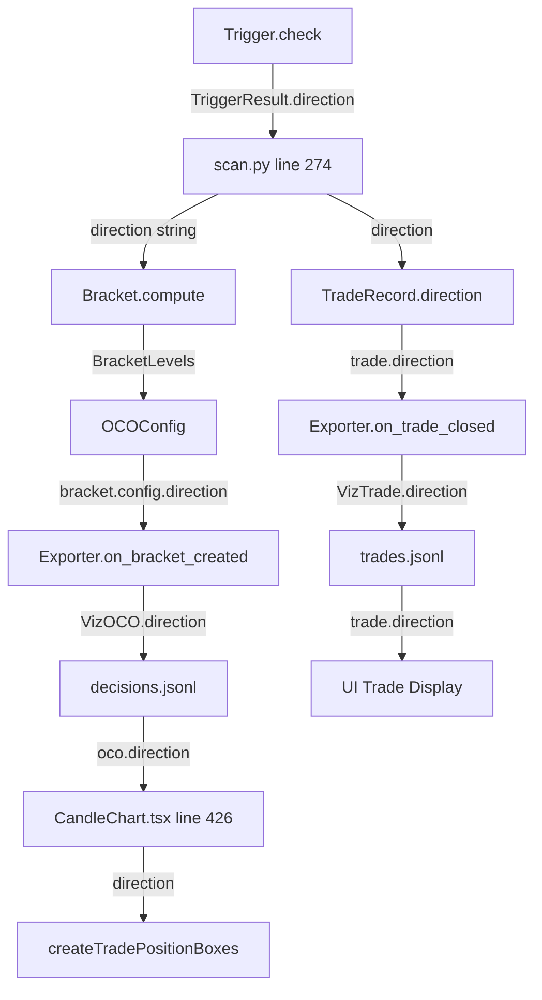

# Trade & Position Box Logic: Deep Analysis

## Overview

This document traces how trades flow from scanner trigger → OCO bracket → visualization to understand the position box mismatch issue (UI shows losses where boxes say LONG but trade says SHORT).

---

## Data Flow Diagram



---

## Key Files & Direction Flow

### 1. Trigger → Direction (Backend)

**File**: `src/policy/triggers/base.py`
- `TriggerResult.direction` returns `TriggerDirection.LONG` or `TriggerDirection.SHORT`

**File**: `src/strategy/scan.py` (lines 270-275)
```python
result = trigger.check(features)
if not result.triggered:
    continue
direction = result.direction.value  # "LONG" or "SHORT"
entry_price = bar['close']
```

### 2. OCO Bracket Creation (Backend)

**File**: `src/strategy/scan.py` (lines 405-421)
```python
oco_config = OCOConfig(
    direction=direction,  # ← From trigger result
    entry_type="MARKET",
    stop_atr=levels.risk_points / atr_value,
    tp_multiple=levels.r_multiple
)
oco_bracket = OCOBracket(...)
exporter.on_bracket_created(decision_id, oco_bracket, contracts=contracts)
```

### 3. Trade Record Creation (Backend)

**File**: `src/strategy/scan.py` (lines 434-456)
```python
trade = TradeRecord(
    direction=direction,  # ← Same direction from trigger
    ...
)
exporter.on_trade_closed(trade)
```

### 4. Exporter → JSON (Backend)

**File**: `src/viz/export.py`

`on_bracket_created` (line 178):
```python
viz_oco = VizOCO(
    direction=bracket.config.direction,  # ← OCOConfig.direction
    ...
)
```

`on_trade_closed` (line 230):
```python
viz_trade = VizTrade(
    direction=trade.direction,  # ← TradeRecord.direction
    ...
)
```

### 5. UI Direction Reading (Frontend)

**File**: `src/components/CandleChart.tsx` (line 426)
```typescript
const direction = (activeDecision.scanner_context?.direction 
                   || oco.direction 
                   || 'LONG') as 'LONG' | 'SHORT';
```

**Priority Order**:
1. `scanner_context.direction` (if populated by trigger)
2. `oco.direction` (from VizOCO)
3. `'LONG'` default fallback

---

## Position Box Creation (Frontend)

**File**: `src/components/PositionBox.ts` (lines 166-207)

```typescript
export function createTradePositionBoxes(
    entryPrice: number,
    stopPrice: number,
    tpPrice: number,
    startTime: Time,
    endTime: Time,
    direction: 'LONG' | 'SHORT',
    tradeId: string = 'default'
): { slBox: PositionBox; tpBox: PositionBox; }
```

The boxes are drawn based on:
- **SL Box**: Between `entryPrice` and `stopPrice` (red)
- **TP Box**: Between `entryPrice` and `tpPrice` (green)

**Note**: The direction doesn't change box positions - it's only used for the `tradeId`. The box positions are determined by price levels only.

---

## Potential Mismatch Points

### Issue 1: `scanner_context.direction` vs `oco.direction`

In `CandleChart.tsx` line 426, direction is read with priority:
1. `scanner_context.direction`
2. `oco.direction`

**Problem**: If `scanner_context.direction` is set incorrectly or is stale, it will override `oco.direction`.

### Issue 2: Trade Direction vs Decision Direction

The UI shows trade direction from `VizTrade.direction`, but position boxes use direction from `VizDecision.oco.direction`.

**If these don't match**, you get the symptom you described:
- Position box shows LONG (from decision oco)
- Trade shows SHORT (from trade record)

### Issue 3: Trigger Result Direction Not Propagated

In `src/strategy/scan.py`, the `scanner_context` is set from `result.context`:
```python
decision = DecisionRecord(
    scanner_context=result.context,  # ← TriggerResult.context dict
    ...
)
```

If `result.context` doesn't include `direction`, then `scanner_context.direction` will be `undefined` in the UI.

---

## Verification Steps

1. **Check decisions.jsonl**: Look at `oco.direction` field
2. **Check trades.jsonl**: Look at `direction` field
3. **Compare**: Do they match for the same `decision_id`?

### Quick Debug Command
```bash
# Show direction from decisions
jq '.oco.direction' results/viz/<run_id>/decisions.jsonl

# Show direction from trades
jq '.direction' results/viz/<run_id>/trades.jsonl
```

---

## Recommended Fixes

### Fix 1: Ensure `scanner_context` includes direction

In `src/strategy/scan.py`, after creating the trigger result, populate context:
```python
result = trigger.check(features)
if result.triggered:
    # Ensure direction is in context
    if isinstance(result.context, dict):
        result.context['direction'] = result.direction.value
```

### Fix 2: Simplify UI direction reading

In `CandleChart.tsx`, prefer `oco.direction` over `scanner_context`:
```typescript
const direction = (oco?.direction 
                   || activeDecision.scanner_context?.direction 
                   || 'LONG') as 'LONG' | 'SHORT';
```

### Fix 3: Validate direction consistency in exporter

Add validation in `Exporter.on_trade_closed`:
```python
def on_trade_closed(self, trade: TradeRecord):
    # Find matching decision
    for d in reversed(self.decisions):
        if d.decision_id == trade.decision_id and d.oco:
            if d.oco.direction != trade.direction:
                print(f"WARNING: Direction mismatch! OCO={d.oco.direction}, Trade={trade.direction}")
            break
```

---

## Summary

~~The direction flows correctly from trigger → OCO → trade in the backend.~~

### Root Cause Found

The `TriggerResult` has two separate fields:
- `direction: TriggerDirection` - the direction (LONG/SHORT)
- `context: Dict[str, Any]` - context data

**The direction was NOT automatically included in context!**

When `scan.py` and `runner.py` passed `result.context` to `scanner_context`, the direction was missing.

### Fix Applied

**scan.py** (lines 365-372):
```python
# CRITICAL: Include direction in scanner_context for UI position boxes
context_with_direction = {**result.context, 'direction': direction}
decision = DecisionRecord(
    scanner_context=context_with_direction,
    ...
)
```

**runner.py** (lines 289-294):
```python
# CRITICAL: Include direction in scanner_context for UI position boxes
context_with_direction = {**(scanner_context or {}), 'direction': effective_direction}
record = DecisionRecord(
    scanner_context=context_with_direction,
    ...
)
```

### Result

New strategy runs will now have `scanner_context.direction` properly set, and position boxes will display the correct direction.
